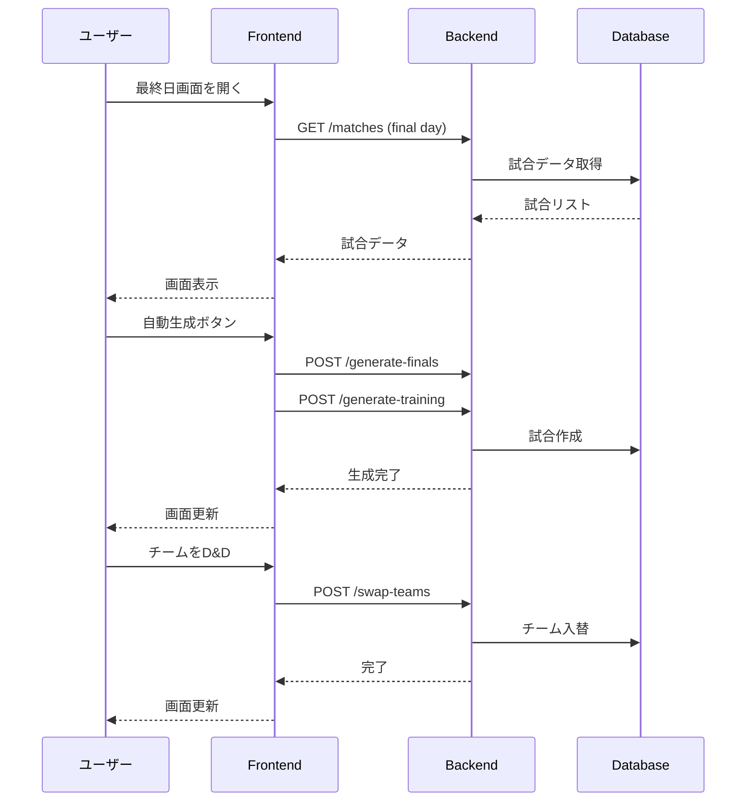
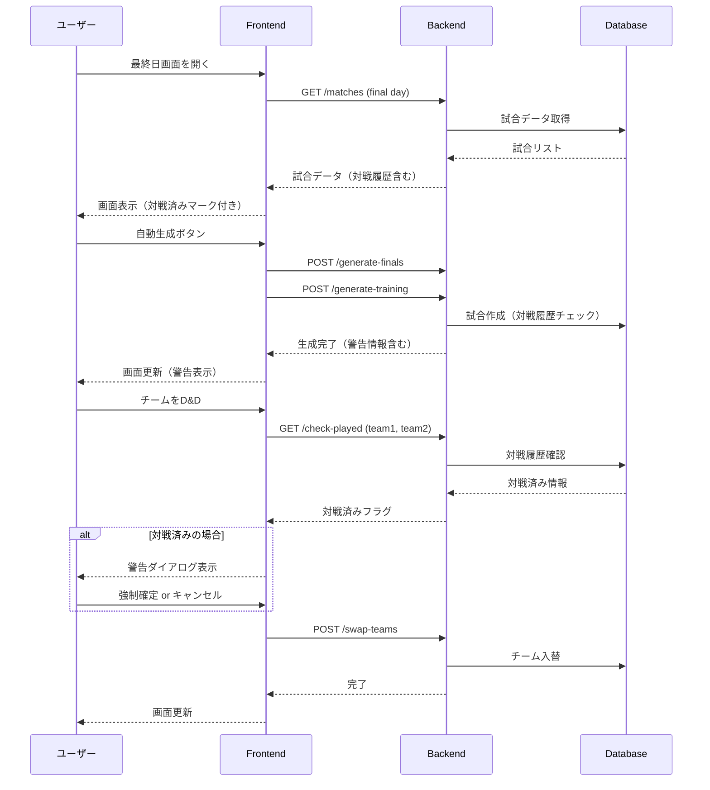

# 最終日組み合わせ画面 ギャップ分析レポート

## 1. 要件定義と実装の比較

### 1.1 要件定義の該当箇所

**requirement.md より:**
- 3.4.1 組み合わせ半自動生成【優先度: 中】
  - 各グループ1位〜6位の自動抽出
  - 予選リーグでの対戦履歴チェック
  - 同順位同士かつ未対戦の組み合わせを自動提案
  - ドラッグ&ドロップでの組み合わせ変更
  - 対戦済みチーム同士になる場合は警告表示
  - 警告を確認の上、強制確定も可能

**Requirement_Phased.md より:**
- MIDDLE Phase: 決勝Tマッチング（予選順位に基づき枠を自動埋め、手動修正可）

---

## 2. 現在の実装状況 (Mermaid図)

```mermaid
graph TB
    subgraph "現在の実装 (2025年1月時点)"
        subgraph "Frontend"
            FP[FinalDaySchedule.tsx]
            FC1[VenueCard.tsx]
            FC2[KnockoutCard.tsx]
            FC3[DraggableTeamSlot.tsx]
            FC4[MatchRow.tsx]
            FC5[MatchEditModal.tsx]
            FC6[TeamSlotPreview.tsx]

            FP --> FC1
            FP --> FC2
            FC1 --> FC3
            FC1 --> FC4
            FC2 --> FC3
            FC2 --> FC4
            FP --> FC5
            FP --> FC6
        end

        subgraph "API Hooks"
            H1[useFinalDayMatches]
            H2[useGenerateFinals]
            H3[useGenerateTrainingMatches]
            H4[useSwapTeams]
            H5[useUpdateMatchTeams]
        end

        subgraph "Backend API"
            B1[GET /matches - 試合取得]
            B2[POST /matches/generate-finals - 決勝生成]
            B3[POST /matches/generate-training - 研修試合生成]
            B4[POST /matches/swap-teams - チーム入替]
            B5[PUT /matches/finals/{id}/teams - チーム変更]
        end

        FP --> H1
        FP --> H2
        FP --> H3
        FP --> H4
        H1 --> B1
        H2 --> B2
        H3 --> B3
        H4 --> B4
        H5 --> B5
    end

    style FP fill:#90EE90
    style B1 fill:#90EE90
    style B2 fill:#90EE90
    style B3 fill:#90EE90
    style B4 fill:#90EE90
    style B5 fill:#90EE90
```

---

## 3. 理想の実装 (要件定義準拠)

```mermaid
graph TB
    subgraph "理想の実装 (要件定義準拠)"
        subgraph "Frontend - 必須機能"
            IP[FinalDaySchedulePage]
            IC1[VenueCard - 会場別表示]
            IC2[KnockoutBracket - トーナメント表]
            IC3[DraggableTeamSlot - D&D対応]
            IC4[MatchRow - 試合行]
            IC5[MatchEditModal - 編集モーダル]
            IC6[TeamSelectModal - チーム選択]
            IC7[WarningDialog - 対戦済み警告]
            IC8[AutoGenerateButton - 自動生成]
            IC9[PlayedCheckIndicator - 対戦済み表示]
        end

        subgraph "Frontend - 拡張機能"
            IE1[UndoRedoManager - 操作履歴]
            IE2[ExportButton - Excel/PDF出力]
            IE3[PreviewModal - 印刷プレビュー]
            IE4[ValidationPanel - 検証パネル]
        end

        subgraph "Backend API - 必須"
            IB1[GET /matches - 試合取得]
            IB2[POST /matches/generate-finals - 決勝生成]
            IB3[POST /matches/generate-training - 研修試合生成]
            IB4[POST /matches/swap-teams - チーム入替]
            IB5[PUT /matches/finals/{id}/teams - チーム変更]
            IB6[GET /matches/check-played - 対戦履歴確認]
            IB7[POST /matches/validate-bracket - 組み合わせ検証]
        end

        subgraph "Backend API - 拡張"
            IBE1[PUT /matches/finals/auto-update - 準決勝結果反映]
            IBE2[GET /matches/bracket-preview - プレビュー]
            IBE3[POST /matches/export - エクスポート]
        end

        IP --> IC1
        IP --> IC2
        IP --> IC7
        IP --> IC8
        IC2 --> IC3
        IC2 --> IC9

        IC7 --> IB6
        IC8 --> IB2
        IC8 --> IB3
    end

    style IP fill:#FFD700
    style IC7 fill:#FF6347
    style IC9 fill:#FF6347
    style IB6 fill:#FF6347
    style IB7 fill:#FF6347
    style IE1 fill:#87CEEB
    style IE2 fill:#87CEEB
    style IE3 fill:#87CEEB
    style IE4 fill:#87CEEB
    style IBE1 fill:#87CEEB
    style IBE2 fill:#87CEEB
    style IBE3 fill:#87CEEB
```

**凡例:**
- 緑: 実装済み
- 黄: 基盤は実装済み
- 赤: 未実装（必須）
- 青: 未実装（拡張）

---

## 4. ギャップ分析

### 4.1 実装済み機能 ✅

| 機能 | 要件 | 実装状況 | 備考 |
|:---|:---|:---|:---|
| 会場別試合表示 | 3.4.1 | ✅ 完了 | VenueCard |
| 決勝トーナメント表示 | 3.4.1 | ✅ 完了 | KnockoutCard |
| ドラッグ&ドロップ | 3.4.1 | ✅ 完了 | @dnd-kit使用 |
| 決勝自動生成 | 3.4.1 | ✅ 完了 | generate-finals API |
| 研修試合自動生成 | 2.6.2 | ✅ 完了 | generate-training API |
| チーム入れ替え | 3.4.1 | ✅ 完了 | swap-teams API |
| 試合編集モーダル | 3.4.1 | ✅ 完了 | MatchEditModal |

### 4.2 未実装機能（必須） ❌

| 機能 | 要件 | 優先度 | 説明 |
|:---|:---|:---|:---|
| 対戦済み警告表示 | 3.4.1「対戦済みチーム同士になる場合は警告表示」 | 高 | D&D時に予選で対戦済みかチェックし警告 |
| 強制確定機能 | 3.4.1「警告を確認の上、強制確定も可能」 | 高 | 警告を無視して確定するダイアログ |
| 対戦履歴チェックAPI | 3.4.1 | 高 | 2チームが予選で対戦済みか確認 |
| 組み合わせ検証 | 3.4.1 | 中 | 全体の整合性チェック |

### 4.3 未実装機能（拡張） 🔵

| 機能 | 要件 | 優先度 | 説明 |
|:---|:---|:---|:---|
| 準決勝結果自動反映 | 2.6.1 | 中 | 準決勝完了時に3決・決勝を自動更新 |
| 操作履歴(Undo/Redo) | - | 低 | ミス時の復元機能 |
| 印刷/エクスポート | 3.5「Excel/PDF出力」 | 中 | 最終日組み合わせ表の出力 |
| 検証パネル | - | 低 | 問題箇所の一覧表示 |

---

## 5. システムフロー比較

### 5.1 現在のフロー



### 5.2 理想のフロー（対戦済みチェック付き）



---

## 6. 推奨アクション

### 6.1 即座に対応すべき項目（優先度: 高）

1. **対戦履歴チェックAPI追加**
   ```python
   # routes/matches.py
   @router.get("/check-played")
   def check_teams_played(
       team1_id: int,
       team2_id: int,
       tournament_id: int,
       db: Session = Depends(get_db)
   ) -> dict:
       """2チームが予選で対戦済みかチェック"""
   ```

2. **フロントエンドに警告ダイアログ追加**
   - D&D完了時にcheck-played APIを呼び出し
   - 対戦済みの場合は警告ダイアログを表示
   - 「強制確定」「キャンセル」の選択肢

3. **MatchRow/DraggableTeamSlotに対戦済みインジケータ追加**
   - 対戦済みチームの組み合わせを視覚的に警告

### 6.2 次フェーズで対応すべき項目（優先度: 中）

1. **準決勝結果の自動反映**
   - 準決勝スコア入力後に3決・決勝のチームを自動更新
   - 既存の `update-finals-bracket` APIを活用

2. **組み合わせ表のエクスポート**
   - PDF/Excel出力機能

### 6.3 将来対応項目（優先度: 低）

1. 操作履歴（Undo/Redo）
2. 検証パネル
3. 印刷プレビュー

---

## 7. 要件定義の更新提案

現在の実装状況を踏まえ、以下の更新を提案:

### requirement.md への追記

```markdown
### 3.4.2 最終日組み合わせ画面【優先度: 中】※新規追加

**画面構成:**
- 順位リーグ（研修試合）セクション: 会場別カード形式
- 決勝トーナメントセクション: 準決勝〜決勝の組み合わせ

**操作機能:**
1. 自動生成ボタン: 順位表から決勝T・研修試合を一括生成
2. ドラッグ&ドロップ: チーム枠間でのチーム入れ替え
3. 編集モーダル: 試合詳細（時刻、チーム）の個別編集
4. 対戦済み警告: 予選で対戦済みの組み合わせに警告表示

**実装状況:**
- [x] 基本UI（会場カード、決勝トーナメント）
- [x] ドラッグ&ドロップ機能
- [x] 自動生成機能
- [ ] 対戦済み警告機能
- [ ] 印刷/エクスポート機能
```

---

## 8. テスト計画

### 8.1 単体テスト

| テスト対象 | テスト内容 | 優先度 |
|:---|:---|:---|
| swap-teams API | 正常系: チーム入替成功 | 高 |
| swap-teams API | 異常系: 完了済み試合の入替拒否 | 高 |
| swap-teams API | 異常系: ロック中試合の入替拒否 | 中 |
| check-played API | 対戦済みチームの検出 | 高 |
| generate-finals API | 正常系: 決勝生成 | 高 |
| generate-training API | 未対戦チーム同士のマッチング | 高 |

### 8.2 統合テスト

| テストシナリオ | 確認項目 |
|:---|:---|
| 最終日画面表示 | 試合データの正しい表示 |
| 自動生成フロー | 順位表→決勝生成→研修試合生成 |
| D&D入替フロー | ドラッグ→ドロップ→API呼出→画面更新 |
| 警告フロー | 対戦済みチェック→警告表示→確定/キャンセル |

---

*作成日: 2025-01-03*
*最終更新: 2025-01-03*
