# TournaMate - シーケンス図・状態遷移図集

---

# 1. 状態遷移図

## 1.1 大会ライフサイクル

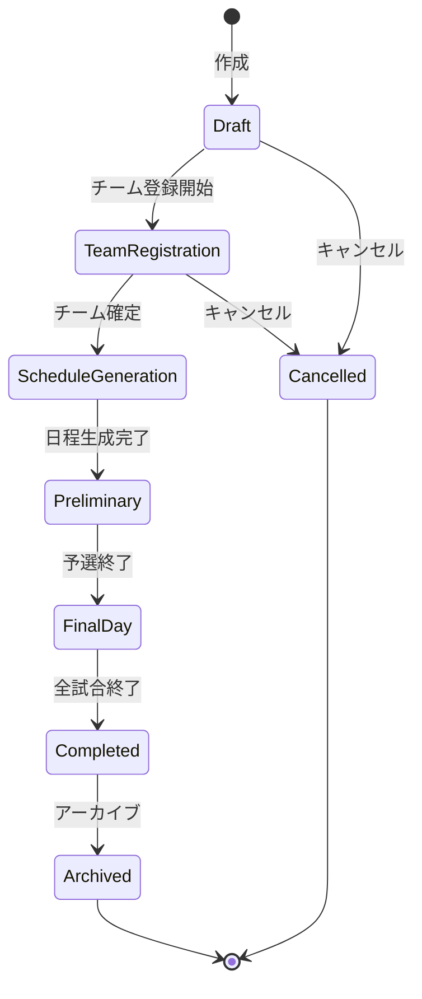
```mermaid
stateDiagram-v2
    [*] --> Draft: 作成
    Draft --> TeamRegistration: チーム登録開始
    TeamRegistration --> ScheduleGeneration: チーム確定
    ScheduleGeneration --> Preliminary: 日程生成完了
    Preliminary --> FinalDay: 予選終了
    FinalDay --> Completed: 全試合終了
    Completed --> Archived: アーカイブ
    Archived --> [*]
    
    Draft --> Cancelled: キャンセル
    TeamRegistration --> Cancelled: キャンセル
    Cancelled --> [*]
```

## 1.2 試合ステータス

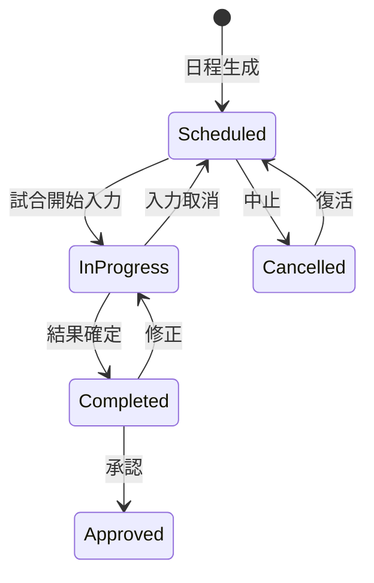
```mermaid
stateDiagram-v2
    [*] --> Scheduled: 日程生成
    Scheduled --> InProgress: 試合開始入力
    InProgress --> Completed: 結果確定
    Completed --> Approved: 承認
    
    InProgress --> Scheduled: 入力取消
    Completed --> InProgress: 修正
    
    Scheduled --> Cancelled: 中止
    Cancelled --> Scheduled: 復活
```

## 1.3 結果入力フロー

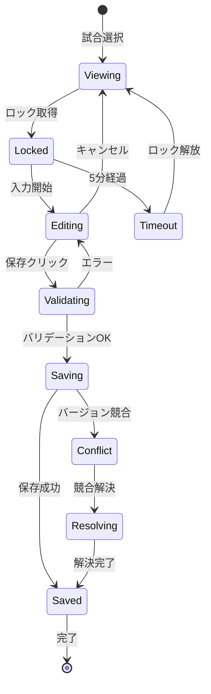
```mermaid
stateDiagram-v2
    [*] --> Viewing: 試合選択
    Viewing --> Locked: ロック取得
    Locked --> Editing: 入力開始
    Editing --> Validating: 保存クリック
    Validating --> Saving: バリデーションOK
    Validating --> Editing: エラー
    Saving --> Saved: 保存成功
    Saving --> Conflict: バージョン競合
    Conflict --> Resolving: 競合解決
    Resolving --> Saved: 解決完了
    Saved --> [*]: 完了
    
    Locked --> Timeout: 5分経過
    Timeout --> Viewing: ロック解放
    Editing --> Viewing: キャンセル
```

---

# 2. シーケンス図

## 2.1 ログイン

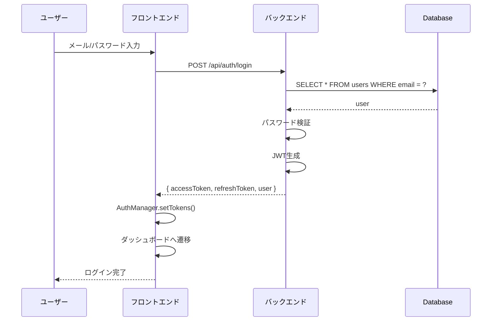
```mermaid
sequenceDiagram
    participant U as ユーザー
    participant F as フロントエンド
    participant API as バックエンド
    participant DB as Database

    U->>F: メール/パスワード入力
    F->>API: POST /api/auth/login
    API->>DB: SELECT * FROM users WHERE email = ?
    DB-->>API: user
    API->>API: パスワード検証
    API->>API: JWT生成
    API-->>F: { accessToken, refreshToken, user }
    F->>F: AuthManager.setTokens()
    F->>F: ダッシュボードへ遷移
    F-->>U: ログイン完了
```

## 2.2 予選日程生成

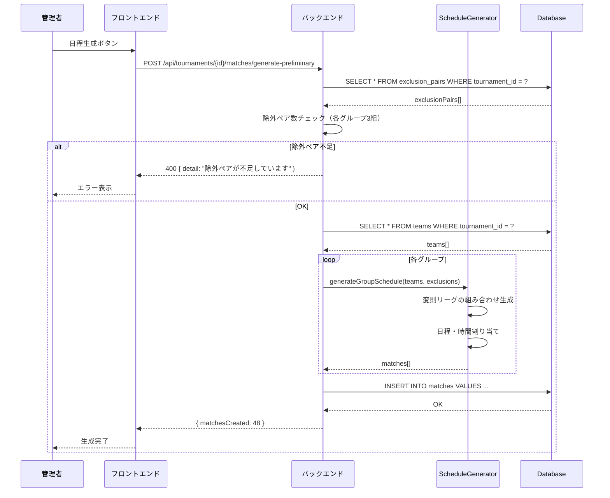
```mermaid
sequenceDiagram
    participant U as 管理者
    participant F as フロントエンド
    participant API as バックエンド
    participant GEN as ScheduleGenerator
    participant DB as Database

    U->>F: 日程生成ボタン
    F->>API: POST /api/tournaments/{id}/matches/generate-preliminary
    
    API->>DB: SELECT * FROM exclusion_pairs WHERE tournament_id = ?
    DB-->>API: exclusionPairs[]
    
    API->>API: 除外ペア数チェック（各グループ3組）
    
    alt 除外ペア不足
        API-->>F: 400 { detail: "除外ペアが不足しています" }
        F-->>U: エラー表示
    else OK
        API->>DB: SELECT * FROM teams WHERE tournament_id = ?
        DB-->>API: teams[]
        
        loop 各グループ
            API->>GEN: generateGroupSchedule(teams, exclusions)
            GEN->>GEN: 変則リーグの組み合わせ生成
            GEN->>GEN: 日程・時間割り当て
            GEN-->>API: matches[]
        end
        
        API->>DB: INSERT INTO matches VALUES ...
        DB-->>API: OK
        API-->>F: { matchesCreated: 48 }
        F-->>U: 生成完了
    end
```

## 2.3 結果入力（完全版）

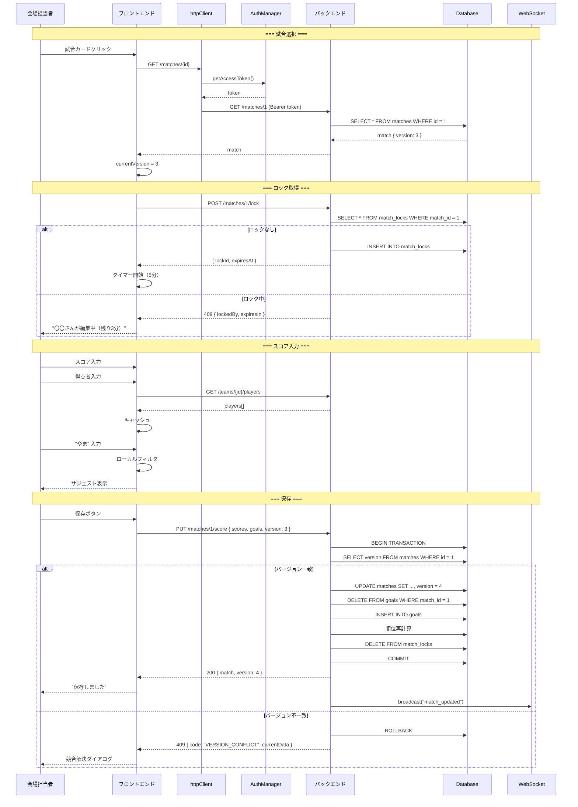
```mermaid
sequenceDiagram
    participant U as 会場担当者
    participant F as フロントエンド
    participant HC as httpClient
    participant AM as AuthManager
    participant API as バックエンド
    participant DB as Database
    participant WS as WebSocket

    Note over U,WS: === 試合選択 ===
    U->>F: 試合カードクリック
    F->>HC: GET /matches/{id}
    HC->>AM: getAccessToken()
    AM-->>HC: token
    HC->>API: GET /matches/1 (Bearer token)
    API->>DB: SELECT * FROM matches WHERE id = 1
    DB-->>API: match { version: 3 }
    API-->>F: match
    F->>F: currentVersion = 3

    Note over U,WS: === ロック取得 ===
    F->>API: POST /matches/1/lock
    API->>DB: SELECT * FROM match_locks WHERE match_id = 1
    
    alt ロックなし
        API->>DB: INSERT INTO match_locks
        API-->>F: { lockId, expiresAt }
        F->>F: タイマー開始（5分）
    else ロック中
        API-->>F: 409 { lockedBy, expiresIn }
        F-->>U: "〇〇さんが編集中（残り3分）"
    end

    Note over U,WS: === スコア入力 ===
    U->>F: スコア入力
    U->>F: 得点者入力
    
    F->>API: GET /teams/{id}/players
    API-->>F: players[]
    F->>F: キャッシュ
    
    U->>F: "やま" 入力
    F->>F: ローカルフィルタ
    F-->>U: サジェスト表示

    Note over U,WS: === 保存 ===
    U->>F: 保存ボタン
    F->>API: PUT /matches/1/score { scores, goals, version: 3 }
    
    API->>DB: BEGIN TRANSACTION
    API->>DB: SELECT version FROM matches WHERE id = 1
    
    alt バージョン一致
        API->>DB: UPDATE matches SET ..., version = 4
        API->>DB: DELETE FROM goals WHERE match_id = 1
        API->>DB: INSERT INTO goals
        API->>DB: 順位再計算
        API->>DB: DELETE FROM match_locks
        API->>DB: COMMIT
        API-->>F: 200 { match, version: 4 }
        F-->>U: "保存しました"
        
        API->>WS: broadcast("match_updated")
    else バージョン不一致
        API->>DB: ROLLBACK
        API-->>F: 409 { code: "VERSION_CONFLICT", currentData }
        F-->>U: 競合解決ダイアログ
    end
```

## 2.4 オフライン同期

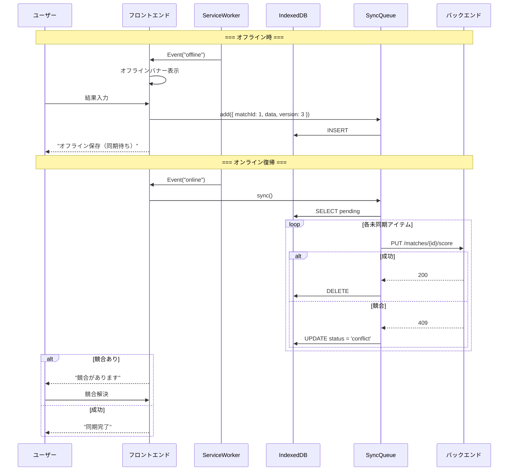
```mermaid
sequenceDiagram
    participant U as ユーザー
    participant F as フロントエンド
    participant SW as ServiceWorker
    participant IDB as IndexedDB
    participant SQ as SyncQueue
    participant API as バックエンド

    Note over U,API: === オフライン時 ===
    SW->>F: Event("offline")
    F->>F: オフラインバナー表示

    U->>F: 結果入力
    F->>SQ: add({ matchId: 1, data, version: 3 })
    SQ->>IDB: INSERT
    F-->>U: "オフライン保存（同期待ち）"

    Note over U,API: === オンライン復帰 ===
    SW->>F: Event("online")
    F->>SQ: sync()
    SQ->>IDB: SELECT pending
    
    loop 各未同期アイテム
        SQ->>API: PUT /matches/{id}/score
        
        alt 成功
            API-->>SQ: 200
            SQ->>IDB: DELETE
        else 競合
            API-->>SQ: 409
            SQ->>IDB: UPDATE status = 'conflict'
        end
    end
    
    alt 競合あり
        F-->>U: "競合があります"
        U->>F: 競合解決
    else 成功
        F-->>U: "同期完了"
    end
```

## 2.5 順位計算

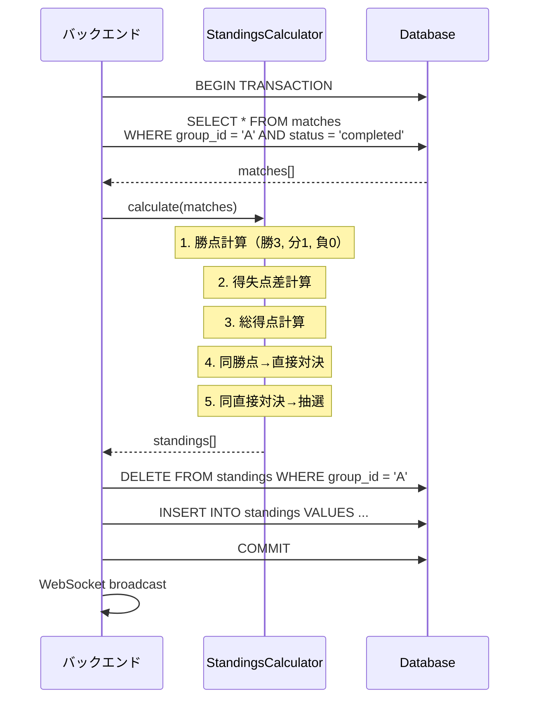
```mermaid
sequenceDiagram
    participant API as バックエンド
    participant CALC as StandingsCalculator
    participant DB as Database

    API->>DB: BEGIN TRANSACTION
    
    API->>DB: SELECT * FROM matches<br/>WHERE group_id = 'A' AND status = 'completed'
    DB-->>API: matches[]

    API->>CALC: calculate(matches)
    
    Note over CALC: 1. 勝点計算（勝3, 分1, 負0）
    Note over CALC: 2. 得失点差計算
    Note over CALC: 3. 総得点計算
    Note over CALC: 4. 同勝点→直接対決
    Note over CALC: 5. 同直接対決→抽選
    
    CALC-->>API: standings[]

    API->>DB: DELETE FROM standings WHERE group_id = 'A'
    API->>DB: INSERT INTO standings VALUES ...
    API->>DB: COMMIT
    
    API->>API: WebSocket broadcast
```

## 2.6 報告書生成

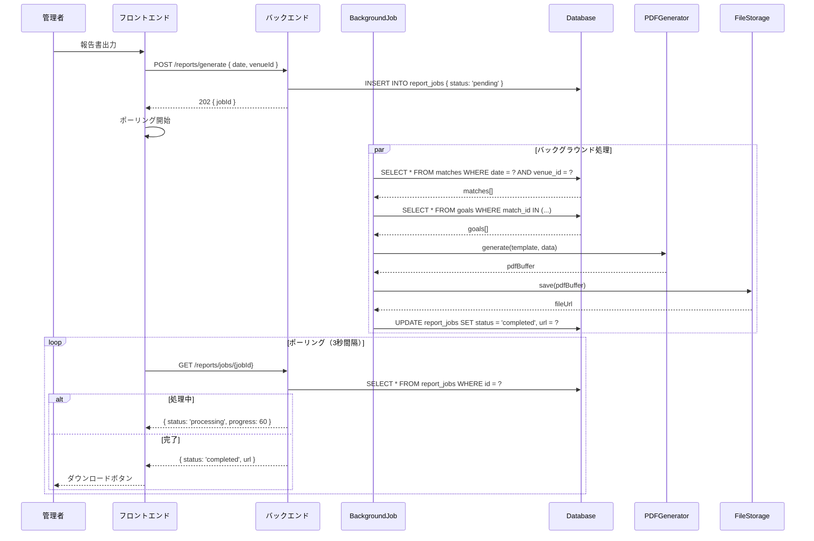
```mermaid
sequenceDiagram
    participant U as 管理者
    participant F as フロントエンド
    participant API as バックエンド
    participant JOB as BackgroundJob
    participant DB as Database
    participant PDF as PDFGenerator
    participant FS as FileStorage

    U->>F: 報告書出力
    F->>API: POST /reports/generate { date, venueId }
    API->>DB: INSERT INTO report_jobs { status: 'pending' }
    API-->>F: 202 { jobId }
    F->>F: ポーリング開始

    par バックグラウンド処理
        JOB->>DB: SELECT * FROM matches WHERE date = ? AND venue_id = ?
        DB-->>JOB: matches[]
        JOB->>DB: SELECT * FROM goals WHERE match_id IN (...)
        DB-->>JOB: goals[]
        JOB->>PDF: generate(template, data)
        PDF-->>JOB: pdfBuffer
        JOB->>FS: save(pdfBuffer)
        FS-->>JOB: fileUrl
        JOB->>DB: UPDATE report_jobs SET status = 'completed', url = ?
    end

    loop ポーリング（3秒間隔）
        F->>API: GET /reports/jobs/{jobId}
        API->>DB: SELECT * FROM report_jobs WHERE id = ?
        
        alt 処理中
            API-->>F: { status: 'processing', progress: 60 }
        else 完了
            API-->>F: { status: 'completed', url }
            F-->>U: ダウンロードボタン
        end
    end
```

## 2.7 WebSocketリアルタイム更新

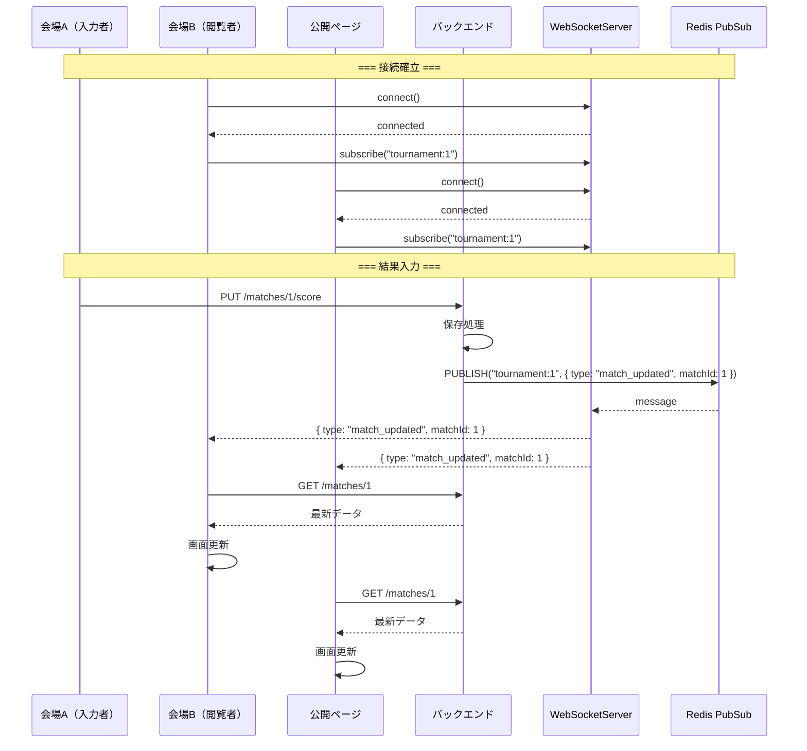
```mermaid
sequenceDiagram
    participant A as 会場A（入力者）
    participant B as 会場B（閲覧者）
    participant C as 公開ページ
    participant API as バックエンド
    participant WS as WebSocketServer
    participant Redis as Redis PubSub

    Note over A,Redis: === 接続確立 ===
    B->>WS: connect()
    WS-->>B: connected
    B->>WS: subscribe("tournament:1")
    
    C->>WS: connect()
    WS-->>C: connected
    C->>WS: subscribe("tournament:1")

    Note over A,Redis: === 結果入力 ===
    A->>API: PUT /matches/1/score
    API->>API: 保存処理
    API->>Redis: PUBLISH("tournament:1", { type: "match_updated", matchId: 1 })
    
    Redis-->>WS: message
    WS-->>B: { type: "match_updated", matchId: 1 }
    WS-->>C: { type: "match_updated", matchId: 1 }
    
    B->>API: GET /matches/1
    API-->>B: 最新データ
    B->>B: 画面更新
    
    C->>API: GET /matches/1
    API-->>C: 最新データ
    C->>C: 画面更新
```

---

# 3. フローチャート

## 3.1 除外ペア設定

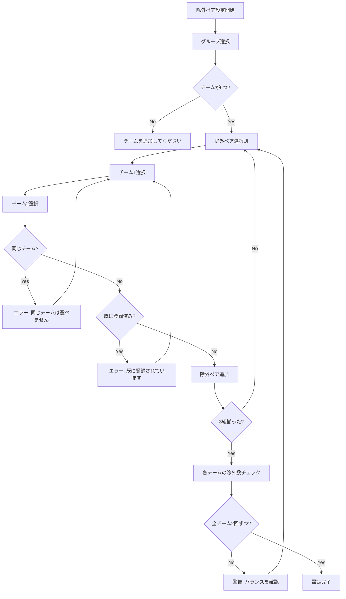
```mermaid
flowchart TD
    A[除外ペア設定開始] --> B[グループ選択]
    B --> C{チームが6つ?}
    C -->|No| D[チームを追加してください]
    C -->|Yes| E[除外ペア選択UI]
    
    E --> F[チーム1選択]
    F --> G[チーム2選択]
    G --> H{同じチーム?}
    H -->|Yes| I[エラー: 同じチームは選べません]
    I --> F
    H -->|No| J{既に登録済み?}
    J -->|Yes| K[エラー: 既に登録されています]
    K --> F
    J -->|No| L[除外ペア追加]
    
    L --> M{3組揃った?}
    M -->|No| E
    M -->|Yes| N[各チームの除外数チェック]
    
    N --> O{全チーム2回ずつ?}
    O -->|No| P[警告: バランスを確認]
    O -->|Yes| Q[設定完了]
    P --> E
```

## 3.2 順位決定ロジック

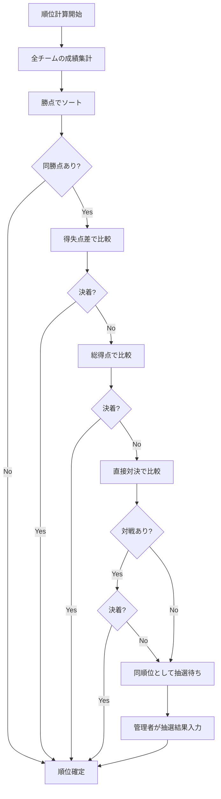
```mermaid
flowchart TD
    A[順位計算開始] --> B[全チームの成績集計]
    B --> C[勝点でソート]
    C --> D{同勝点あり?}
    D -->|No| E[順位確定]
    D -->|Yes| F[得失点差で比較]
    F --> G{決着?}
    G -->|Yes| E
    G -->|No| H[総得点で比較]
    H --> I{決着?}
    I -->|Yes| E
    I -->|No| J[直接対決で比較]
    J --> K{対戦あり?}
    K -->|Yes| L{決着?}
    L -->|Yes| E
    L -->|No| M[同順位として抽選待ち]
    K -->|No| M
    M --> N[管理者が抽選結果入力]
    N --> E
```

## 3.3 最終日組み合わせ生成

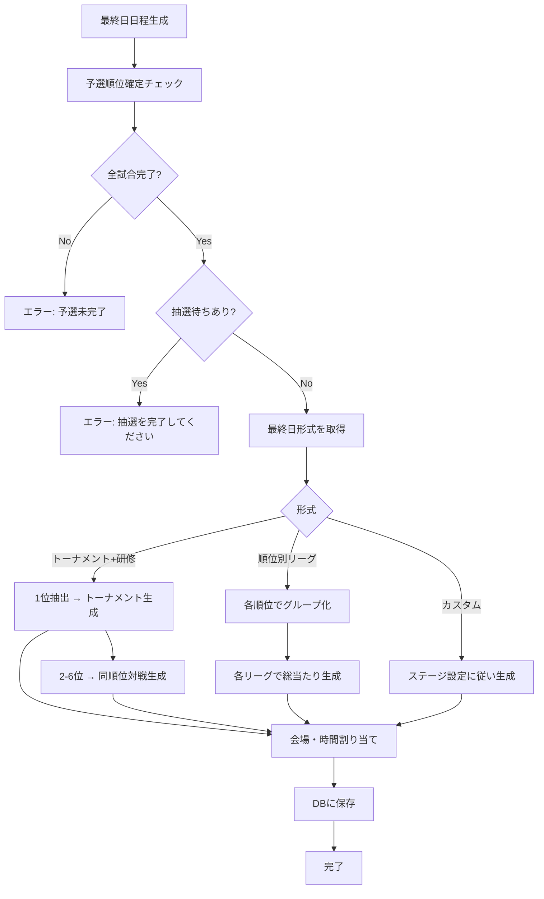
```mermaid
flowchart TD
    A[最終日日程生成] --> B[予選順位確定チェック]
    B --> C{全試合完了?}
    C -->|No| D[エラー: 予選未完了]
    C -->|Yes| E{抽選待ちあり?}
    E -->|Yes| F[エラー: 抽選を完了してください]
    E -->|No| G[最終日形式を取得]
    
    G --> H{形式}
    H -->|トーナメント+研修| I[1位抽出 → トーナメント生成]
    I --> J[2-6位 → 同順位対戦生成]
    
    H -->|順位別リーグ| K[各順位でグループ化]
    K --> L[各リーグで総当たり生成]
    
    H -->|カスタム| M[ステージ設定に従い生成]
    
    I --> N[会場・時間割り当て]
    J --> N
    L --> N
    M --> N
    
    N --> O[DBに保存]
    O --> P[完了]
```

---

# 4. 画面遷移図

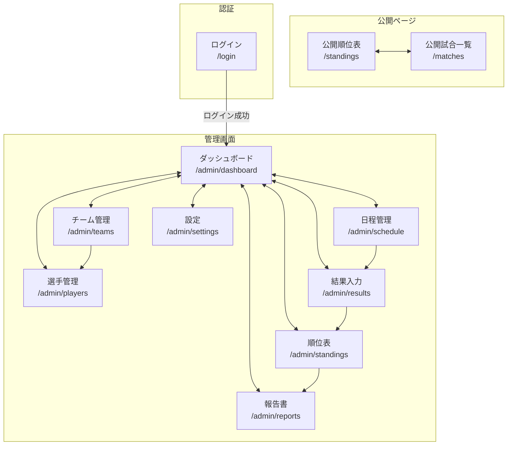
```mermaid
flowchart TD
    subgraph Public[公開ページ]
        P1[公開順位表<br/>/standings]
        P2[公開試合一覧<br/>/matches]
    end
    
    subgraph Auth[認証]
        L[ログイン<br/>/login]
    end
    
    subgraph Admin[管理画面]
        A1[ダッシュボード<br/>/admin/dashboard]
        A2[チーム管理<br/>/admin/teams]
        A3[選手管理<br/>/admin/players]
        A4[日程管理<br/>/admin/schedule]
        A5[結果入力<br/>/admin/results]
        A6[順位表<br/>/admin/standings]
        A7[報告書<br/>/admin/reports]
        A8[設定<br/>/admin/settings]
    end
    
    L -->|ログイン成功| A1
    A1 <--> A2
    A1 <--> A3
    A1 <--> A4
    A1 <--> A5
    A1 <--> A6
    A1 <--> A7
    A1 <--> A8
    
    A2 --> A3
    A4 --> A5
    A5 --> A6
    A6 --> A7
    
    P1 <--> P2
```

---

# 5. コンポーネント図

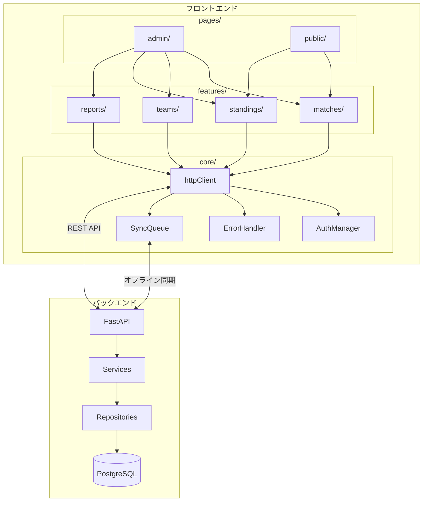
```mermaid
flowchart TB
    subgraph Frontend[フロントエンド]
        subgraph Core[core/]
            HTTP[httpClient]
            AUTH[AuthManager]
            SYNC[SyncQueue]
            ERR[ErrorHandler]
        end

        subgraph Features[features/]
            MATCH[matches/]
            TEAM[teams/]
            STAND[standings/]
            REPORT[reports/]
        end

        subgraph Pages[pages/]
            ADMIN[admin/]
            PUBLIC[public/]
        end

        ADMIN --> MATCH
        ADMIN --> TEAM
        ADMIN --> STAND
        ADMIN --> REPORT

        PUBLIC --> MATCH
        PUBLIC --> STAND

        MATCH --> HTTP
        TEAM --> HTTP
        STAND --> HTTP
        REPORT --> HTTP

        HTTP --> AUTH
        HTTP --> ERR
        HTTP --> SYNC
    end

    subgraph Backend[バックエンド]
        API[FastAPI]
        SVC[Services]
        REPO[Repositories]
        DB[(PostgreSQL)]

        API --> SVC
        SVC --> REPO
        REPO --> DB
    end

    HTTP <-->|REST API| API
    SYNC <-->|オフライン同期| API
```

---

# 6. 追加シーケンス図

## 6.1 得点ランキング取得（詳細）

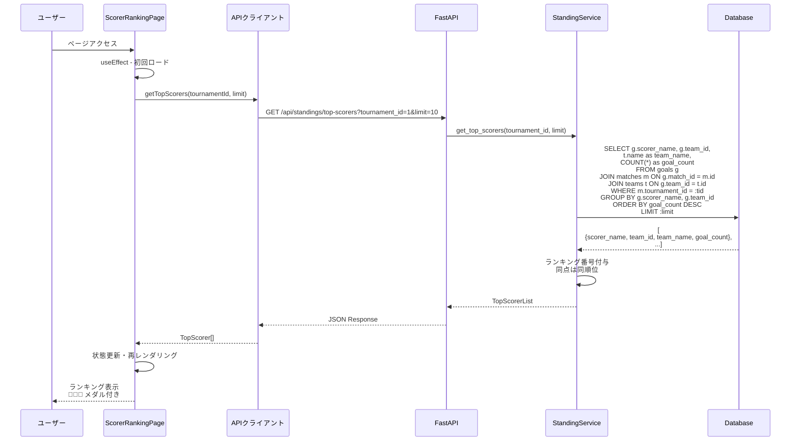
```mermaid
sequenceDiagram
    participant U as ユーザー
    participant P as ScorerRankingPage
    participant API as APIクライアント
    participant BE as FastAPI
    participant SVC as StandingService
    participant DB as Database

    U->>P: ページアクセス
    P->>P: useEffect - 初回ロード

    P->>API: getTopScorers(tournamentId, limit)
    API->>BE: GET /api/standings/top-scorers?tournament_id=1&limit=10

    BE->>SVC: get_top_scorers(tournament_id, limit)

    SVC->>DB: SELECT g.scorer_name, g.team_id,<br/>t.name as team_name,<br/>COUNT(*) as goal_count<br/>FROM goals g<br/>JOIN matches m ON g.match_id = m.id<br/>JOIN teams t ON g.team_id = t.id<br/>WHERE m.tournament_id = :tid<br/>GROUP BY g.scorer_name, g.team_id<br/>ORDER BY goal_count DESC<br/>LIMIT :limit

    DB-->>SVC: [<br/>{scorer_name, team_id, team_name, goal_count},<br/>...]

    SVC->>SVC: ランキング番号付与<br/>同点は同順位

    SVC-->>BE: TopScorerList

    BE-->>API: JSON Response
    API-->>P: TopScorer[]

    P->>P: 状態更新・再レンダリング

    P-->>U: ランキング表示<br/>🥇🥈🥉 メダル付き
```

## 6.2 データ同期競合解決フロー

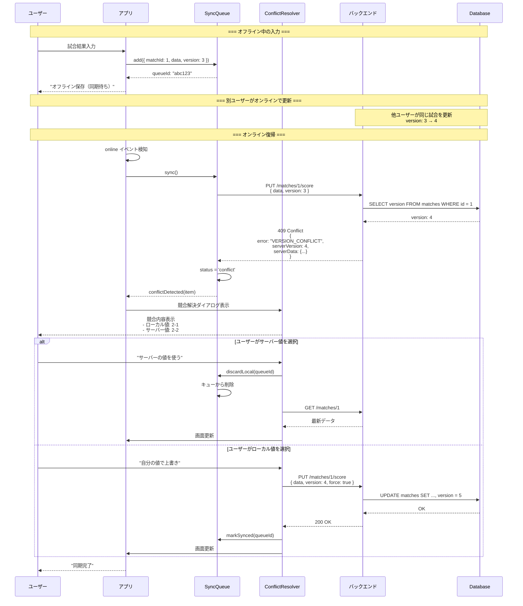
```mermaid
sequenceDiagram
    participant U as ユーザー
    participant App as アプリ
    participant SQ as SyncQueue
    participant CR as ConflictResolver
    participant API as バックエンド
    participant DB as Database

    Note over U,DB: === オフライン中の入力 ===
    U->>App: 試合結果入力
    App->>SQ: add({ matchId: 1, data, version: 3 })
    SQ-->>App: queueId: "abc123"
    App-->>U: "オフライン保存（同期待ち）"

    Note over U,DB: === 別ユーザーがオンラインで更新 ===
    Note over API,DB: 他ユーザーが同じ試合を更新<br/>version: 3 → 4

    Note over U,DB: === オンライン復帰 ===
    App->>App: online イベント検知
    App->>SQ: sync()

    SQ->>API: PUT /matches/1/score<br/>{ data, version: 3 }

    API->>DB: SELECT version FROM matches WHERE id = 1
    DB-->>API: version: 4

    API-->>SQ: 409 Conflict<br/>{<br/>error: "VERSION_CONFLICT",<br/>serverVersion: 4,<br/>serverData: {...}<br/>}

    SQ->>SQ: status = 'conflict'

    SQ-->>App: conflictDetected(item)
    App->>CR: 競合解決ダイアログ表示

    CR-->>U: 競合内容表示<br/>- ローカル値: 2-1<br/>- サーバー値: 2-2

    alt ユーザーがサーバー値を選択
        U->>CR: "サーバーの値を使う"
        CR->>SQ: discardLocal(queueId)
        SQ->>SQ: キューから削除
        CR->>API: GET /matches/1
        API-->>CR: 最新データ
        CR->>App: 画面更新
    else ユーザーがローカル値を選択
        U->>CR: "自分の値で上書き"
        CR->>API: PUT /matches/1/score<br/>{ data, version: 4, force: true }
        API->>DB: UPDATE matches SET ..., version = 5
        DB-->>API: OK
        API-->>CR: 200 OK
        CR->>SQ: markSynced(queueId)
        CR->>App: 画面更新
    end

    App-->>U: "同期完了"
```

## 6.3 PWAインストールフロー

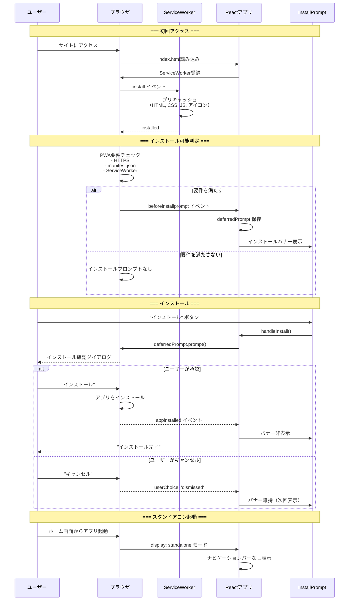
```mermaid
sequenceDiagram
    participant U as ユーザー
    participant B as ブラウザ
    participant SW as ServiceWorker
    participant App as Reactアプリ
    participant IP as InstallPrompt

    Note over U,IP: === 初回アクセス ===
    U->>B: サイトにアクセス
    B->>App: index.html読み込み
    App->>B: ServiceWorker登録

    B->>SW: install イベント
    SW->>SW: プリキャッシュ<br/>（HTML, CSS, JS, アイコン）
    SW-->>B: installed

    Note over U,IP: === インストール可能判定 ===
    B->>B: PWA要件チェック<br/>- HTTPS<br/>- manifest.json<br/>- ServiceWorker

    alt 要件を満たす
        B->>App: beforeinstallprompt イベント
        App->>App: deferredPrompt 保存
        App->>IP: インストールバナー表示
    else 要件を満たさない
        B->>B: インストールプロンプトなし
    end

    Note over U,IP: === インストール ===
    U->>IP: "インストール" ボタン
    IP->>App: handleInstall()
    App->>B: deferredPrompt.prompt()

    B-->>U: インストール確認ダイアログ

    alt ユーザーが承認
        U->>B: "インストール"
        B->>B: アプリをインストール
        B-->>App: appinstalled イベント
        App->>IP: バナー非表示
        App-->>U: "インストール完了"
    else ユーザーがキャンセル
        U->>B: "キャンセル"
        B-->>App: userChoice: 'dismissed'
        App->>IP: バナー維持（次回表示）
    end

    Note over U,IP: === スタンドアロン起動 ===
    U->>B: ホーム画面からアプリ起動
    B->>App: display: standalone モード
    App->>App: ナビゲーションバーなし表示
```

## 6.4 バックアップ・リストアフロー

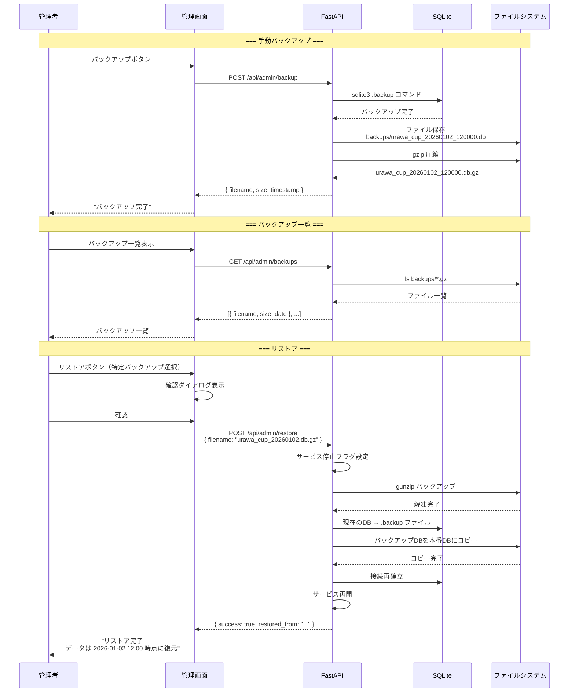
```mermaid
sequenceDiagram
    participant AD as 管理者
    participant UI as 管理画面
    participant API as FastAPI
    participant DB as SQLite
    participant FS as ファイルシステム

    Note over AD,FS: === 手動バックアップ ===
    AD->>UI: バックアップボタン
    UI->>API: POST /api/admin/backup

    API->>DB: sqlite3 .backup コマンド
    DB-->>API: バックアップ完了

    API->>FS: ファイル保存<br/>backups/urawa_cup_20260102_120000.db

    API->>FS: gzip 圧縮
    FS-->>API: urawa_cup_20260102_120000.db.gz

    API-->>UI: { filename, size, timestamp }
    UI-->>AD: "バックアップ完了"

    Note over AD,FS: === バックアップ一覧 ===
    AD->>UI: バックアップ一覧表示
    UI->>API: GET /api/admin/backups
    API->>FS: ls backups/*.gz
    FS-->>API: ファイル一覧
    API-->>UI: [{ filename, size, date }, ...]
    UI-->>AD: バックアップ一覧

    Note over AD,FS: === リストア ===
    AD->>UI: リストアボタン（特定バックアップ選択）
    UI->>UI: 確認ダイアログ表示
    AD->>UI: 確認

    UI->>API: POST /api/admin/restore<br/>{ filename: "urawa_cup_20260102.db.gz" }

    API->>API: サービス停止フラグ設定
    API->>FS: gunzip バックアップ
    FS-->>API: 解凍完了

    API->>DB: 現在のDB → .backup ファイル
    API->>FS: バックアップDBを本番DBにコピー
    FS-->>API: コピー完了

    API->>DB: 接続再確立
    API->>API: サービス再開

    API-->>UI: { success: true, restored_from: "..." }
    UI-->>AD: "リストア完了<br/>データは 2026-01-02 12:00 時点に復元"
```

## 6.5 トークン更新フロー

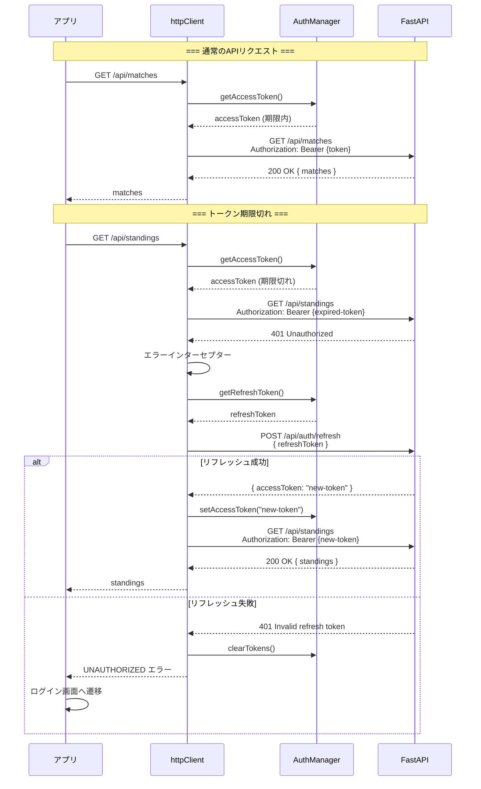
```mermaid
sequenceDiagram
    participant App as アプリ
    participant HC as httpClient
    participant AM as AuthManager
    participant API as FastAPI

    Note over App,API: === 通常のAPIリクエスト ===
    App->>HC: GET /api/matches

    HC->>AM: getAccessToken()
    AM-->>HC: accessToken (期限内)

    HC->>API: GET /api/matches<br/>Authorization: Bearer {token}
    API-->>HC: 200 OK { matches }
    HC-->>App: matches

    Note over App,API: === トークン期限切れ ===
    App->>HC: GET /api/standings

    HC->>AM: getAccessToken()
    AM-->>HC: accessToken (期限切れ)

    HC->>API: GET /api/standings<br/>Authorization: Bearer {expired-token}
    API-->>HC: 401 Unauthorized

    HC->>HC: エラーインターセプター

    HC->>AM: getRefreshToken()
    AM-->>HC: refreshToken

    HC->>API: POST /api/auth/refresh<br/>{ refreshToken }

    alt リフレッシュ成功
        API-->>HC: { accessToken: "new-token" }
        HC->>AM: setAccessToken("new-token")

        HC->>API: GET /api/standings<br/>Authorization: Bearer {new-token}
        API-->>HC: 200 OK { standings }
        HC-->>App: standings
    else リフレッシュ失敗
        API-->>HC: 401 Invalid refresh token
        HC->>AM: clearTokens()
        HC-->>App: UNAUTHORIZED エラー
        App->>App: ログイン画面へ遷移
    end
```

## 6.6 楽観的ロック競合検出

```mermaid
sequenceDiagram
    participant A as ユーザーA
    participant B as ユーザーB
    participant API as FastAPI
    participant DB as Database

    Note over A,DB: === 両者が同じ試合を取得 ===
    A->>API: GET /api/matches/1
    API->>DB: SELECT * FROM matches WHERE id = 1
    DB-->>API: { id: 1, score: "0-0", version: 3 }
    API-->>A: { version: 3, ... }

    B->>API: GET /api/matches/1
    API->>DB: SELECT * FROM matches WHERE id = 1
    DB-->>API: { id: 1, score: "0-0", version: 3 }
    API-->>B: { version: 3, ... }

    Note over A,DB: === ユーザーAが先に更新 ===
    A->>API: PUT /api/matches/1/score<br/>{ score: "1-0", version: 3 }

    API->>DB: BEGIN TRANSACTION
    API->>DB: SELECT version FROM matches<br/>WHERE id = 1 FOR UPDATE
    DB-->>API: version: 3

    API->>API: version == 3 → OK

    API->>DB: UPDATE matches SET<br/>score = "1-0",<br/>version = 4<br/>WHERE id = 1

    API->>DB: COMMIT
    API-->>A: 200 OK { version: 4 }

    Note over A,DB: === ユーザーBが後から更新（競合）===
    B->>API: PUT /api/matches/1/score<br/>{ score: "0-1", version: 3 }

    API->>DB: BEGIN TRANSACTION
    API->>DB: SELECT version FROM matches<br/>WHERE id = 1 FOR UPDATE
    DB-->>API: version: 4

    API->>API: version != 3 → 競合!

    API->>DB: ROLLBACK

    API-->>B: 409 Conflict<br/>{<br/>error: "VERSION_CONFLICT",<br/>currentVersion: 4,<br/>currentData: { score: "1-0" }<br/>}

    B->>B: 競合解決ダイアログ表示
```

---

# 7. 追加フローチャート

## 7.1 エラーハンドリングフロー

```mermaid
flowchart TD
    A[APIレスポンス] --> B{ステータスコード}

    B -->|2xx 成功| C[正常処理]

    B -->|400| D[AppError: BAD_REQUEST]
    D --> D1[入力エラー表示]

    B -->|401| E{トークン期限切れ?}
    E -->|Yes| F[トークン更新試行]
    F -->|成功| G[リトライ]
    F -->|失敗| H[ログアウト→ログイン画面]
    E -->|No| H

    B -->|403| I[AppError: FORBIDDEN]
    I --> I1[権限エラー表示]

    B -->|404| J[AppError: NOT_FOUND]
    J --> J1[リソースなし表示]

    B -->|409| K{競合タイプ}
    K -->|VERSION_CONFLICT| L[競合解決ダイアログ]
    K -->|LOCK_CONFLICT| M[編集中ユーザー表示]

    B -->|422| N[AppError: VALIDATION_ERROR]
    N --> N1[フィールドエラー表示]

    B -->|5xx| O[AppError: SERVER_ERROR]
    O --> O1[リトライボタン表示]

    B -->|ネットワークエラー| P[AppError: OFFLINE]
    P --> P1[オフラインキュー追加]
    P1 --> P2[オフラインバナー表示]
```

## 7.2 大会ライフサイクル管理

```mermaid
flowchart TD
    subgraph Preparation["📋 準備フェーズ"]
        A1[大会作成] --> A2[基本情報設定]
        A2 --> A3[グループ設定]
        A3 --> A4[会場設定]
    end

    subgraph Registration["👥 登録フェーズ"]
        B1[チーム登録] --> B2[選手登録]
        B2 --> B3[除外ペア設定]
        B3 --> B4[日程生成]
    end

    subgraph Tournament["⚽ 大会フェーズ"]
        C1[予選リーグ<br/>Day 1-2] --> C2[順位確定]
        C2 --> C3{同率あり?}
        C3 -->|Yes| C4[抽選]
        C3 -->|No| C5[最終日日程生成]
        C4 --> C5
        C5 --> C6[決勝トーナメント<br/>+ 研修試合<br/>Day 3]
    end

    subgraph Completion["📄 完了フェーズ"]
        D1[最終結果確定] --> D2[報告書生成]
        D2 --> D3[データエクスポート]
        D3 --> D4[アーカイブ]
    end

    Preparation --> Registration
    Registration --> Tournament
    Tournament --> Completion
```

## 7.3 権限チェックフロー

```mermaid
flowchart TD
    A[APIリクエスト] --> B{認証必要?}

    B -->|No| C[公開API処理]

    B -->|Yes| D[JWTトークン検証]
    D --> E{トークン有効?}
    E -->|No| F[401 Unauthorized]

    E -->|Yes| G[ユーザー情報取得]
    G --> H{権限チェック}

    H -->|require_admin| I{role == admin?}
    I -->|No| J[403 Forbidden]
    I -->|Yes| K[処理実行]

    H -->|require_venue_manager| L{role ∈ admin, venue_staff?}
    L -->|No| J
    L -->|Yes| M{会場チェック}
    M -->|自分の会場| K
    M -->|他会場 & admin| K
    M -->|他会場 & venue_staff| J

    H -->|認証のみ| K
```

---

# 8. データモデル図

## 8.1 ER図（詳細版）

```mermaid
erDiagram
    tournaments ||--o{ groups : has
    tournaments ||--o{ teams : has
    tournaments ||--o{ matches : has
    tournaments ||--o{ exclusion_pairs : has
    tournaments ||--o{ venues : has

    groups ||--o{ teams : contains
    groups ||--o{ matches : hosts
    groups ||--o{ standings : has

    teams ||--o{ players : has
    teams ||--o{ goals : scored_by
    teams ||--o{ standings : has

    matches ||--o{ goals : has

    users ||--o{ matches : entered_by

    tournaments {
        int id PK
        string name
        string slug UK
        int edition
        date start_date
        date end_date
        int num_groups
        int teams_per_group
        int match_duration
        int interval_minutes
        string status
        json settings
        int version
        datetime created_at
        datetime updated_at
    }

    groups {
        string id PK "A, B, C, D"
        int tournament_id FK
        int venue_id FK
    }

    teams {
        int id PK
        int tournament_id FK
        string name
        string short_name
        string team_type "local/invited"
        boolean is_venue_host
        string group_id FK
        int group_order
        string prefecture
        int version
    }

    players {
        int id PK
        int team_id FK
        int number
        string name
        string name_kana
        string name_normalized
    }

    matches {
        int id PK
        int tournament_id FK
        string group_id FK
        int venue_id FK
        int home_team_id FK
        int away_team_id FK
        date match_date
        time match_time
        int match_order
        string stage
        string status
        int home_score_half1
        int home_score_half2
        int home_score_total
        int away_score_half1
        int away_score_half2
        int away_score_total
        int home_pk
        int away_pk
        boolean has_penalty_shootout
        string approval_status
        int approved_by FK
        datetime approved_at
        string rejection_reason
        int entered_by FK
        datetime entered_at
        int version
    }

    goals {
        int id PK
        int match_id FK
        int team_id FK
        int player_id FK "NULL可"
        string scorer_name
        int minute
        int half
        boolean is_own_goal
    }

    standings {
        int id PK
        int tournament_id FK
        string group_id FK
        int team_id FK
        int rank
        int played
        int won
        int drawn
        int lost
        int goals_for
        int goals_against
        int goal_difference
        int points
        string rank_reason
        int version
        datetime calculated_at
    }

    exclusion_pairs {
        int id PK
        int tournament_id FK
        string group_id FK
        int team1_id FK
        int team2_id FK
        string reason
    }

    venues {
        int id PK
        int tournament_id FK
        string name
        string address
        string group_id
    }

    users {
        int id PK
        string username UK
        string password_hash
        string display_name
        string role
        int venue_id FK
        boolean is_active
        datetime created_at
    }
```
