# 浦和カップ - 現在の実装状況図

現在実装されているコードを分析して作成した図

---

# 1. 現在のシステムアーキテクチャ

## 1.1 全体構成

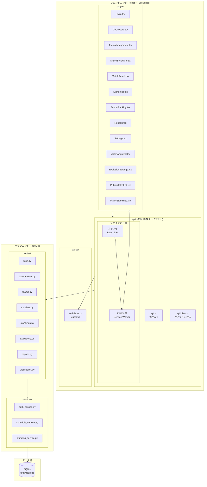
```mermaid
flowchart TB
    subgraph Client["クライアント層"]
        Browser[ブラウザ<br/>React SPA]
        PWA[PWA対応<br/>Service Worker]
    end

    subgraph Frontend["フロントエンド (React + TypeScript)"]
        subgraph Pages["pages/"]
            Login[Login.tsx]
            Dashboard[Dashboard.tsx]
            TeamMgmt[TeamManagement.tsx]
            MatchSchedule[MatchSchedule.tsx]
            MatchResult[MatchResult.tsx]
            Standings[Standings.tsx]
            ScorerRank[ScorerRanking.tsx]
            Reports[Reports.tsx]
            Settings[Settings.tsx]
            Approval[MatchApproval.tsx]
            Exclusion[ExclusionSettings.tsx]
            PubMatch[PublicMatchList.tsx]
            PubStand[PublicStandings.tsx]
        end

        subgraph API_Layer["api/ (現状: 複数クライアント)"]
            API_TS[api.ts<br/>汎用API]
            ApiClient[apiClient.ts<br/>オフライン対応]
            Client[client.ts<br/>matchApi用]
        end

        subgraph Stores["stores/"]
            AuthStore[authStore.ts<br/>Zustand]
        end
    end

    subgraph Backend["バックエンド (FastAPI)"]
        subgraph Routes["routes/"]
            AuthRoute[auth.py]
            TournRoute[tournaments.py]
            TeamRoute[teams.py]
            MatchRoute[matches.py]
            StandRoute[standings.py]
            ExclRoute[exclusions.py]
            ReportRoute[reports.py]
            WSRoute[websocket.py]
        end

        subgraph Services["services/"]
            AuthSvc[auth_service.py]
            ScheduleSvc[schedule_service.py]
            StandSvc[standing_service.py]
        end
    end

    subgraph Data["データ層"]
        SQLite[(SQLite<br/>urawacup.db)]
    end

    Browser --> PWA
    PWA --> Pages
    Pages --> API_Layer
    API_Layer --> AuthStore
    API_Layer --> Routes
    Routes --> Services
    Services --> SQLite
```

## 1.2 問題点: 複数HTTPクライアント

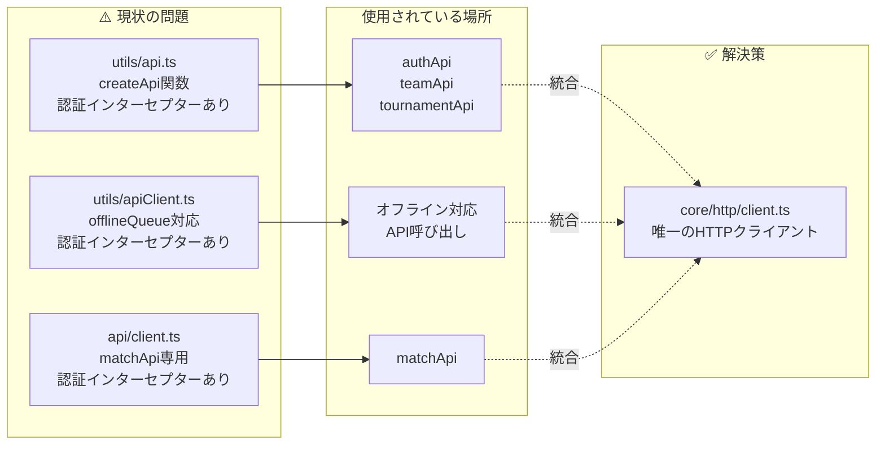
```mermaid
flowchart LR
    subgraph 問題["⚠️ 現状の問題"]
        direction TB
        A[utils/api.ts<br/>createApi関数<br/>認証インターセプターあり]
        B[utils/apiClient.ts<br/>offlineQueue対応<br/>認証インターセプターあり]
        C[api/client.ts<br/>matchApi専用<br/>認証インターセプターあり]
    end

    subgraph 使用箇所["使用されている場所"]
        D[authApi<br/>teamApi<br/>tournamentApi]
        E[オフライン対応<br/>API呼び出し]
        F[matchApi]
    end

    A --> D
    B --> E
    C --> F

    subgraph 解決策["✅ 解決策"]
        G[core/http/client.ts<br/>唯一のHTTPクライアント]
    end

    D -.->|統合| G
    E -.->|統合| G
    F -.->|統合| G
```

---

# 2. 認証フロー（実装済み）

## 2.1 ログイン処理

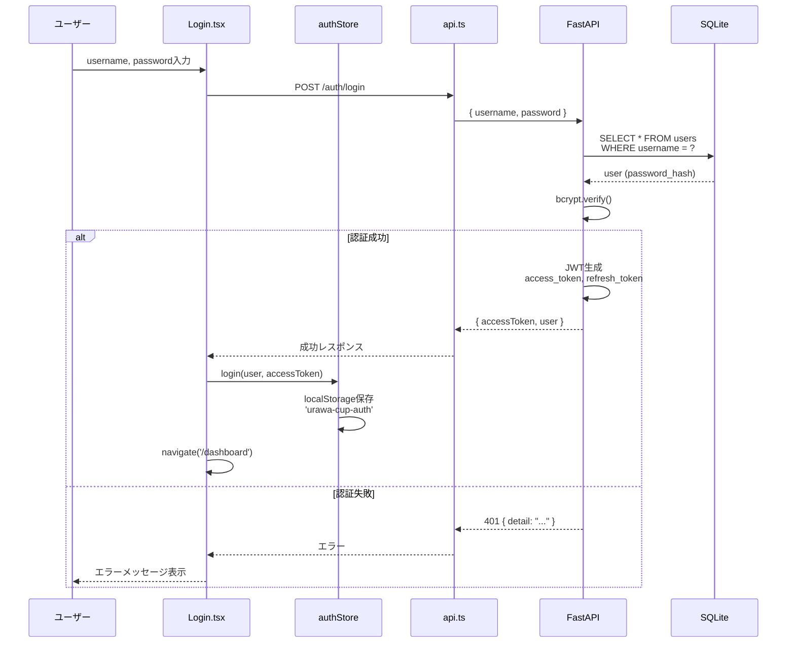
```mermaid
sequenceDiagram
    participant U as ユーザー
    participant L as Login.tsx
    participant AS as authStore
    participant API as api.ts
    participant BE as FastAPI
    participant DB as SQLite

    U->>L: username, password入力
    L->>API: POST /auth/login
    API->>BE: { username, password }

    BE->>DB: SELECT * FROM users<br/>WHERE username = ?
    DB-->>BE: user (password_hash)

    BE->>BE: bcrypt.verify()

    alt 認証成功
        BE->>BE: JWT生成<br/>access_token, refresh_token
        BE-->>API: { accessToken, user }
        API-->>L: 成功レスポンス
        L->>AS: login(user, accessToken)
        AS->>AS: localStorage保存<br/>'urawa-cup-auth'
        L->>L: navigate('/dashboard')
    else 認証失敗
        BE-->>API: 401 { detail: "..." }
        API-->>L: エラー
        L-->>U: エラーメッセージ表示
    end
```

## 2.2 認証状態管理

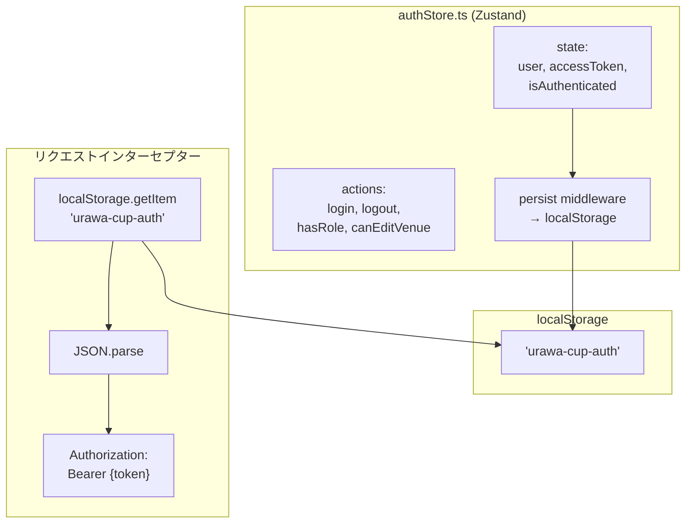
```mermaid
flowchart TD
    subgraph AuthStore["authStore.ts (Zustand)"]
        State[state:<br/>user, accessToken,<br/>isAuthenticated]
        Actions[actions:<br/>login, logout,<br/>hasRole, canEditVenue]
        Persist[persist middleware<br/>→ localStorage]
    end

    subgraph Storage["localStorage"]
        Key["'urawa-cup-auth'"]
    end

    subgraph Interceptor["リクエストインターセプター"]
        GetToken[localStorage.getItem<br/>'urawa-cup-auth']
        ParseJSON[JSON.parse]
        SetHeader["Authorization:<br/>Bearer {token}"]
    end

    State --> Persist
    Persist --> Key

    GetToken --> Key
    GetToken --> ParseJSON
    ParseJSON --> SetHeader
```

## 2.3 権限チェックフロー

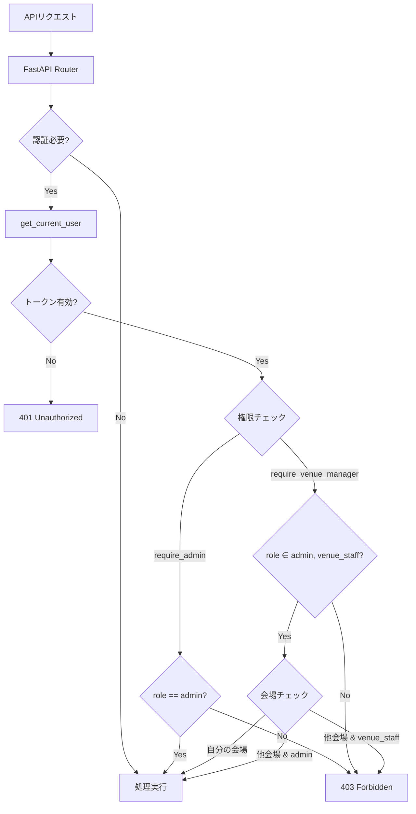
```mermaid
flowchart TD
    A[APIリクエスト] --> B[FastAPI Router]
    B --> C{認証必要?}

    C -->|No| D[処理実行]

    C -->|Yes| E[get_current_user]
    E --> F{トークン有効?}
    F -->|No| G[401 Unauthorized]

    F -->|Yes| H{権限チェック}

    H -->|require_admin| I{role == admin?}
    I -->|No| J[403 Forbidden]
    I -->|Yes| D

    H -->|require_venue_manager| K{role ∈ admin, venue_staff?}
    K -->|No| J
    K -->|Yes| L{会場チェック}
    L -->|自分の会場| D
    L -->|他会場 & admin| D
    L -->|他会場 & venue_staff| J
```

---

# 3. 試合結果入力フロー（実装済み）

## 3.1 結果入力シーケンス

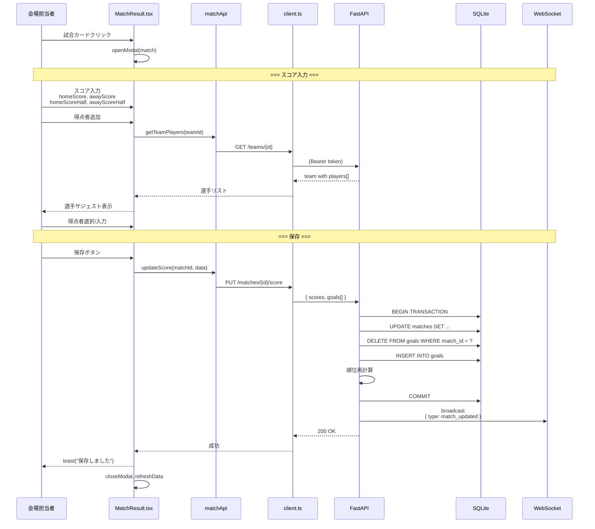
```mermaid
sequenceDiagram
    participant U as 会場担当者
    participant MR as MatchResult.tsx
    participant MA as matchApi
    participant CL as client.ts
    participant BE as FastAPI
    participant DB as SQLite
    participant WS as WebSocket

    U->>MR: 試合カードクリック
    MR->>MR: openModal(match)

    Note over U,WS: === スコア入力 ===
    U->>MR: スコア入力<br/>homeScore, awayScore<br/>homeScoreHalf, awayScoreHalf

    U->>MR: 得点者追加
    MR->>MA: getTeamPlayers(teamId)
    MA->>CL: GET /teams/{id}
    CL->>BE: (Bearer token)
    BE-->>CL: team with players[]
    CL-->>MR: 選手リスト
    MR-->>U: 選手サジェスト表示

    U->>MR: 得点者選択/入力

    Note over U,WS: === 保存 ===
    U->>MR: 保存ボタン
    MR->>MA: updateScore(matchId, data)
    MA->>CL: PUT /matches/{id}/score

    CL->>BE: { scores, goals[] }
    BE->>DB: BEGIN TRANSACTION
    BE->>DB: UPDATE matches SET ...
    BE->>DB: DELETE FROM goals WHERE match_id = ?
    BE->>DB: INSERT INTO goals

    BE->>BE: 順位再計算

    BE->>DB: COMMIT

    BE->>WS: broadcast<br/>{ type: match_updated }
    BE-->>CL: 200 OK
    CL-->>MR: 成功
    MR-->>U: toast("保存しました")
    MR->>MR: closeModal, refreshData
```

## 3.2 承認フロー

```mermaid
flowchart TD
    A[試合結果入力] --> B[status: pending_approval]
    B --> C[管理者に通知]

    C --> D[MatchApproval.tsx]
    D --> E{承認 or 却下}

    E -->|承認| F[POST /matches/{id}/approve]
    F --> G[status: approved]
    G --> H[順位表に反映]

    E -->|却下| I[POST /matches/{id}/reject<br/>{ reason: "..." }]
    I --> J[status: rejected]
    J --> K[会場担当者に通知]
    K --> L[修正後 resubmit]
    L --> B
```

---

# 4. 日程生成フロー（実装済み）

## 4.1 予選日程生成

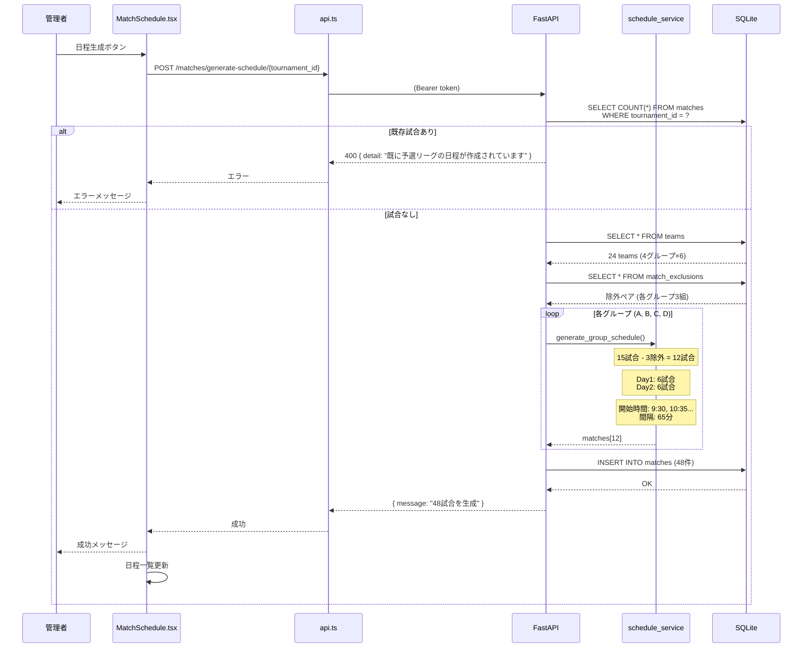
```mermaid
sequenceDiagram
    participant U as 管理者
    participant MS as MatchSchedule.tsx
    participant API as api.ts
    participant BE as FastAPI
    participant SG as schedule_service
    participant DB as SQLite

    U->>MS: 日程生成ボタン
    MS->>API: POST /matches/generate-schedule/{tournament_id}

    API->>BE: (Bearer token)

    BE->>DB: SELECT COUNT(*) FROM matches<br/>WHERE tournament_id = ?

    alt 既存試合あり
        BE-->>API: 400 { detail: "既に予選リーグの日程が作成されています" }
        API-->>MS: エラー
        MS-->>U: エラーメッセージ
    else 試合なし
        BE->>DB: SELECT * FROM teams
        DB-->>BE: 24 teams (4グループ×6)

        BE->>DB: SELECT * FROM match_exclusions
        DB-->>BE: 除外ペア (各グループ3組)

        loop 各グループ (A, B, C, D)
            BE->>SG: generate_group_schedule()
            Note over SG: 15試合 - 3除外 = 12試合
            Note over SG: Day1: 6試合<br/>Day2: 6試合
            Note over SG: 開始時間: 9:30, 10:35...<br/>間隔: 65分
            SG-->>BE: matches[12]
        end

        BE->>DB: INSERT INTO matches (48件)
        DB-->>BE: OK

        BE-->>API: { message: "48試合を生成" }
        API-->>MS: 成功
        MS-->>U: 成功メッセージ
        MS->>MS: 日程一覧更新
    end
```

## 4.2 除外ペア設定

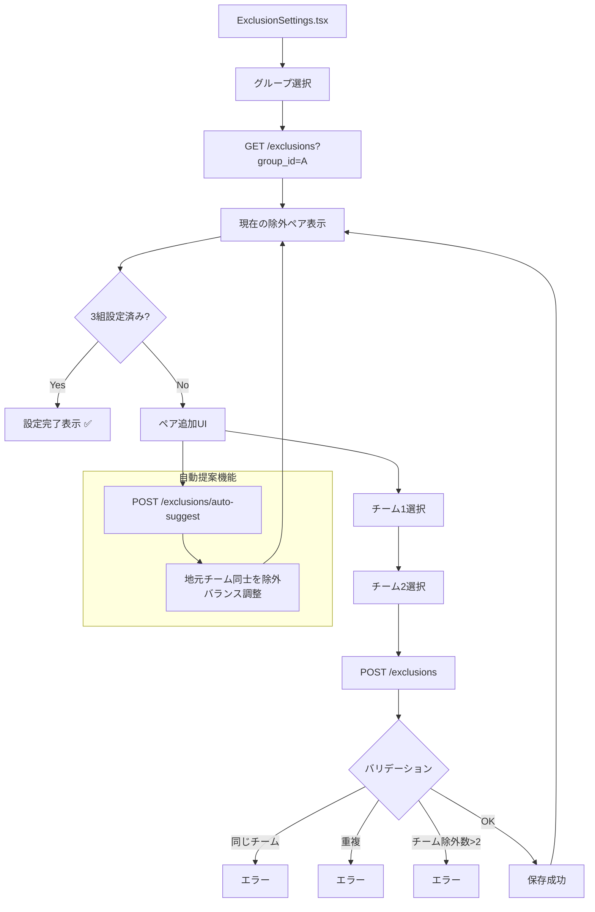
```mermaid
flowchart TD
    A[ExclusionSettings.tsx] --> B[グループ選択]
    B --> C[GET /exclusions?group_id=A]
    C --> D[現在の除外ペア表示]

    D --> E{3組設定済み?}
    E -->|Yes| F[設定完了表示 ✅]

    E -->|No| G[ペア追加UI]
    G --> H[チーム1選択]
    H --> I[チーム2選択]
    I --> J[POST /exclusions]

    J --> K{バリデーション}
    K -->|同じチーム| L[エラー]
    K -->|重複| M[エラー]
    K -->|チーム除外数>2| N[エラー]
    K -->|OK| O[保存成功]
    O --> D

    subgraph AutoSuggest["自動提案機能"]
        P[POST /exclusions/auto-suggest]
        Q[地元チーム同士を除外<br/>バランス調整]
    end

    G --> P
    P --> Q
    Q --> D
```

---

# 5. 順位計算フロー（実装済み）

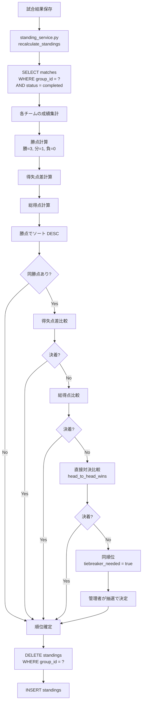
```mermaid
flowchart TD
    A[試合結果保存] --> B[standing_service.py<br/>recalculate_standings]

    B --> C[SELECT matches<br/>WHERE group_id = ?<br/>AND status = completed]

    C --> D[各チームの成績集計]

    D --> E[勝点計算<br/>勝=3, 分=1, 負=0]
    E --> F[得失点差計算]
    F --> G[総得点計算]

    G --> H[勝点でソート DESC]

    H --> I{同勝点あり?}
    I -->|No| J[順位確定]

    I -->|Yes| K[得失点差比較]
    K --> L{決着?}
    L -->|Yes| J

    L -->|No| M[総得点比較]
    M --> N{決着?}
    N -->|Yes| J

    N -->|No| O[直接対決比較<br/>head_to_head_wins]
    O --> P{決着?}
    P -->|Yes| J
    P -->|No| Q[同順位<br/>tiebreaker_needed = true]

    Q --> R[管理者が抽選で決定]
    R --> J

    J --> S[DELETE standings<br/>WHERE group_id = ?]
    S --> T[INSERT standings]
```

---

# 6. データベース構造（実装済み）

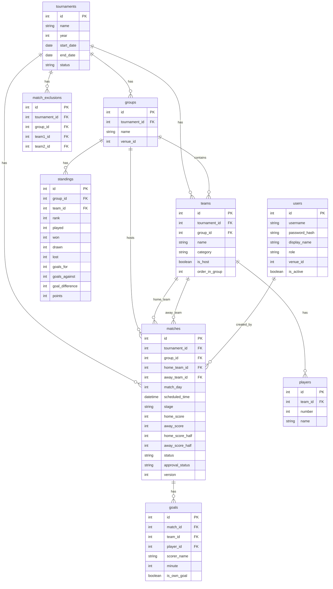
```mermaid
erDiagram
    tournaments ||--o{ groups : has
    tournaments ||--o{ teams : has
    tournaments ||--o{ matches : has
    tournaments ||--o{ match_exclusions : has

    groups ||--o{ teams : contains
    groups ||--o{ matches : hosts
    groups ||--o{ standings : has

    teams ||--o{ players : has
    teams ||--o{ matches : "home_team"
    teams ||--o{ matches : "away_team"

    matches ||--o{ goals : has

    users ||--o{ matches : "created_by"

    tournaments {
        int id PK
        string name
        int year
        date start_date
        date end_date
        string status
    }

    groups {
        int id PK
        int tournament_id FK
        string name
        int venue_id
    }

    teams {
        int id PK
        int tournament_id FK
        int group_id FK
        string name
        string category
        boolean is_host
        int order_in_group
    }

    players {
        int id PK
        int team_id FK
        int number
        string name
    }

    matches {
        int id PK
        int tournament_id FK
        int group_id FK
        int home_team_id FK
        int away_team_id FK
        int match_day
        datetime scheduled_time
        string stage
        int home_score
        int away_score
        int home_score_half
        int away_score_half
        string status
        string approval_status
        int version
    }

    goals {
        int id PK
        int match_id FK
        int team_id FK
        int player_id FK
        string scorer_name
        int minute
        boolean is_own_goal
    }

    standings {
        int id PK
        int group_id FK
        int team_id FK
        int rank
        int played
        int won
        int drawn
        int lost
        int goals_for
        int goals_against
        int goal_difference
        int points
    }

    match_exclusions {
        int id PK
        int tournament_id FK
        int group_id FK
        int team1_id FK
        int team2_id FK
    }

    users {
        int id PK
        string username
        string password_hash
        string display_name
        string role
        int venue_id
        boolean is_active
    }
```

---

# 7. 画面遷移（実装済み）

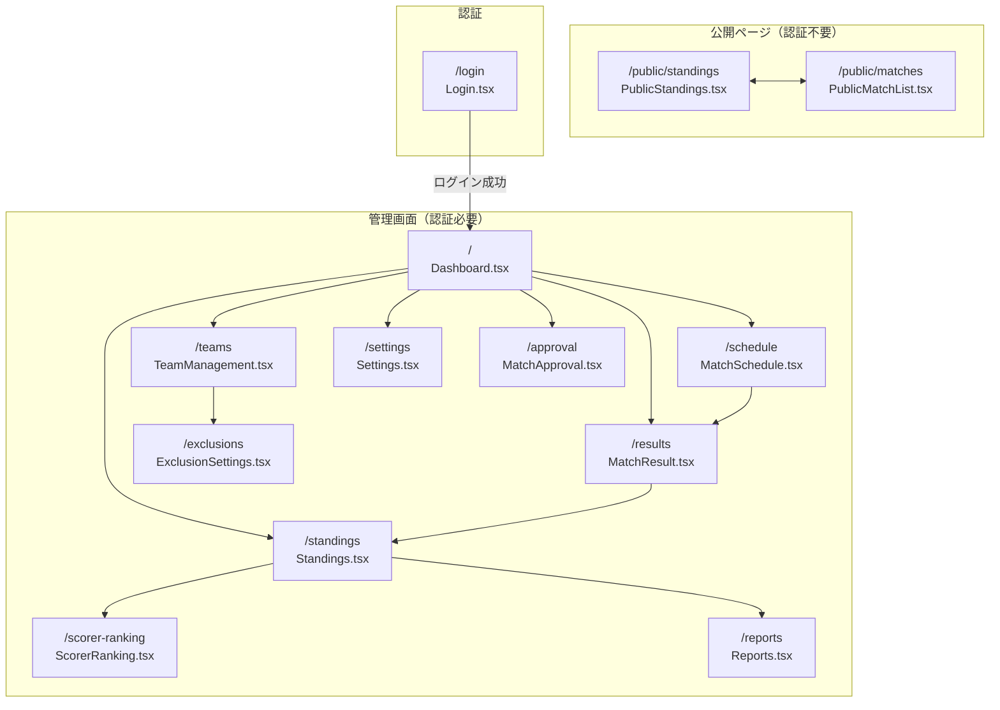
```mermaid
flowchart TD
    subgraph Public["公開ページ（認証不要）"]
        P1["/public/standings<br/>PublicStandings.tsx"]
        P2["/public/matches<br/>PublicMatchList.tsx"]
        P1 <--> P2
    end

    subgraph Auth["認証"]
        L["/login<br/>Login.tsx"]
    end

    subgraph Admin["管理画面（認証必要）"]
        A1["/<br/>Dashboard.tsx"]
        A2["/teams<br/>TeamManagement.tsx"]
        A3["/schedule<br/>MatchSchedule.tsx"]
        A4["/results<br/>MatchResult.tsx"]
        A5["/standings<br/>Standings.tsx"]
        A6["/scorer-ranking<br/>ScorerRanking.tsx"]
        A7["/reports<br/>Reports.tsx"]
        A8["/settings<br/>Settings.tsx"]
        A9["/approval<br/>MatchApproval.tsx"]
        A10["/exclusions<br/>ExclusionSettings.tsx"]
    end

    L -->|ログイン成功| A1

    A1 --> A2
    A1 --> A3
    A1 --> A4
    A1 --> A5
    A1 --> A9

    A2 --> A10
    A3 --> A4
    A4 --> A5
    A5 --> A6
    A5 --> A7
    A1 --> A8
```

---

# 8. オフライン対応（実装済み）

## 8.1 オフラインキュー

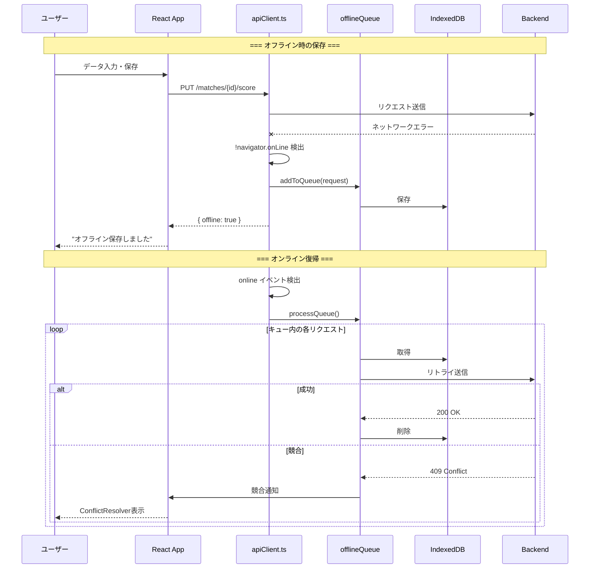
```mermaid
sequenceDiagram
    participant U as ユーザー
    participant App as React App
    participant AC as apiClient.ts
    participant OQ as offlineQueue
    participant IDB as IndexedDB
    participant BE as Backend

    Note over U,BE: === オフライン時の保存 ===
    U->>App: データ入力・保存
    App->>AC: PUT /matches/{id}/score

    AC->>BE: リクエスト送信
    BE--xAC: ネットワークエラー

    AC->>AC: !navigator.onLine 検出
    AC->>OQ: addToQueue(request)
    OQ->>IDB: 保存
    AC-->>App: { offline: true }
    App-->>U: "オフライン保存しました"

    Note over U,BE: === オンライン復帰 ===
    AC->>AC: online イベント検出
    AC->>OQ: processQueue()

    loop キュー内の各リクエスト
        OQ->>IDB: 取得
        OQ->>BE: リトライ送信

        alt 成功
            BE-->>OQ: 200 OK
            OQ->>IDB: 削除
        else 競合
            BE-->>OQ: 409 Conflict
            OQ->>App: 競合通知
            App-->>U: ConflictResolver表示
        end
    end
```

## 8.2 PWA構成

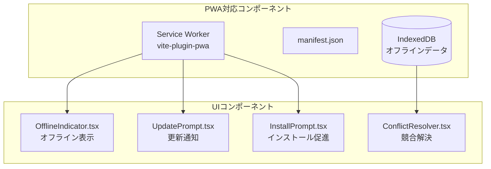
```mermaid
flowchart TB
    subgraph PWA["PWA対応コンポーネント"]
        SW[Service Worker<br/>vite-plugin-pwa]
        Manifest[manifest.json]
        IDB[(IndexedDB<br/>オフラインデータ)]
    end

    subgraph Components["UIコンポーネント"]
        OI[OfflineIndicator.tsx<br/>オフライン表示]
        UP[UpdatePrompt.tsx<br/>更新通知]
        IP[InstallPrompt.tsx<br/>インストール促進]
        CR[ConflictResolver.tsx<br/>競合解決]
    end

    SW --> OI
    SW --> UP
    SW --> IP
    IDB --> CR
```

---

# 9. WebSocket リアルタイム通知（実装済み）

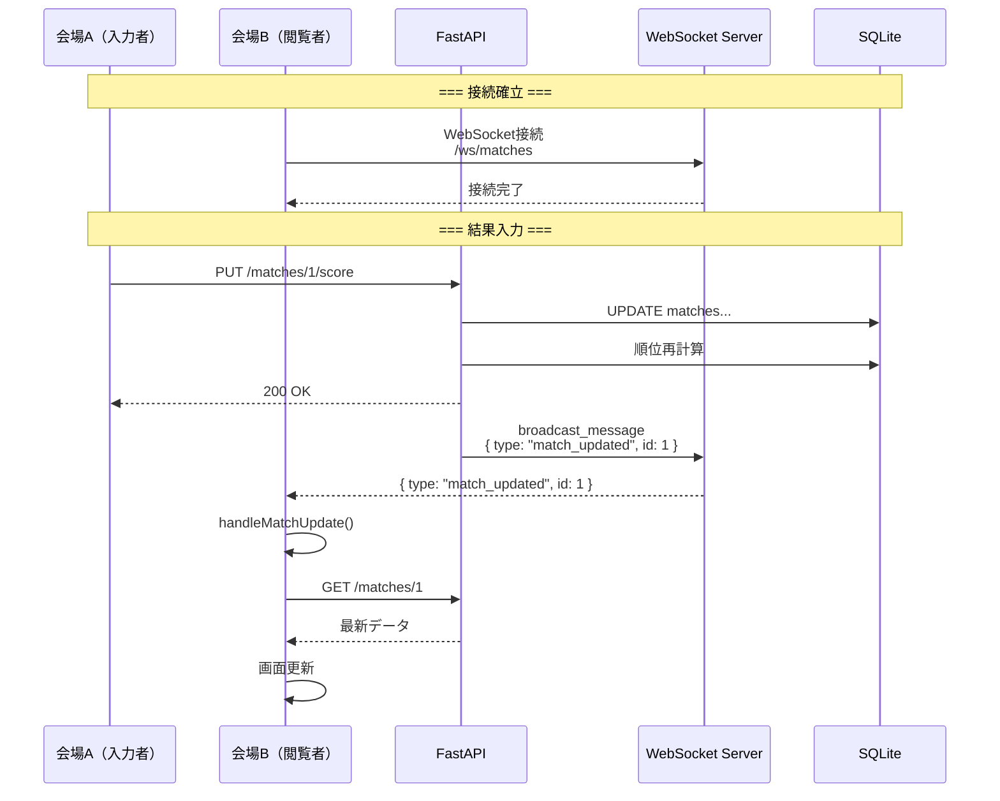
```mermaid
sequenceDiagram
    participant A as 会場A（入力者）
    participant B as 会場B（閲覧者）
    participant BE as FastAPI
    participant WS as WebSocket Server
    participant DB as SQLite

    Note over A,DB: === 接続確立 ===
    B->>WS: WebSocket接続<br/>/ws/matches
    WS-->>B: 接続完了

    Note over A,DB: === 結果入力 ===
    A->>BE: PUT /matches/1/score
    BE->>DB: UPDATE matches...
    BE->>DB: 順位再計算
    BE-->>A: 200 OK

    BE->>WS: broadcast_message<br/>{ type: "match_updated", id: 1 }

    WS-->>B: { type: "match_updated", id: 1 }
    B->>B: handleMatchUpdate()
    B->>BE: GET /matches/1
    BE-->>B: 最新データ
    B->>B: 画面更新
```

---

# 10. エラーハンドリング（現状）

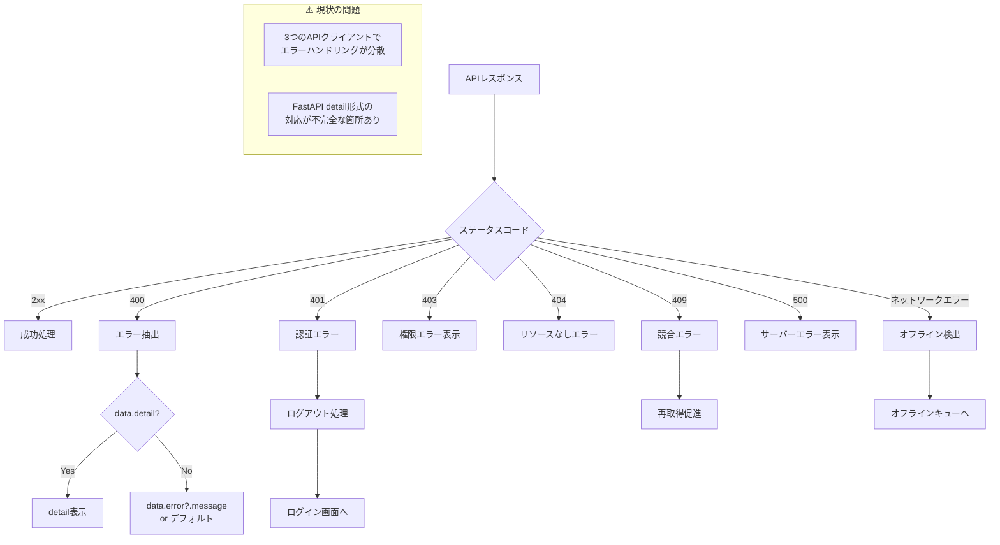
```mermaid
flowchart TD
    A[APIレスポンス] --> B{ステータスコード}

    B -->|2xx| C[成功処理]

    B -->|400| D[エラー抽出]
    D --> E{data.detail?}
    E -->|Yes| F[detail表示]
    E -->|No| G[data.error?.message<br/>or デフォルト]

    B -->|401| H[認証エラー]
    H --> I[ログアウト処理]
    I --> J[ログイン画面へ]

    B -->|403| K[権限エラー表示]

    B -->|404| L[リソースなしエラー]

    B -->|409| M[競合エラー]
    M --> N[再取得促進]

    B -->|500| O[サーバーエラー表示]

    B -->|ネットワークエラー| P[オフライン検出]
    P --> Q[オフラインキューへ]

    subgraph 問題点["⚠️ 現状の問題"]
        R[3つのAPIクライアントで<br/>エラーハンドリングが分散]
        S[FastAPI detail形式の<br/>対応が不完全な箇所あり]
    end
```

---

# 11. 実装済み機能一覧

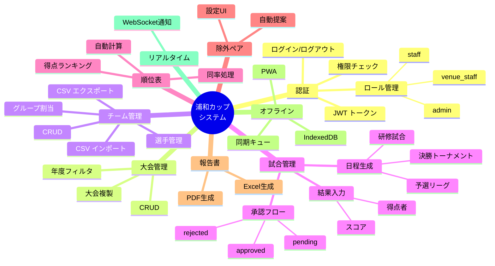
```mermaid
mindmap
  root((浦和カップ<br/>システム))
    認証
      ログイン/ログアウト
      JWT トークン
      ロール管理
        admin
        venue_staff
        staff
      権限チェック
    大会管理
      CRUD
      年度フィルタ
      大会複製
    チーム管理
      CRUD
      グループ割当
      CSV インポート
      CSV エクスポート
      選手管理
    試合管理
      日程生成
        予選リーグ
        研修試合
        決勝トーナメント
      結果入力
        スコア
        得点者
      承認フロー
        pending
        approved
        rejected
    順位表
      自動計算
      同率処理
      得点ランキング
    除外ペア
      設定UI
      自動提案
    報告書
      PDF生成
      Excel生成
    オフライン
      PWA
      IndexedDB
      同期キュー
    リアルタイム
      WebSocket通知
```

---

# 12. 詳細ファイル構成（実装済み）

## 12.1 フロントエンドファイル構成

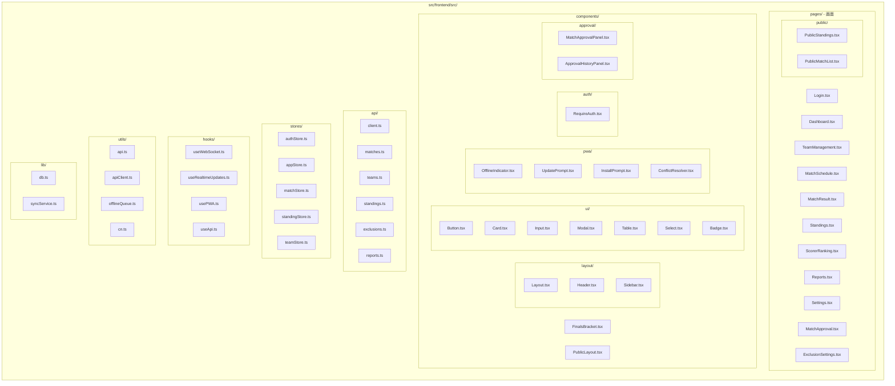
```mermaid
flowchart TB
    subgraph Frontend["src/frontend/src/"]
        direction TB

        subgraph Pages["pages/ - 画面"]
            P1[Login.tsx]
            P2[Dashboard.tsx]
            P3[TeamManagement.tsx]
            P4[MatchSchedule.tsx]
            P5[MatchResult.tsx]
            P6[Standings.tsx]
            P7[ScorerRanking.tsx]
            P8[Reports.tsx]
            P9[Settings.tsx]
            P10[MatchApproval.tsx]
            P11[ExclusionSettings.tsx]

            subgraph Public["public/"]
                PP1[PublicStandings.tsx]
                PP2[PublicMatchList.tsx]
            end
        end

        subgraph Components["components/"]
            subgraph Layout["layout/"]
                CL1[Layout.tsx]
                CL2[Header.tsx]
                CL3[Sidebar.tsx]
            end

            subgraph UI["ui/"]
                CU1[Button.tsx]
                CU2[Card.tsx]
                CU3[Input.tsx]
                CU4[Modal.tsx]
                CU5[Table.tsx]
                CU6[Select.tsx]
                CU7[Badge.tsx]
            end

            subgraph PWA["pwa/"]
                CP1[OfflineIndicator.tsx]
                CP2[UpdatePrompt.tsx]
                CP3[InstallPrompt.tsx]
                CP4[ConflictResolver.tsx]
            end

            subgraph Auth["auth/"]
                CA1[RequireAuth.tsx]
            end

            subgraph Approval["approval/"]
                CAP1[MatchApprovalPanel.tsx]
                CAP2[ApprovalHistoryPanel.tsx]
            end

            C1[FinalsBracket.tsx]
            C2[PublicLayout.tsx]
        end

        subgraph API["api/"]
            A1[client.ts]
            A2[matches.ts]
            A3[teams.ts]
            A4[standings.ts]
            A5[exclusions.ts]
            A6[reports.ts]
        end

        subgraph Stores["stores/"]
            S1[authStore.ts]
            S2[appStore.ts]
            S3[matchStore.ts]
            S4[standingStore.ts]
            S5[teamStore.ts]
        end

        subgraph Hooks["hooks/"]
            H1[useWebSocket.ts]
            H2[useRealtimeUpdates.ts]
            H3[usePWA.ts]
            H4[useApi.ts]
        end

        subgraph Utils["utils/"]
            U1[api.ts]
            U2[apiClient.ts]
            U3[offlineQueue.ts]
            U4[cn.ts]
        end

        subgraph Lib["lib/"]
            L1[db.ts]
            L2[syncService.ts]
        end
    end
```

## 12.2 バックエンドファイル構成

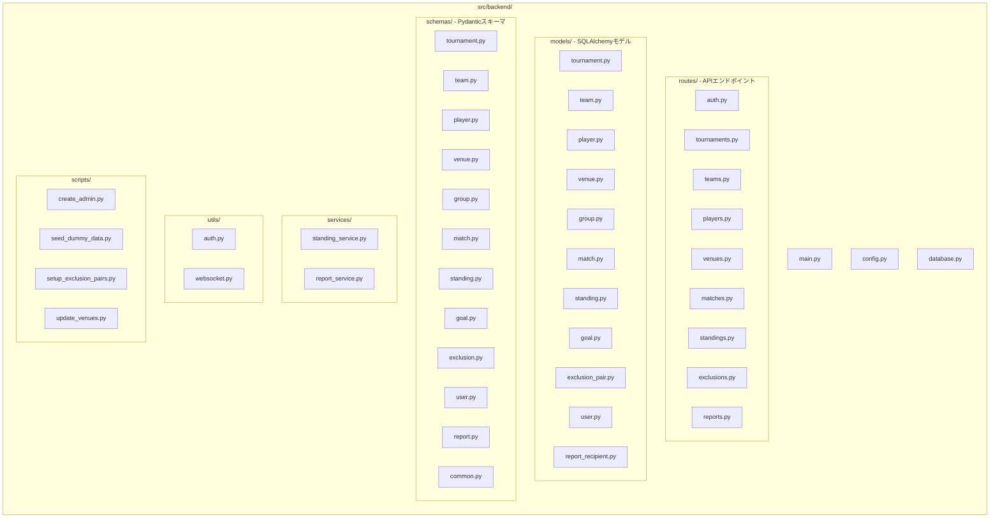
```mermaid
flowchart TB
    subgraph Backend["src/backend/"]
        direction TB

        subgraph Routes["routes/ - APIエンドポイント"]
            R1[auth.py]
            R2[tournaments.py]
            R3[teams.py]
            R4[players.py]
            R5[venues.py]
            R6[matches.py]
            R7[standings.py]
            R8[exclusions.py]
            R9[reports.py]
        end

        subgraph Models["models/ - SQLAlchemyモデル"]
            M1[tournament.py]
            M2[team.py]
            M3[player.py]
            M4[venue.py]
            M5[group.py]
            M6[match.py]
            M7[standing.py]
            M8[goal.py]
            M9[exclusion_pair.py]
            M10[user.py]
            M11[report_recipient.py]
        end

        subgraph Schemas["schemas/ - Pydanticスキーマ"]
            SC1[tournament.py]
            SC2[team.py]
            SC3[player.py]
            SC4[venue.py]
            SC5[group.py]
            SC6[match.py]
            SC7[standing.py]
            SC8[goal.py]
            SC9[exclusion.py]
            SC10[user.py]
            SC11[report.py]
            SC12[common.py]
        end

        subgraph Services["services/"]
            SV1[standing_service.py]
            SV2[report_service.py]
        end

        subgraph Utils["utils/"]
            UT1[auth.py]
            UT2[websocket.py]
        end

        subgraph Scripts["scripts/"]
            SP1[create_admin.py]
            SP2[seed_dummy_data.py]
            SP3[setup_exclusion_pairs.py]
            SP4[update_venues.py]
        end

        Main[main.py]
        Config[config.py]
        Database[database.py]
    end
```

---

# 13. 推奨アーキテクチャ（SystemDesign_v2.md準拠）

## 13.1 推奨Core構成

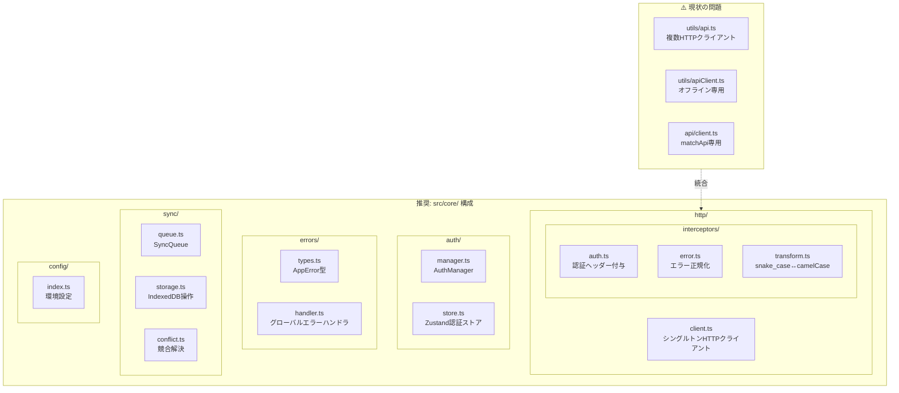
```mermaid
flowchart TB
    subgraph RecommendedCore["推奨: src/core/ 構成"]
        direction TB

        subgraph HTTP["http/"]
            HC[client.ts<br/>シングルトンHTTPクライアント]
            subgraph Interceptors["interceptors/"]
                INT1[auth.ts<br/>認証ヘッダー付与]
                INT2[error.ts<br/>エラー正規化]
                INT3[transform.ts<br/>snake_case↔camelCase]
            end
        end

        subgraph Auth["auth/"]
            AM[manager.ts<br/>AuthManager]
            AS[store.ts<br/>Zustand認証ストア]
        end

        subgraph Errors["errors/"]
            ET[types.ts<br/>AppError型]
            EH[handler.ts<br/>グローバルエラーハンドラ]
        end

        subgraph Sync["sync/"]
            SQ[queue.ts<br/>SyncQueue]
            SS[storage.ts<br/>IndexedDB操作]
            SC[conflict.ts<br/>競合解決]
        end

        subgraph Config["config/"]
            CFG[index.ts<br/>環境設定]
        end
    end

    subgraph CurrentIssue["⚠️ 現状の問題"]
        CI1[utils/api.ts<br/>複数HTTPクライアント]
        CI2[utils/apiClient.ts<br/>オフライン専用]
        CI3[api/client.ts<br/>matchApi専用]
    end

    CurrentIssue -.->|統合| HTTP
```

## 13.2 マイグレーション計画

```mermaid
flowchart TD
    subgraph Phase1["Phase 1: Core基盤構築"]
        A1[core/http/client.ts 作成]
        A2[core/auth/manager.ts 作成]
        A3[core/errors/types.ts 作成]
    end

    subgraph Phase2["Phase 2: Interceptor実装"]
        B1[認証インターセプター]
        B2[エラーインターセプター]
        B3[変換インターセプター]
    end

    subgraph Phase3["Phase 3: 既存コード移行"]
        C1[utils/api.ts 削除]
        C2[utils/apiClient.ts 削除]
        C3[api/client.ts 削除]
        C4[全API呼び出しをcore経由に]
    end

    subgraph Phase4["Phase 4: Feature Module化"]
        D1[features/teams/ 作成]
        D2[features/matches/ 作成]
        D3[features/standings/ 作成]
    end

    Phase1 --> Phase2
    Phase2 --> Phase3
    Phase3 --> Phase4
```

---

# 14. 得点ランキング実装状況

## 14.1 実装済みコンポーネント

```mermaid
flowchart TB
    subgraph Backend["バックエンド（実装済み）"]
        API[GET /standings/top-scorers]
        SVC[standing_service.py<br/>get_top_scorers()]
        DB[(goals + matches + teams)]

        API --> SVC
        SVC --> DB
    end

    subgraph Frontend["フロントエンド（実装済み）"]
        Page[ScorerRanking.tsx]
        Store[standingStore.ts]
        API_FE[api/standings.ts]

        Page --> Store
        Store --> API_FE
        API_FE --> API
    end
```

## 14.2 得点ランキングデータフロー

```mermaid
sequenceDiagram
    participant U as ユーザー
    participant P as ScorerRanking.tsx
    participant S as standingStore
    participant API as standings API
    participant BE as FastAPI
    participant DB as SQLite

    U->>P: ページアクセス
    P->>S: fetchTopScorers()
    S->>API: getTopScorers(tournamentId, limit)
    API->>BE: GET /standings/top-scorers

    BE->>DB: SELECT g.scorer_name, g.team_id,<br/>COUNT(*) as goals<br/>FROM goals g<br/>JOIN matches m ON g.match_id = m.id<br/>WHERE m.tournament_id = ?<br/>GROUP BY g.scorer_name, g.team_id<br/>ORDER BY goals DESC<br/>LIMIT ?

    DB-->>BE: ランキングデータ
    BE-->>API: TopScorer[]
    API-->>S: データ格納
    S-->>P: 再レンダリング
    P-->>U: ランキング表示
```

---

# 15. 承認フロー実装状況

## 15.1 実装済みコンポーネント

```mermaid
flowchart TB
    subgraph Backend["バックエンド"]
        M[Match モデル<br/>approval_status<br/>approved_by<br/>approved_at]
        R1[POST /matches/:id/approve]
        R2[POST /matches/:id/reject]
        R3[GET /matches/pending-approval]
    end

    subgraph Frontend["フロントエンド"]
        P1[MatchApproval.tsx]
        C1[MatchApprovalPanel.tsx]
        C2[ApprovalHistoryPanel.tsx]
    end

    P1 --> C1
    P1 --> C2
    C1 --> R1
    C1 --> R2
    C1 --> R3
```

## 15.2 承認ステータス遷移

```mermaid
stateDiagram-v2
    [*] --> scheduled: 試合作成
    scheduled --> completed: 結果入力
    completed --> pending: 会場担当者が保存
    pending --> approved: 管理者が承認
    pending --> rejected: 管理者が却下
    rejected --> pending: 修正後再送信
    approved --> [*]: 完了

    note right of pending
        approval_status = 'pending'
        承認待ちバッジ表示
    end note

    note right of approved
        approval_status = 'approved'
        順位表に反映
    end note

    note right of rejected
        approval_status = 'rejected'
        rejection_reason が設定される
    end note
```
