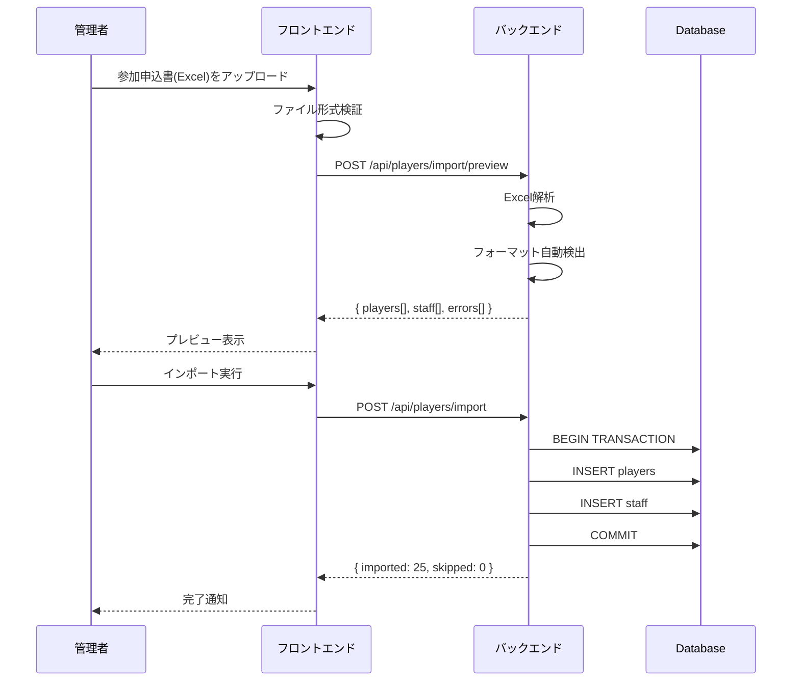
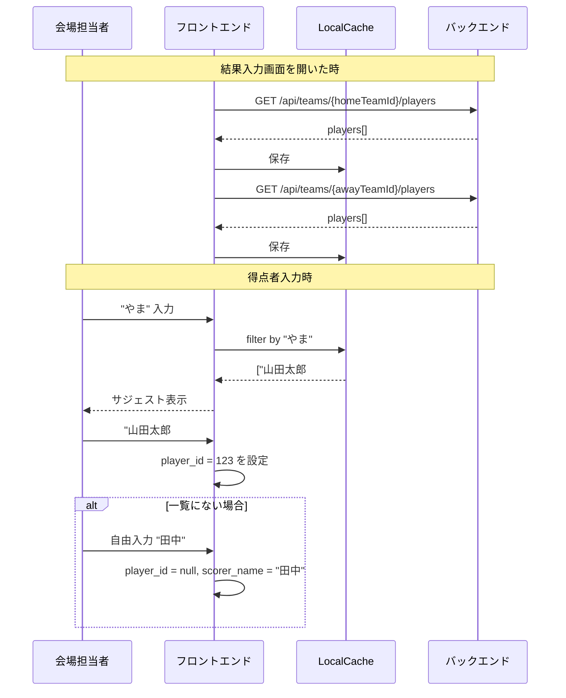
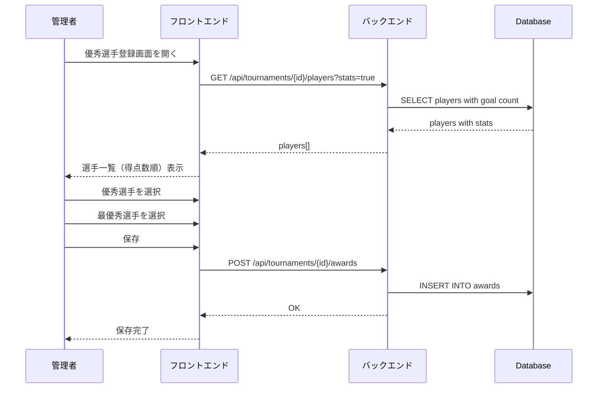
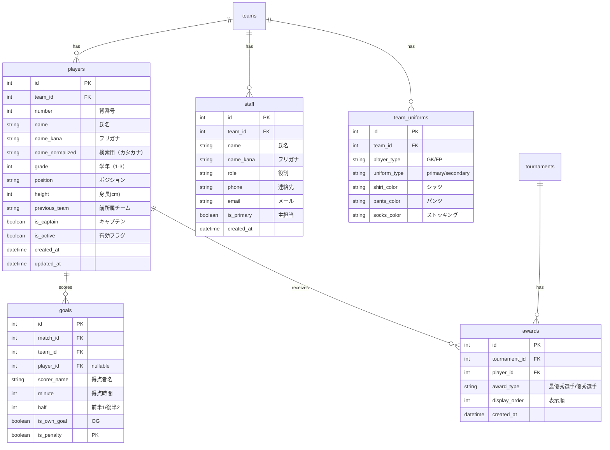
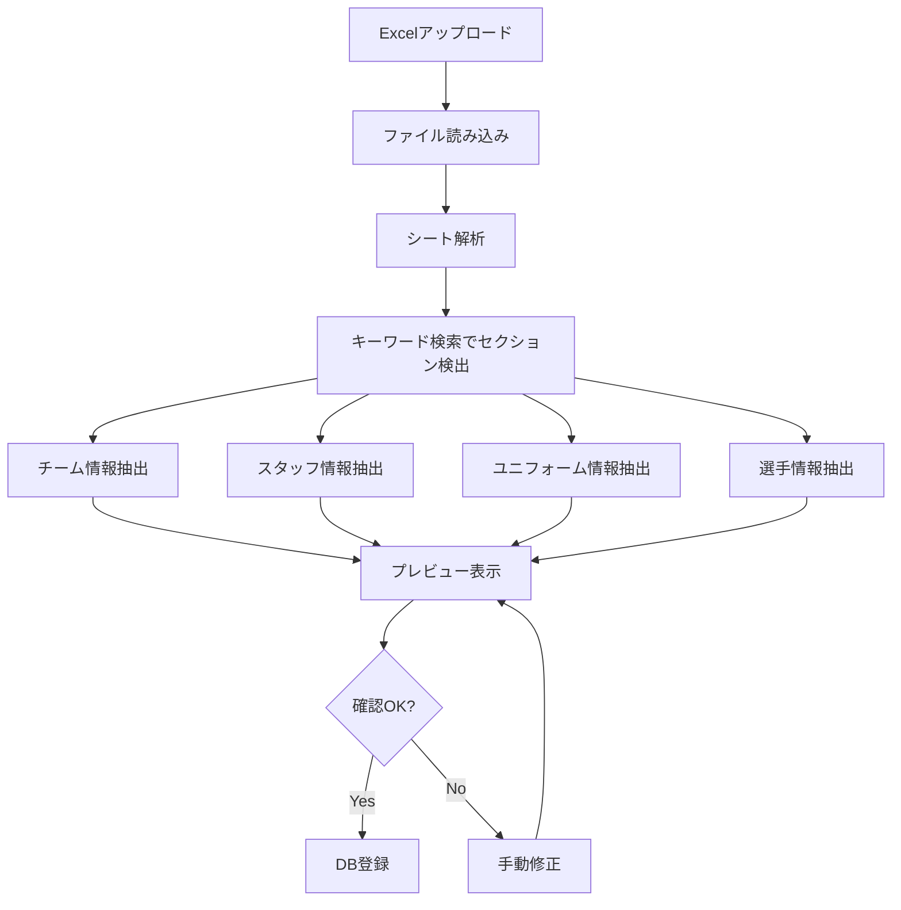
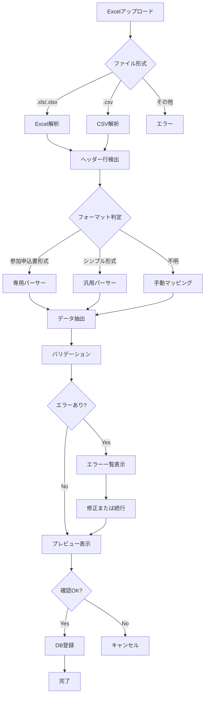
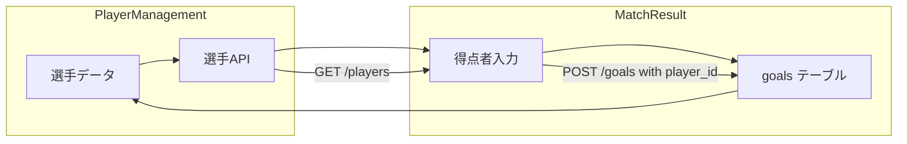
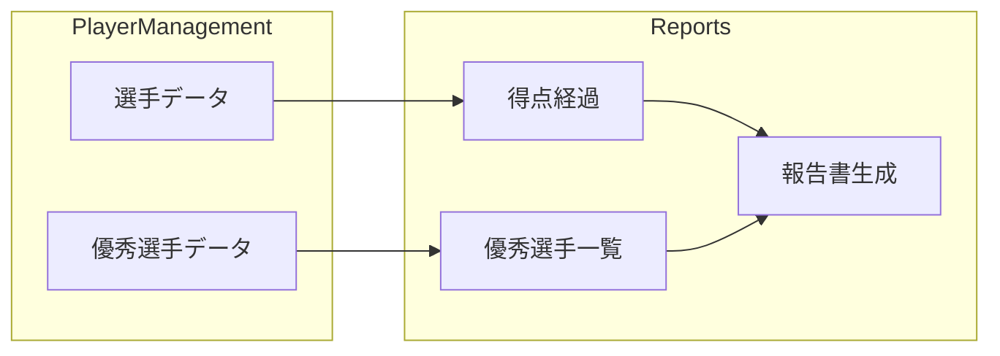
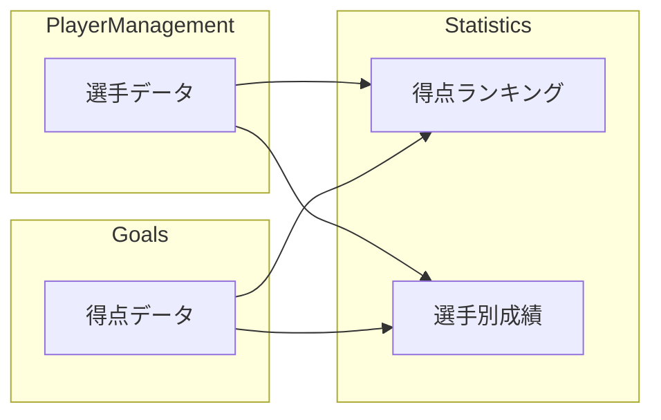

# TournaMate - 選手管理モジュール 仕様書

**モジュール名**: PlayerManagement  
**バージョン**: 1.0  
**作成日**: 2026-01-02  
**ステータス**: 設計中

---

# 目次

1. [概要](#1-概要)
2. [機能要件](#2-機能要件)
3. [データ設計](#3-データ設計)
4. [インポート仕様](#4-インポート仕様)
5. [画面設計](#5-画面設計)
6. [API設計](#6-api設計)
7. [他モジュールとの連携](#7-他モジュールとの連携)
8. [実装計画](#8-実装計画)

---

# 1. 概要

## 1.1 目的

チームに紐づく選手を登録・管理し、以下の機能で活用する：

- **結果入力画面**: 得点者をサジェストから選択
- **報告書出力**: 優秀選手の記載
- **統計機能**: 得点ランキング等（将来）

## 1.2 スコープ

| 機能 | v1.0 | v1.1（将来） |
|------|------|-------------|
| 選手の登録・編集・削除 | ✅ | ✅ |
| Excel/CSVからの一括インポート | ✅ | ✅ |
| 参加申込書形式のインポート | ✅ | ✅ |
| 得点者サジェスト | ✅ | ✅ |
| 優秀選手登録 | ✅ | ✅ |
| 得点ランキング | - | ✅ |
| 選手写真管理 | - | ✅ |
| ベンチ入り管理 | - | ✅ |

## 1.3 用語定義

| 用語 | 定義 |
|------|------|
| 選手（Player） | チームに所属する個人 |
| 背番号（Number） | 選手の識別番号（1〜99） |
| フリガナ（Kana） | 氏名の読み（サジェスト用） |
| スタッフ（Staff） | 監督、コーチ等（選手とは別管理） |
| 参加申込書 | 各チームから提出される選手一覧Excel |

---

# 2. 機能要件

## 2.1 機能一覧

### 選手管理（CRUD）

| ID | 機能 | 説明 | 優先度 |
|----|------|------|--------|
| PM-01 | 選手一覧表示 | チーム別の選手一覧 | 必須 |
| PM-02 | 選手登録 | 個別の選手登録 | 必須 |
| PM-03 | 選手編集 | 選手情報の編集 | 必須 |
| PM-04 | 選手削除 | 選手の削除（論理削除） | 必須 |
| PM-05 | 選手検索 | 名前、背番号での検索 | 必須 |

### インポート

| ID | 機能 | 説明 | 優先度 |
|----|------|------|--------|
| PM-10 | CSVインポート | シンプルなCSV形式 | 必須 |
| PM-11 | Excelインポート | 参加申込書形式（.xls, .xlsx） | 必須 |
| PM-12 | インポートプレビュー | 取り込み前の確認画面 | 必須 |
| PM-13 | エラーハンドリング | 不正データの検出・スキップ | 必須 |
| PM-14 | 差分インポート | 既存データとの差分表示 | 推奨 |

### スタッフ管理

| ID | 機能 | 説明 | 優先度 |
|----|------|------|--------|
| PM-20 | スタッフ登録 | 監督、コーチ、マネージャー等 | 必須 |
| PM-21 | スタッフ編集 | スタッフ情報の編集 | 必須 |
| PM-22 | スタッフ削除 | スタッフの削除 | 必須 |

### 優秀選手

| ID | 機能 | 説明 | 優先度 |
|----|------|------|--------|
| PM-30 | 優秀選手登録 | 大会終了後に選出 | 必須 |
| PM-31 | 最優秀選手設定 | MVP設定 | 必須 |
| PM-32 | 優秀選手一覧 | 報告書出力用 | 必須 |

## 2.2 ユースケース

### UC-01: 参加申込書からの選手登録



### UC-02: 得点者入力時のサジェスト



### UC-03: 優秀選手の登録



---

# 3. データ設計

## 3.1 ER図



## 3.2 テーブル定義

### players（選手）

```sql
CREATE TABLE players (
    id SERIAL PRIMARY KEY,
    team_id INTEGER NOT NULL REFERENCES teams(id) ON DELETE CASCADE,
    number INTEGER,                           -- 背番号（NULL許容：未定の場合）
    name VARCHAR(100) NOT NULL,               -- 氏名
    name_kana VARCHAR(100),                   -- フリガナ
    name_normalized VARCHAR(100),             -- 検索用（カタカナ正規化）
    grade INTEGER CHECK (grade BETWEEN 1 AND 3), -- 学年
    position VARCHAR(20),                     -- GK/DF/MF/FW
    height INTEGER,                           -- 身長(cm)
    previous_team VARCHAR(100),               -- 前所属チーム（中学校/クラブ）
    is_captain BOOLEAN DEFAULT FALSE,         -- キャプテン
    is_active BOOLEAN DEFAULT TRUE,           -- 有効フラグ（論理削除用）
    notes TEXT,                               -- 備考
    created_at TIMESTAMP DEFAULT CURRENT_TIMESTAMP,
    updated_at TIMESTAMP DEFAULT CURRENT_TIMESTAMP,
    
    -- 同チーム内で背番号はユニーク（NULLは複数可）
    UNIQUE NULLS NOT DISTINCT (team_id, number)
);

-- インデックス
CREATE INDEX idx_players_team ON players(team_id);
CREATE INDEX idx_players_name ON players(name_normalized);
CREATE INDEX idx_players_active ON players(team_id, is_active);
```

### staff（スタッフ）

```sql
CREATE TABLE staff (
    id SERIAL PRIMARY KEY,
    team_id INTEGER NOT NULL REFERENCES teams(id) ON DELETE CASCADE,
    name VARCHAR(100) NOT NULL,               -- 氏名
    name_kana VARCHAR(100),                   -- フリガナ
    role VARCHAR(50) NOT NULL,                -- 監督/コーチ/マネージャー/トレーナー/帯同審判
    phone VARCHAR(20),                        -- 連絡先（携帯）
    email VARCHAR(200),                       -- メールアドレス
    is_primary BOOLEAN DEFAULT FALSE,         -- 主担当（監督）
    created_at TIMESTAMP DEFAULT CURRENT_TIMESTAMP,
    updated_at TIMESTAMP DEFAULT CURRENT_TIMESTAMP
);

CREATE INDEX idx_staff_team ON staff(team_id);
```

### team_uniforms（ユニフォーム）

```sql
CREATE TABLE team_uniforms (
    id SERIAL PRIMARY KEY,
    team_id INTEGER NOT NULL REFERENCES teams(id) ON DELETE CASCADE,
    player_type VARCHAR(10) NOT NULL,         -- GK / FP
    uniform_type VARCHAR(10) NOT NULL,        -- primary / secondary
    shirt_color VARCHAR(50),                  -- シャツの色
    pants_color VARCHAR(50),                  -- パンツの色
    socks_color VARCHAR(50),                  -- ストッキングの色
    
    UNIQUE (team_id, player_type, uniform_type)
);
```
```

### awards（表彰）

```sql
CREATE TABLE awards (
    id SERIAL PRIMARY KEY,
    tournament_id INTEGER NOT NULL REFERENCES tournaments(id) ON DELETE CASCADE,
    player_id INTEGER NOT NULL REFERENCES players(id),
    award_type VARCHAR(50) NOT NULL,          -- 最優秀選手/優秀選手
    display_order INTEGER DEFAULT 0,          -- 表示順
    notes TEXT,                               -- 選出理由等
    created_at TIMESTAMP DEFAULT CURRENT_TIMESTAMP,
    
    UNIQUE (tournament_id, player_id, award_type)
);

CREATE INDEX idx_awards_tournament ON awards(tournament_id);
```

### goals（得点）テーブルの更新

```sql
-- 既存のgoalsテーブルにplayer_idを追加
ALTER TABLE goals ADD COLUMN player_id INTEGER REFERENCES players(id);
ALTER TABLE goals ADD COLUMN is_own_goal BOOLEAN DEFAULT FALSE;
ALTER TABLE goals ADD COLUMN is_penalty BOOLEAN DEFAULT FALSE;

-- scorer_nameは必須のまま（player_idがNULLでも入力可能）
```

## 3.3 名前正規化ロジック

```python
import unicodedata
import re

def normalize_name(name: str, kana: str | None = None) -> str:
    """
    検索用に名前を正規化
    - 全角カタカナに統一
    - 空白除去
    - 小文字カタカナを大文字に
    """
    target = kana if kana else name
    
    # 全角カタカナに変換
    normalized = unicodedata.normalize('NFKC', target)
    
    # ひらがな→カタカナ
    normalized = ''.join(
        chr(ord(c) + 96) if 'ぁ' <= c <= 'ん' else c
        for c in normalized
    )
    
    # 空白除去
    normalized = re.sub(r'\s+', '', normalized)
    
    return normalized

# 例
normalize_name("山田 太郎", "やまだ たろう")  # → "ヤマダタロウ"
normalize_name("山田 太郎", None)              # → "山田太郎"
```

---

# 4. インポート仕様

## 4.1 インポート方式

| 方式 | 用途 | 優先度 |
|------|------|--------|
| **Excel直接取り込み** | メイン方式。参加申込書をそのままアップロード | ★★★ |
| **コピペ取り込み** | サブ方式。Excel範囲を選択してペースト | ★★☆ |
| **手動入力** | 追加・修正用 | ★☆☆ |

```
┌─────────────────────────────────────────────────────────────────────┐
│  選手インポート                                                      │
├─────────────────────────────────────────────────────────────────────┤
│                                                                     │
│  ┌─────────────────────────┐  ┌─────────────────────────┐          │
│  │                         │  │                         │          │
│  │   📁 Excelファイル      │  │   📋 コピペで貼り付け   │          │
│  │      アップロード       │  │                         │          │
│  │                         │  │                         │          │
│  │   参加申込書をそのまま  │  │   Excelで範囲選択して   │          │
│  │   ドラッグ＆ドロップ    │  │   貼り付け              │          │
│  │                         │  │                         │          │
│  └─────────────────────────┘  └─────────────────────────┘          │
│         ★推奨                       フォーマットが違う時            │
│                                                                     │
└─────────────────────────────────────────────────────────────────────┘
```

## 4.2 参加申込書フォーマット（実際の形式）

第44回浦和カップで使用されている参加申込書の形式：

```
┌─────────────────────────────────────────────────────────────────────────────┐
│  第44回 浦和カップ高校サッカーフェスティバル大会参加申込書                   │
├─────────────────────────────────────────────────────────────────────────────┤
│                                                                             │
│  チーム（学校）名: 埼玉県立浦和高等学校    〒330-9330                        │
│  所在地: さいたま市浦和区領家5-3-3                                          │
│  TEL: 048-886-3000    FAX: 048-885-4647                                     │
│                                                                             │
│  監督名: 本田 哲也    監督携帯電話: 090-4715-6572                           │
│  コーチ名: 谷 直樹　矢野 武史　森川 大地　横山 和彦                         │
│  メールアドレス: honda.tetsuya.d1@spec.ed.jp                                │
│  帯同審判員: 本田 哲也                                                      │
│                                                                             │
├─────────────────────────────────────────────────────────────────────────────┤
│  【ユニフォーム】                                                            │
│         正              副                                                  │
│        シャツ パンツ ストッキング  シャツ パンツ ストッキング                │
│  GK     黄    黄      緑           緑    緑      緑                         │
│  FP     青    青      白           白    白      白                         │
│                                                                             │
├─────────────────────────────────────────────────────────────────────────────┤
│  【登録メンバー】 ※学年は新年度で記入                                        │
│                                                                             │
│  （左列）                              （右列）                              │
│  Pos│氏名      │前所属T    │身長│学年  背番号│氏名      │前所属T    │身長│学年│
│  ───┼──────────┼───────────┼────┼────  ──────┼──────────┼───────────┼────┼────│
│  FW │秋山 州斗 │北本東     │170 │3年    2   │渡邉 陽希 │朝霞第三   │170 │3年 │
│  MF │植木 彪   │伊奈南     │173 │3年   16   │菊池 颯   │川口西     │167 │3年 │
│  DF │渡辺 翔真 │FC FESTA   │175 │3年   20   │大村 蓮   │越谷光陽   │165 │3年 │
│  MF │松本 樹   │さいたま大宮北│171│3年   22   │藤榮 蒼士 │草加花栗   │172 │3年 │
│  ...                                                                        │
│  GK │鈴木 啓太 │さいたま土合│176 │3年   56   │小川 瑛太 │さいたま大原│166│2年 │
│                                                                             │
├─────────────────────────────────────────────────────────────────────────────┤
│  【チーム紹介】                                                              │
│  埼玉県南部支部１部リーグ                                                   │
│  謙虚にひたむきに、攻守にアグレッシブに戦えるチームを目指して頑張ります。   │
│                                                                             │
└─────────────────────────────────────────────────────────────────────────────┘
```

### フォーマットの特徴

1. **2列構成**: 選手が左右2列に分かれている
2. **追加フィールド**: 前所属チーム（中学校/クラブ）、身長
3. **ポジション**: 左列のみに記載（右列は背番号から始まる）
4. **学年表記**: "3年" のような文字列形式
5. **ユニフォーム情報**: GK/FP別に正副の色情報

### 取り込むデータ

| フィールド | 左列の位置 | 右列の位置 | 必須 |
|-----------|-----------|-----------|------|
| ポジション | 1列目 | なし（背番号から推測） | × |
| 氏名 | 2列目 | 2列目 | ○ |
| 前所属チーム | 3列目 | 3列目 | × |
| 身長 | 4列目 | 4列目 | × |
| 学年 | 5列目 | 5列目 | × |
| 背番号 | なし | 1列目 | × |

## 4.3 Excel直接取り込み

### 処理フロー



### セクション検出ロジック

```python
class UrawaCupExcelParser:
    """浦和カップ参加申込書パーサー"""
    
    # キーワードでセクションを検出
    SECTION_KEYWORDS = {
        'team_info': ['チーム', '学校', '名'],
        'staff': ['監督', 'コーチ', '携帯', 'メール'],
        'uniform': ['ユニフォーム', 'ユニホーム', 'シャツ', 'GK', 'FP'],
        'players': ['登録メンバー', 'ポジション', 'Pos', '背番号'],
    }
    
    def parse(self, file_path: str) -> ParseResult:
        """Excelファイルを解析"""
        import openpyxl
        
        wb = openpyxl.load_workbook(file_path)
        ws = wb.active
        
        # 全セルをスキャンしてセクション位置を特定
        sections = self._detect_sections(ws)
        
        result = ParseResult()
        result.team_info = self._parse_team_info(ws, sections.get('team_info'))
        result.staff = self._parse_staff(ws, sections.get('staff'))
        result.uniforms = self._parse_uniforms(ws, sections.get('uniform'))
        result.players = self._parse_players(ws, sections.get('players'))
        
        return result
    
    def _detect_sections(self, ws) -> dict:
        """キーワードでセクション開始位置を検出"""
        sections = {}
        
        for row_idx, row in enumerate(ws.iter_rows(values_only=True), 1):
            row_text = ' '.join([str(c) for c in row if c])
            
            for section_name, keywords in self.SECTION_KEYWORDS.items():
                if any(kw in row_text for kw in keywords):
                    if section_name not in sections:
                        sections[section_name] = row_idx
        
        return sections
    
    def _parse_players(self, ws, start_row: int) -> list:
        """選手一覧を抽出（2列構成対応）"""
        players = []
        
        if not start_row:
            return players
        
        # ヘッダー行をスキップして選手データを読み取り
        for row_idx in range(start_row + 1, ws.max_row + 1):
            row = [ws.cell(row=row_idx, column=c).value for c in range(1, 15)]
            
            # 左列の選手
            left_player = self._extract_left_player(row)
            if left_player:
                players.append(left_player)
            
            # 右列の選手
            right_player = self._extract_right_player(row)
            if right_player:
                players.append(right_player)
            
            # 空行が続いたら終了
            if not any(row):
                break
        
        return players
    
    def _extract_left_player(self, row: list) -> dict | None:
        """左列: Pos, 氏名, 前所属, 身長, 学年"""
        # 列インデックスは実際のExcelに合わせて調整
        pos = self._normalize_position(row[0])
        name = self._clean_string(row[1])
        
        if not name:
            return None
        
        return {
            'position': pos,
            'name': name,
            'previous_team': self._clean_string(row[2]),
            'height': self._parse_int(row[3]),
            'grade': self._parse_grade(row[4]),
            'number': None,  # 左列には背番号なし
        }
    
    def _extract_right_player(self, row: list) -> dict | None:
        """右列: 背番号, 氏名, 前所属, 身長, 学年"""
        # 列インデックスは実際のExcelに合わせて調整（右側の列）
        number = self._parse_int(row[5])
        name = self._clean_string(row[6])
        
        if not name:
            return None
        
        return {
            'number': number,
            'name': name,
            'previous_team': self._clean_string(row[7]),
            'height': self._parse_int(row[8]),
            'grade': self._parse_grade(row[9]),
            'position': None,  # 右列にはポジションなし
        }
```

### 列位置の自動検出

```python
def _detect_column_layout(self, ws, header_row: int) -> dict:
    """ヘッダー行から列位置を自動検出"""
    
    layout = {
        'left': {},   # 左列のマッピング
        'right': {},  # 右列のマッピング
    }
    
    header = [ws.cell(row=header_row, column=c).value for c in range(1, 20)]
    
    # 「背番号」が出現する位置で左右を分割
    split_col = None
    for idx, val in enumerate(header):
        if val and '背番号' in str(val):
            split_col = idx
            break
    
    if split_col is None:
        # 背番号列が見つからない場合、中央で分割
        split_col = len([h for h in header if h]) // 2
    
    # 左列のマッピング
    for idx, val in enumerate(header[:split_col]):
        if val:
            val_str = str(val).lower()
            if 'pos' in val_str or 'ポジション' in val_str:
                layout['left']['position'] = idx
            elif '氏名' in val_str or '名' in val_str:
                layout['left']['name'] = idx
            elif '前所属' in val_str or '出身' in val_str:
                layout['left']['previous_team'] = idx
            elif '身長' in val_str:
                layout['left']['height'] = idx
            elif '学年' in val_str:
                layout['left']['grade'] = idx
    
    # 右列のマッピング
    for idx, val in enumerate(header[split_col:], split_col):
        if val:
            val_str = str(val).lower()
            if '背番号' in val_str or 'no' in val_str:
                layout['right']['number'] = idx
            elif '氏名' in val_str or '名' in val_str:
                layout['right']['name'] = idx
            elif '前所属' in val_str or '出身' in val_str:
                layout['right']['previous_team'] = idx
            elif '身長' in val_str:
                layout['right']['height'] = idx
            elif '学年' in val_str:
                layout['right']['grade'] = idx
    
    return layout
```

## 4.4 コピペ取り込み（サブ方式）

フォーマットが異なる場合や、一部の選手だけ追加したい場合に使用。

### 画面設計

```
┌─────────────────────────────────────────────────────────────────────┐
│  選手インポート（コピペ方式）                                        │
├─────────────────────────────────────────────────────────────────────┤
│                                                                     │
│  Step 1: Excelからコピー                                            │
│  ─────────────────────────                                          │
│  参加申込書で選手の範囲を選択して Ctrl+C でコピーしてください       │
│                                                                     │
│  Step 2: ここに貼り付け (Ctrl+V)                                    │
│  ┌─────────────────────────────────────────────────────────────┐   │
│  │                                                             │   │
│  │  2  渡邉 陽希  朝霞第三  170  3年                           │   │
│  │  16 菊池 颯    川口西    167  3年                           │   │
│  │  20 大村 蓮    越谷光陽  165  3年                           │   │
│  │  ...                                                        │   │
│  │                                                             │   │
│  └─────────────────────────────────────────────────────────────┘   │
│                                                                     │
│  Step 3: 列の割り当て                                               │
│  ─────────────────────────                                          │
│  1列目: [背番号 ▼]     サンプル: 2                                  │
│  2列目: [氏名 ▼]       サンプル: 渡邉 陽希                          │
│  3列目: [前所属 ▼]     サンプル: 朝霞第三                           │
│  4列目: [身長 ▼]       サンプル: 170                                │
│  5列目: [学年 ▼]       サンプル: 3年                                │
│                                                                     │
│                                    [プレビュー]  [インポート]       │
└─────────────────────────────────────────────────────────────────────┘
```

### コピペ解析ロジック

```typescript
// Excelからコピーするとタブ区切りテキストになる
function parseClipboardText(text: string): ParsedPlayer[] {
  const lines = text.trim().split('\n');
  const players: ParsedPlayer[] = [];
  
  for (const line of lines) {
    const cols = line.split('\t').map(c => c.trim());
    
    // 空行スキップ
    if (cols.every(c => !c)) continue;
    
    players.push({
      values: cols,
      // マッピングは後でユーザーが指定
    });
  }
  
  return players;
}
```

## 4.2 Excelパーサー実装

### 浦和カップ参加申込書パーサー

```python
# services/parsers/urawa_cup_parser.py

import pandas as pd
import re
from typing import Optional
from dataclasses import dataclass

@dataclass
class ParsedTeamInfo:
    name: str
    postal_code: str
    address: str
    tel: str
    fax: str

@dataclass
class ParsedStaff:
    role: str
    name: str
    phone: Optional[str]
    email: Optional[str]

@dataclass
class ParsedPlayer:
    number: Optional[int]
    name: str
    position: Optional[str]
    height: Optional[int]
    grade: Optional[int]
    previous_team: Optional[str]

@dataclass
class ParsedUniform:
    player_type: str  # GK / FP
    uniform_type: str  # primary / secondary
    shirt_color: str
    pants_color: str
    socks_color: str

class UrawaCupApplicationParser:
    """浦和カップ参加申込書パーサー"""
    
    def parse(self, file_path: str) -> dict:
        """Excelファイルを解析"""
        df = pd.read_excel(file_path, header=None)
        
        result = {
            'team_info': self._parse_team_info(df),
            'staff': self._parse_staff(df),
            'uniforms': self._parse_uniforms(df),
            'players': self._parse_players(df),
            'errors': []
        }
        
        return result
    
    def _parse_team_info(self, df: pd.DataFrame) -> ParsedTeamInfo:
        """チーム基本情報を抽出"""
        # "チーム（学校）名" の行を探す
        for idx, row in df.iterrows():
            row_str = ' '.join([str(v) for v in row.values if pd.notna(v)])
            if 'チーム' in row_str and '学校' in row_str:
                # この行からチーム名を抽出
                # 実際のセル位置はExcelの構造に依存
                pass
        
        return ParsedTeamInfo(
            name="",
            postal_code="",
            address="",
            tel="",
            fax=""
        )
    
    def _parse_staff(self, df: pd.DataFrame) -> list[ParsedStaff]:
        """スタッフ情報を抽出"""
        staff = []
        
        # 監督名の行を探す
        for idx, row in df.iterrows():
            row_str = ' '.join([str(v) for v in row.values if pd.notna(v)])
            
            if '監督名' in row_str:
                # 監督名、コーチ名を抽出
                # 例: "監督名 本田 哲也 コーチ名 谷 直樹　矢野 武史..."
                pass
            
            if '監督携帯' in row_str or '携帯電話' in row_str:
                # 電話番号を抽出
                phone_match = re.search(r'[\d\-]+', row_str)
                if phone_match:
                    pass
            
            if 'メールアドレス' in row_str:
                # メールを抽出
                email_match = re.search(r'[\w\.\-]+@[\w\.\-]+', row_str)
                if email_match:
                    pass
            
            if '帯同審判' in row_str:
                # 帯同審判員を抽出
                pass
        
        return staff
    
    def _parse_uniforms(self, df: pd.DataFrame) -> list[ParsedUniform]:
        """ユニフォーム情報を抽出"""
        uniforms = []
        
        # "GK" と "FP" の行を探す
        for idx, row in df.iterrows():
            row_values = [str(v).strip() for v in row.values if pd.notna(v)]
            
            if 'GK' in row_values or 'Ｇ　Ｋ' in row_values:
                # GKユニフォーム
                pass
            
            if 'FP' in row_values or 'Ｆ　Ｐ' in row_values:
                # FPユニフォーム
                pass
        
        return uniforms
    
    def _parse_players(self, df: pd.DataFrame) -> list[ParsedPlayer]:
        """選手一覧を抽出（2列構成対応）"""
        players = []
        
        # "登録メンバー" または "Pos" "ポジション" の行を探してヘッダー位置を特定
        header_row = None
        for idx, row in df.iterrows():
            row_str = ' '.join([str(v) for v in row.values if pd.notna(v)])
            if 'ポジション' in row_str or 'Pos' in row_str:
                header_row = idx
                break
        
        if header_row is None:
            return players
        
        # ヘッダー行以降をパース
        for idx in range(header_row + 1, len(df)):
            row = df.iloc[idx]
            
            # 左列の選手（ポジション, 氏名, 前所属, 身長, 学年）
            left_player = self._parse_player_row_left(row)
            if left_player:
                players.append(left_player)
            
            # 右列の選手（背番号, 氏名, 前所属, 身長, 学年）
            right_player = self._parse_player_row_right(row)
            if right_player:
                players.append(right_player)
        
        return players
    
    def _parse_player_row_left(self, row) -> Optional[ParsedPlayer]:
        """左列の選手を抽出"""
        # 実際のカラム位置はExcelの構造に依存
        # 例: A列=ポジション, B列=氏名, C列=前所属, D列=身長, E列=学年
        try:
            position = self._normalize_position(str(row.iloc[0]))
            name = str(row.iloc[1]).strip()
            
            if not name or name == 'nan':
                return None
            
            previous_team = str(row.iloc[2]).strip() if pd.notna(row.iloc[2]) else None
            height = self._parse_height(row.iloc[3])
            grade = self._parse_grade(row.iloc[4])
            
            return ParsedPlayer(
                number=None,  # 左列には背番号なし
                name=name,
                position=position,
                height=height,
                grade=grade,
                previous_team=previous_team
            )
        except:
            return None
    
    def _parse_player_row_right(self, row) -> Optional[ParsedPlayer]:
        """右列の選手を抽出"""
        # 例: F列=背番号, G列=氏名, H列=前所属, I列=身長, J列=学年
        try:
            number = self._parse_number(row.iloc[5])
            name = str(row.iloc[6]).strip()
            
            if not name or name == 'nan':
                return None
            
            previous_team = str(row.iloc[7]).strip() if pd.notna(row.iloc[7]) else None
            height = self._parse_height(row.iloc[8])
            grade = self._parse_grade(row.iloc[9])
            
            return ParsedPlayer(
                number=number,
                name=name,
                position=None,  # 右列にはポジションなし（推測が必要）
                height=height,
                grade=grade,
                previous_team=previous_team
            )
        except:
            return None
    
    def _normalize_position(self, pos: str) -> Optional[str]:
        """ポジションを正規化"""
        pos = pos.upper().strip()
        if pos in ['GK', 'DF', 'MF', 'FW']:
            return pos
        return None
    
    def _parse_height(self, value) -> Optional[int]:
        """身長を数値に変換"""
        try:
            return int(float(value))
        except:
            return None
    
    def _parse_grade(self, value) -> Optional[int]:
        """学年を数値に変換"""
        try:
            s = str(value)
            match = re.search(r'(\d)', s)
            if match:
                return int(match.group(1))
        except:
            pass
        return None
    
    def _parse_number(self, value) -> Optional[int]:
        """背番号を数値に変換"""
        try:
            return int(float(value))
        except:
            return None
```

### 左列と右列のマッピング

参加申込書の2列構成を解析するためのカラムマッピング：

```python
# 左列（ポジション付き）
LEFT_COLUMNS = {
    'position': 0,      # A列
    'name': 1,          # B列
    'previous_team': 2, # C列
    'height': 3,        # D列
    'grade': 4,         # E列
}

# 右列（背番号付き）
RIGHT_COLUMNS = {
    'number': 5,        # F列
    'name': 6,          # G列
    'previous_team': 7, # H列
    'height': 8,        # I列
    'grade': 9,         # J列
}
```

**注意**: 実際のExcelファイルの構造に合わせて列番号の調整が必要



## 4.3 フォーマット自動検出

```python
class ExcelFormatDetector:
    """参加申込書のフォーマットを自動検出"""
    
    KNOWN_HEADERS = {
        'application_form': ['No', '氏名', 'フリガナ', '学年'],
        'simple': ['背番号', '名前', 'ふりがな'],
        'with_position': ['番号', '選手名', 'カナ', 'ポジション'],
    }
    
    def detect(self, df: pd.DataFrame) -> str:
        """ヘッダー行を探してフォーマットを判定"""
        for idx, row in df.iterrows():
            row_values = [str(v).strip() for v in row.values if pd.notna(v)]
            
            for format_name, headers in self.KNOWN_HEADERS.items():
                if self._match_headers(row_values, headers):
                    return format_name, idx
        
        return 'unknown', None
    
    def _match_headers(self, row: list, expected: list) -> bool:
        """ヘッダーがマッチするか"""
        row_lower = [s.lower() for s in row]
        return all(h.lower() in ' '.join(row_lower) for h in expected)
```

## 4.4 バリデーションルール

| フィールド | ルール | エラー時の動作 |
|-----------|--------|---------------|
| 背番号 | 1〜99の整数、同チーム内ユニーク | 警告、空欄で登録可 |
| 氏名 | 必須、100文字以内 | エラー、スキップ |
| フリガナ | 任意、カタカナ/ひらがな | 警告、そのまま登録 |
| 学年 | 1〜3の整数 | 警告、空欄で登録 |
| ポジション | GK/DF/MF/FW | 警告、空欄で登録 |
| 身長 | 100〜220の整数(cm) | 警告、空欄で登録 |
| 前所属チーム | 任意、100文字以内 | そのまま登録 |

### 2列構成の特殊処理

左列と右列で選手情報の構造が異なるため、以下の処理を行う：

1. **背番号なし（左列）**: `number = NULL` で登録、後から手動で設定可能
2. **ポジションなし（右列）**: `position = NULL` で登録、または背番号から推測
   - 背番号1番 → GK の可能性が高い
   - 推測は参考表示のみ、確定は手動

### 氏名の揺らぎ対応

```python
def normalize_name(name: str) -> str:
    """氏名の正規化"""
    # 全角スペース → 半角スペース
    name = name.replace('　', ' ')
    # 連続スペースを1つに
    name = re.sub(r'\s+', ' ', name)
    # 前後の空白削除
    name = name.strip()
    return name

# 例
normalize_name("山田　太郎")  # → "山田 太郎"
normalize_name("山田  太郎")  # → "山田 太郎"
```

## 4.5 差分インポート

既存データがある場合の処理：

```typescript
interface ImportDiff {
  toCreate: Player[];    // 新規追加
  toUpdate: Player[];    // 更新（背番号一致）
  toDelete: Player[];    // 削除候補
  unchanged: Player[];   // 変更なし
  conflicts: Conflict[]; // 競合（要確認）
}

interface Conflict {
  existing: Player;
  imported: Player;
  fields: string[];      // 差分のあるフィールド
}
```

---

# 5. 画面設計

## 5.1 選手管理画面

```
┌─────────────────────────────────────────────────────────────────────┐
│  選手管理                                           [インポート ▼]  │
├─────────────────────────────────────────────────────────────────────┤
│                                                                     │
│  チーム選択: [県立浦和高校 ▼]                     [＋ 選手追加]    │
│                                                                     │
│  ┌─────────────────────────────────────────────────────────────┐   │
│  │ 検索: [                    🔍]  フィルタ: [全て ▼]          │   │
│  └─────────────────────────────────────────────────────────────┘   │
│                                                                     │
│  【スタッフ】                                                        │
│  ┌────┬──────────┬──────────┬──────────────┬────────┐             │
│  │役割│氏名      │フリガナ  │連絡先        │        │             │
│  ├────┼──────────┼──────────┼──────────────┼────────┤             │
│  │監督│森川 大地 │モリカワ  │090-XXXX-XXXX│ [編集] │             │
│  │ｺｰﾁ│田中 一郎 │タナカ    │080-XXXX-XXXX│ [編集] │             │
│  └────┴──────────┴──────────┴──────────────┴────────┘             │
│                                               [＋ スタッフ追加]    │
│                                                                     │
│  【選手一覧】 25名                                                   │
│  ┌──┬──────────┬──────────┬────┬────┬────┬────────┐              │
│  │No│氏名      │フリガナ  │学年│Pos │得点│        │              │
│  ├──┼──────────┼──────────┼────┼────┼────┼────────┤              │
│  │ 1│田中 太郎 │タナカ    │ 3 │ GK │  0 │ [編集] │              │
│  │ 2│山田 次郎 │ヤマダ    │ 3 │ DF │  1 │ [編集] │              │
│  │ 3│佐藤 三郎 │サトウ    │ 2 │ DF │  0 │ [編集] │              │
│  │ 4│鈴木 四郎 │スズキ    │ 2 │ MF │  2 │ [編集] │              │
│  │ 5│高橋 五郎 │タカハシ  │ 3 │ MF │  0 │ [編集] │              │
│  │...│...       │...       │...│... │... │        │              │
│  └──┴──────────┴──────────┴────┴────┴────┴────────┘              │
│                                                                     │
│  [ページ: < 1 2 3 >]                                               │
│                                                                     │
└─────────────────────────────────────────────────────────────────────┘
```

## 5.2 選手編集モーダル

```
┌─────────────────────────────────────────────┐
│  選手編集                              [×] │
├─────────────────────────────────────────────┤
│                                             │
│  背番号     [10    ]                        │
│                                             │
│  氏名 *     [山田 太郎                   ]  │
│                                             │
│  フリガナ   [ヤマダ タロウ               ]  │
│                                             │
│  学年       [2年 ▼]                        │
│                                             │
│  ポジション [MF ▼]                         │
│                                             │
│  ☐ キャプテン                              │
│                                             │
│  備考                                       │
│  [                                       ]  │
│  [                                       ]  │
│                                             │
│            [キャンセル]  [保存]             │
└─────────────────────────────────────────────┘
```

## 5.3 インポート画面（方式選択）

```
┌─────────────────────────────────────────────────────────────────────┐
│  選手インポート                                                      │
├─────────────────────────────────────────────────────────────────────┤
│                                                                     │
│  対象チーム: [県立浦和高校 ▼]                                       │
│                                                                     │
│  インポート方式を選択してください                                    │
│                                                                     │
│  ┌───────────────────────────┐  ┌───────────────────────────┐      │
│  │                           │  │                           │      │
│  │   📁 Excelファイル        │  │   📋 コピペで貼り付け     │      │
│  │                           │  │                           │      │
│  │   参加申込書を             │  │   Excelで範囲を選択して   │      │
│  │   そのままアップロード     │  │   貼り付け                │      │
│  │                           │  │                           │      │
│  │   .xls .xlsx 対応         │  │   フォーマット自由        │      │
│  │                           │  │                           │      │
│  │        ★ 推奨             │  │                           │      │
│  └───────────────────────────┘  └───────────────────────────┘      │
│                                                                     │
└─────────────────────────────────────────────────────────────────────┘
```

## 5.4 インポート画面（Excel方式）

```
┌─────────────────────────────────────────────────────────────────────┐
│  選手インポート - Excelファイル                            [← 戻る] │
├─────────────────────────────────────────────────────────────────────┤
│                                                                     │
│  Step 1/3: ファイルアップロード                                     │
│  ━━━━━━━━━━━━━━━━━━━━━━━━━━━━━━━                                   │
│                                                                     │
│  ┌─────────────────────────────────────────────────────────────┐   │
│  │                                                             │   │
│  │         📁 ここにファイルをドラッグ＆ドロップ               │   │
│  │                                                             │   │
│  │                    または                                   │   │
│  │                                                             │   │
│  │              [ファイルを選択...]                            │   │
│  │                                                             │   │
│  │              対応形式: .xls, .xlsx                          │   │
│  │                                                             │   │
│  └─────────────────────────────────────────────────────────────┘   │
│                                                                     │
│  💡 浦和カップ参加申込書のフォーマットに対応しています              │
│                                                                     │
└─────────────────────────────────────────────────────────────────────┘
```

## 5.5 インポート画面（Excel解析結果）

```
┌─────────────────────────────────────────────────────────────────────┐
│  選手インポート - Excelファイル                            [← 戻る] │
├─────────────────────────────────────────────────────────────────────┤
│                                                                     │
│  Step 2/3: 解析結果の確認                                           │
│  ━━━━━━━━━━━━━━━━━━━━━━━━━━━━━━━                                   │
│                                                                     │
│  📄 第44回大会参加申込書_県立浦和高校.xls                           │
│                                                                     │
│  ─────────────────────────────────────────────────────────────────  │
│  【チーム情報】                                                      │
│  ┌─────────────────────────────────────────────────────────────┐   │
│  │ チーム名: 埼玉県立浦和高等学校                              │   │
│  │ 所在地:   さいたま市浦和区領家5-3-3                         │   │
│  │ TEL:     048-886-3000                                       │   │
│  └─────────────────────────────────────────────────────────────┘   │
│                                                                     │
│  ─────────────────────────────────────────────────────────────────  │
│  【スタッフ】 5名検出                                                │
│  ┌────────┬──────────────┬────────────────┬─────────────────────┐  │
│  │ 役割   │ 氏名         │ 連絡先         │ メール              │  │
│  ├────────┼──────────────┼────────────────┼─────────────────────┤  │
│  │ 監督   │ 本田 哲也    │ 090-4715-6572  │ honda...@spec.ed.jp │  │
│  │ コーチ │ 谷 直樹      │                │                     │  │
│  │ コーチ │ 矢野 武史    │                │                     │  │
│  │ コーチ │ 森川 大地    │                │                     │  │
│  │ コーチ │ 横山 和彦    │                │                     │  │
│  │帯同審判│ 本田 哲也    │                │                     │  │
│  └────────┴──────────────┴────────────────┴─────────────────────┘  │
│                                                                     │
│  ─────────────────────────────────────────────────────────────────  │
│  【ユニフォーム】                                                    │
│  ┌────┬─────────────────────┬─────────────────────┐               │
│  │    │ 正                  │ 副                  │               │
│  │    │ シャツ/パンツ/ストッキング │ シャツ/パンツ/ストッキング │               │
│  ├────┼─────────────────────┼─────────────────────┤               │
│  │ GK │ 黄 / 黄 / 緑        │ 緑 / 緑 / 緑        │               │
│  │ FP │ 青 / 青 / 白        │ 白 / 白 / 白        │               │
│  └────┴─────────────────────┴─────────────────────┘               │
│                                                                     │
│  ─────────────────────────────────────────────────────────────────  │
│  【選手】 30名検出 (🟢 OK: 28, 🟡 警告: 2, 🔴 エラー: 0)            │
│  ┌──┬────┬──────────┬─────────────┬────┬────┬────────┐            │
│  │No│Pos │氏名      │前所属       │身長│学年│ステータス│            │
│  ├──┼────┼──────────┼─────────────┼────┼────┼────────┤            │
│  │ 2│ DF │渡邉 陽希 │朝霞第三     │170 │ 3 │ 🟢 OK  │            │
│  │16│ MF │菊池 颯   │川口西       │167 │ 3 │ 🟢 OK  │            │
│  │20│ FW │大村 蓮   │越谷光陽     │165 │ 3 │ 🟢 OK  │            │
│  │22│ DF │藤榮 蒼士 │草加花栗     │172 │ 3 │ 🟢 OK  │            │
│  │- │ FW │秋山 州斗 │北本東       │170 │ 3 │ 🟡 警告│            │
│  │  │    │          │             │    │    │No未設定│            │
│  │...                                                              │
│  └──┴────┴──────────┴─────────────┴────┴────┴────────┘            │
│                                             [すべて表示（30件）]    │
│                                                                     │
│  ⚠️ 警告: 2件                                                       │
│  ・背番号が設定されていない選手が2名います                          │
│    （左列の選手は背番号なしで登録されます）                         │
│                                                                     │
│                                              [インポート実行]       │
└─────────────────────────────────────────────────────────────────────┘
```

## 5.6 インポート画面（コピペ方式）

```
┌─────────────────────────────────────────────────────────────────────┐
│  選手インポート - コピペ方式                               [← 戻る] │
├─────────────────────────────────────────────────────────────────────┤
│                                                                     │
│  Step 1: Excelで選手の範囲を選択してコピー (Ctrl+C)                 │
│                                                                     │
│  Step 2: ここに貼り付け (Ctrl+V)                                    │
│  ┌─────────────────────────────────────────────────────────────┐   │
│  │ 2    渡邉 陽希   朝霞第三      170   3年                     │   │
│  │ 16   菊池 颯     川口西        167   3年                     │   │
│  │ 20   大村 蓮     越谷光陽      165   3年                     │   │
│  │ 22   藤榮 蒼士   草加花栗      172   3年                     │   │
│  │ ...                                                         │   │
│  │                                                             │   │
│  └─────────────────────────────────────────────────────────────┘   │
│                                                                     │
│  検出: 5列 × 25行                                                   │
│                                                                     │
│  Step 3: 列の割り当て                                               │
│  ┌────────┬────────────────┬──────────────────┐                    │
│  │ 列     │ 割り当て       │ サンプル         │                    │
│  ├────────┼────────────────┼──────────────────┤                    │
│  │ 1列目  │ [背番号 ▼]     │ 2                │                    │
│  │ 2列目  │ [氏名 ▼]       │ 渡邉 陽希        │                    │
│  │ 3列目  │ [前所属 ▼]     │ 朝霞第三         │                    │
│  │ 4列目  │ [身長 ▼]       │ 170              │                    │
│  │ 5列目  │ [学年 ▼]       │ 3年              │                    │
│  └────────┴────────────────┴──────────────────┘                    │
│                                                                     │
│  ☑ 1行目をヘッダーとしてスキップ                                    │
│                                                                     │
│                              [プレビュー]  [インポート実行]         │
└─────────────────────────────────────────────────────────────────────┘
```

## 5.7 選手編集モーダル（更新版）

```
┌─────────────────────────────────────────────────────────┐
│  選手編集                                          [×] │
├─────────────────────────────────────────────────────────┤
│                                                         │
│  背番号     [ 10   ]                                    │
│                                                         │
│  氏名 *     [山田 太郎                               ]  │
│                                                         │
│  フリガナ   [ヤマダ タロウ                           ]  │
│                                                         │
│  学年       [3年 ▼]                                    │
│                                                         │
│  ポジション [MF ▼]                                     │
│                                                         │
│  身長       [ 175  ] cm                                 │
│                                                         │
│  前所属     [さいたま大宮北                          ]  │
│                                                         │
│  ☐ キャプテン                                          │
│                                                         │
│  備考                                                   │
│  [                                                   ]  │
│                                                         │
│                    [キャンセル]  [保存]                 │
└─────────────────────────────────────────────────────────┘
```

```
┌─────────────────────────────────────────────────────────────────────┐
│  選手インポート                                                      │
├─────────────────────────────────────────────────────────────────────┤
│                                                                     │
│  Step 1: ファイル選択  →  Step 2: プレビュー  →  Step 3: 完了     │
│                          ━━━━━━━━━━━━━━━━━━━━━                       │
│                                                                     │
│  📄 第44回大会参加申込書_県立浦和高校.xls                           │
│  検出フォーマット: 参加申込書形式                                   │
│                                                                     │
│  【スタッフ】 2名検出                                                │
│  ┌────┬──────────┬──────────┬──────────────┐                      │
│  │役割│氏名      │フリガナ  │連絡先        │                      │
│  ├────┼──────────┼──────────┼──────────────┤                      │
│  │監督│森川 大地 │モリカワ  │090-XXXX-XXXX│                      │
│  │ｺｰﾁ│田中 一郎 │タナカ    │080-XXXX-XXXX│                      │
│  └────┴──────────┴──────────┴──────────────┘                      │
│                                                                     │
│  【選手】 25名検出 (新規: 25, 更新: 0, エラー: 0)                   │
│  ┌──┬──────────┬──────────┬────┬────┬──────┬────────┐            │
│  │No│氏名      │フリガナ  │学年│Pos │備考  │ステータス│            │
│  ├──┼──────────┼──────────┼────┼────┼──────┼────────┤            │
│  │ 1│田中 太郎 │タナカ    │ 3 │ GK │主将  │🟢 新規 │            │
│  │ 2│山田 次郎 │ヤマダ    │ 3 │ DF │      │🟢 新規 │            │
│  │ 3│佐藤 三郎 │サトウ    │ 2 │ DF │      │🟢 新規 │            │
│  │ 4│鈴木 四郎 │スズキ    │ 2 │ MF │      │🟡 警告 │            │
│  │...│...       │...       │...│... │...   │        │            │
│  └──┴──────────┴──────────┴────┴────┴──────┴────────┘            │
│                                                                     │
│  ⚠️ 警告: 1件                                                       │
│  - No.4: フリガナが空欄です                                         │
│                                                                     │
│  ☑ 警告のあるデータもインポートする                                 │
│                                                                     │
│                          [戻る]  [インポート実行]                   │
└─────────────────────────────────────────────────────────────────────┘
```

## 5.5 得点者入力（結果入力画面の一部）

```
┌─────────────────────────────────────────────────────────────────────┐
│  得点者入力                                                          │
├─────────────────────────────────────────────────────────────────────┤
│                                                                     │
│  【県立浦和】の得点                                                  │
│                                                                     │
│  ┌──────────┬─────────────────────────────┬────────────┬────────┐  │
│  │ 時間     │ 得点者                      │ 種別       │        │  │
│  ├──────────┼─────────────────────────────┼────────────┼────────┤  │
│  │ 前半 12  │ 山田 太郎 #10               │            │ [×]   │  │
│  │ 後半 35  │ 鈴木 四郎 #7                │            │ [×]   │  │
│  └──────────┴─────────────────────────────┴────────────┴────────┘  │
│                                                                     │
│  ┌─────────────────────────────────────────────────────────────┐   │
│  │ 追加: [前半 ▼] [ 分] [やま                        🔍]       │   │
│  │                       ┌───────────────────────────┐         │   │
│  │                       │ 山田 太郎 #10  3年 MF     │         │   │
│  │                       │ 山本 次郎 #7   2年 FW     │         │   │
│  │                       │ 山崎 三郎 #15  1年 MF     │         │   │
│  │                       ├───────────────────────────┤         │   │
│  │                       │ ✏️ 自由入力...            │         │   │
│  │                       └───────────────────────────┘         │   │
│  │                                                             │   │
│  │ ☐ オウンゴール  ☐ PK                         [追加]        │   │
│  └─────────────────────────────────────────────────────────────┘   │
│                                                                     │
└─────────────────────────────────────────────────────────────────────┘
```

## 5.6 優秀選手登録画面

```
┌─────────────────────────────────────────────────────────────────────┐
│  優秀選手登録                                                        │
├─────────────────────────────────────────────────────────────────────┤
│                                                                     │
│  【最優秀選手】                                                      │
│  ┌─────────────────────────────────────────────────────────────┐   │
│  │ [中村 虎太郎 - 浦和レッズユース           ▼]  [クリア]       │   │
│  └─────────────────────────────────────────────────────────────┘   │
│                                                                     │
│  【優秀選手】 (12名選出)                                            │
│  ┌─────────────────────────────────────────────────────────────┐   │
│  │ 1. 安藤 純和 - 浦和レッズユース                      [×]    │   │
│  │ 2. マルコム A.恵太 - 浦和レッズユース                [×]    │   │
│  │ 3. 蔦澤 洋紀 - 浦和レッズユース                      [×]    │   │
│  │ 4. 和田 武士 - 浦和レッズユース                      [×]    │   │
│  │ 5. 青木 利仁 - 富士市立                              [×]    │   │
│  │ 6. 小畑 龍武 - 富士市立                              [×]    │   │
│  │ 7. 竹内 悠仁 - 富士市立                              [×]    │   │
│  │ 8. 小山 拓 - 市立浦和                                [×]    │   │
│  │ 9. 山崎 倖汰 - 市立浦和                              [×]    │   │
│  │10. 青山 遥成 - 佐野日大                              [×]    │   │
│  │11. 柿沼 楓音 - 佐野日大                              [×]    │   │
│  │                                                             │   │
│  │ [＋ 選手を追加...]                                          │   │
│  └─────────────────────────────────────────────────────────────┘   │
│                                                                     │
│  💡 ドラッグで順番を変更できます                                    │
│                                                                     │
│  【参考：得点ランキング】                                            │
│  ┌──┬──────────┬──────────────┬──────┐                            │
│  │順│選手名    │チーム        │得点数│                            │
│  ├──┼──────────┼──────────────┼──────┤                            │
│  │ 1│中村虎太郎│浦和レッズ    │   5  │                            │
│  │ 2│市川太陽  │健大高崎      │   4  │                            │
│  │ 3│山崎倖汰  │市立浦和      │   3  │                            │
│  │...│...       │...           │...   │                            │
│  └──┴──────────┴──────────────┴──────┘                            │
│                                                                     │
│                                    [キャンセル]  [保存]             │
└─────────────────────────────────────────────────────────────────────┘
```

---

# 6. API設計

## 6.1 選手API

```yaml
# 選手一覧
GET /api/teams/{teamId}/players
  Query:
    - active: boolean (default: true)
    - search: string (名前検索)
  Response:
    players: Player[]
    total: number

# 選手詳細
GET /api/players/{playerId}
  Response: Player

# 選手作成
POST /api/teams/{teamId}/players
  Request:
    number?: number
    name: string
    nameKana?: string
    grade?: number
    position?: string
    isCaptain?: boolean
  Response: Player

# 選手更新
PATCH /api/players/{playerId}
  Request: Partial<Player>
  Response: Player

# 選手削除（論理削除）
DELETE /api/players/{playerId}
  Response: { success: true }

# 選手インポート（プレビュー）
POST /api/teams/{teamId}/players/import/preview
  Request: FormData (file)
  Response:
    format: string
    staff: Staff[]
    players: PlayerImportRow[]
    errors: ImportError[]

# 選手インポート（実行）
POST /api/teams/{teamId}/players/import
  Request:
    staff: Staff[]
    players: Player[]
    options:
      skipWarnings: boolean
      updateExisting: boolean
  Response:
    imported: number
    updated: number
    skipped: number
    errors: ImportError[]
```

## 6.2 スタッフAPI

```yaml
# スタッフ一覧
GET /api/teams/{teamId}/staff
  Response: Staff[]

# スタッフ作成
POST /api/teams/{teamId}/staff
  Request:
    name: string
    nameKana?: string
    role: string
    phone?: string
    email?: string
    isPrimary?: boolean
  Response: Staff

# スタッフ更新
PATCH /api/staff/{staffId}
  Request: Partial<Staff>
  Response: Staff

# スタッフ削除
DELETE /api/staff/{staffId}
  Response: { success: true }
```

## 6.3 優秀選手API

```yaml
# 優秀選手一覧
GET /api/tournaments/{tournamentId}/awards
  Response:
    mvp: Award | null
    awards: Award[]

# 優秀選手登録
POST /api/tournaments/{tournamentId}/awards
  Request:
    awards: {
      playerId: number
      awardType: 'mvp' | 'outstanding'
      displayOrder: number
    }[]
  Response:
    awards: Award[]

# 優秀選手更新
PUT /api/tournaments/{tournamentId}/awards
  Request:
    awards: Award[]
  Response:
    awards: Award[]
```

## 6.4 得点者サジェストAPI

```yaml
# 得点者候補取得
GET /api/matches/{matchId}/scorer-suggestions
  Query:
    - team: 'home' | 'away'
    - search?: string
  Response:
    players: PlayerSuggestion[]

interface PlayerSuggestion {
  id: number
  number: number | null
  name: string
  nameKana: string
  position: string
  displayText: string  // "山田 太郎 #10 (MF)"
}
```

---

# 7. 他モジュールとの連携

## 7.1 結果入力モジュールとの連携



### 連携ポイント

1. **結果入力画面を開いた時**: 両チームの選手一覧を取得してキャッシュ
2. **得点者入力時**: キャッシュからサジェスト表示
3. **得点保存時**: player_id と scorer_name の両方を保存
4. **player_id = null の場合**: scorer_name のみで保存（自由入力）

## 7.2 報告書モジュールとの連携



### 連携ポイント

1. **得点経過表示**: goals.player_id から選手情報を取得（背番号付きで表示）
2. **優秀選手一覧**: awards テーブルから取得して報告書に出力

## 7.3 統計モジュールとの連携（将来）



---

# 8. 実装計画

## 8.1 フェーズ分け

### Phase 1: 基本CRUD（1週間）

```
□ DB マイグレーション（players, staff, awards テーブル）
□ 選手API（CRUD）
□ スタッフAPI（CRUD）
□ 選手管理画面
□ 選手編集モーダル
```

### Phase 2: インポート機能（1週間）

```
□ Excelパーサー
□ CSVパーサー
□ フォーマット自動検出
□ インポートプレビュー画面
□ バリデーション
□ 差分インポート
```

### Phase 3: 結果入力連携（3日）

```
□ goals テーブルに player_id 追加
□ 得点者サジェストAPI
□ 結果入力画面の得点者入力UI改修
□ 自由入力対応
```

### Phase 4: 優秀選手・報告書連携（3日）

```
□ 優秀選手登録画面
□ 優秀選手API
□ 報告書への優秀選手一覧出力
□ 得点経過に背番号表示
```

## 8.2 ブランチ戦略

```
main
  └── develop
        └── feature/player-management
              ├── feature/player-crud
              ├── feature/player-import
              ├── feature/scorer-suggest
              └── feature/outstanding-players
```

## 8.3 テスト計画

| テスト種別 | 対象 | ツール |
|-----------|------|--------|
| 単体テスト | API、パーサー | pytest |
| 統合テスト | インポート処理 | pytest |
| E2Eテスト | 画面操作 | Playwright |

### テストケース例

```python
# インポートテスト
def test_import_application_form():
    """参加申込書形式のインポート"""
    file = load_test_file("application_form.xlsx")
    result = import_players(file)
    
    assert len(result.players) == 25
    assert len(result.staff) == 2
    assert result.errors == []

def test_import_duplicate_number():
    """背番号重複時の警告"""
    file = load_test_file("duplicate_number.csv")
    result = import_players(file)
    
    assert any(e.type == "warning" for e in result.errors)
    assert "背番号" in result.errors[0].message
```

---

# 9. 型定義

## 9.1 フロントエンド（TypeScript）

```typescript
// types/player.ts

export interface Player {
  id: number;
  teamId: number;
  number: number | null;
  name: string;
  nameKana: string | null;
  grade: number | null;
  position: string | null;
  height: number | null;           // 身長(cm)
  previousTeam: string | null;     // 前所属チーム
  isCaptain: boolean;
  isActive: boolean;
  notes: string | null;
  createdAt: string;
  updatedAt: string;
  
  // 集計値（オプション）
  goalCount?: number;
}

export interface Staff {
  id: number;
  teamId: number;
  name: string;
  nameKana: string | null;
  role: string;                    // 監督/コーチ/帯同審判
  phone: string | null;
  email: string | null;
  isPrimary: boolean;
}

export interface TeamUniform {
  id: number;
  teamId: number;
  playerType: 'GK' | 'FP';
  uniformType: 'primary' | 'secondary';
  shirtColor: string | null;
  pantsColor: string | null;
  socksColor: string | null;
}

export interface Award {
  id: number;
  tournamentId: number;
  playerId: number;
  awardType: 'mvp' | 'outstanding';
  displayOrder: number;
  player?: Player;  // joined
  team?: Team;      // joined
}

export interface PlayerImportRow {
  rowNumber: number;
  number: number | null;
  name: string;
  nameKana: string | null;
  grade: number | null;
  position: string | null;
  height: number | null;
  previousTeam: string | null;
  status: 'new' | 'update' | 'error' | 'warning';
  errors: string[];
}

export interface StaffImportRow {
  role: string;
  name: string;
  phone: string | null;
  email: string | null;
}

export interface UniformImportRow {
  playerType: 'GK' | 'FP';
  uniformType: 'primary' | 'secondary';
  shirtColor: string;
  pantsColor: string;
  socksColor: string;
}

export interface ImportResult {
  format: string;
  teamInfo: {
    name: string;
    address: string;
    tel: string;
    fax: string;
  } | null;
  staff: StaffImportRow[];
  uniforms: UniformImportRow[];
  players: PlayerImportRow[];
  errors: ImportError[];
}

export interface ImportError {
  row: number;
  field: string;
  type: 'error' | 'warning';
  message: string;
}
```

## 9.2 バックエンド（Python）

```python
# schemas/player.py

from pydantic import BaseModel, Field
from typing import Optional
from datetime import datetime

class PlayerBase(BaseModel):
    number: Optional[int] = Field(None, ge=1, le=99)
    name: str = Field(..., max_length=100)
    name_kana: Optional[str] = Field(None, max_length=100)
    grade: Optional[int] = Field(None, ge=1, le=3)
    position: Optional[str] = Field(None, pattern=r'^(GK|DF|MF|FW)$')
    height: Optional[int] = Field(None, ge=100, le=220)
    previous_team: Optional[str] = Field(None, max_length=100)
    is_captain: bool = False
    notes: Optional[str] = None

class PlayerCreate(PlayerBase):
    pass

class PlayerUpdate(BaseModel):
    number: Optional[int] = Field(None, ge=1, le=99)
    name: Optional[str] = Field(None, max_length=100)
    name_kana: Optional[str] = None
    grade: Optional[int] = Field(None, ge=1, le=3)
    position: Optional[str] = None
    height: Optional[int] = Field(None, ge=100, le=220)
    previous_team: Optional[str] = None
    is_captain: Optional[bool] = None
    notes: Optional[str] = None

class Player(PlayerBase):
    id: int
    team_id: int
    name_normalized: Optional[str]
    is_active: bool
    created_at: datetime
    updated_at: datetime
    
    # 集計値
    goal_count: Optional[int] = None
    
    class Config:
        from_attributes = True


# schemas/staff.py

class StaffBase(BaseModel):
    name: str = Field(..., max_length=100)
    name_kana: Optional[str] = Field(None, max_length=100)
    role: str = Field(..., max_length=50)  # 監督/コーチ/帯同審判
    phone: Optional[str] = Field(None, max_length=20)
    email: Optional[str] = Field(None, max_length=200)
    is_primary: bool = False

class StaffCreate(StaffBase):
    pass

class Staff(StaffBase):
    id: int
    team_id: int
    created_at: datetime
    updated_at: datetime
    
    class Config:
        from_attributes = True


# schemas/uniform.py

class TeamUniformBase(BaseModel):
    player_type: str = Field(..., pattern=r'^(GK|FP)$')
    uniform_type: str = Field(..., pattern=r'^(primary|secondary)$')
    shirt_color: Optional[str] = Field(None, max_length=50)
    pants_color: Optional[str] = Field(None, max_length=50)
    socks_color: Optional[str] = Field(None, max_length=50)

class TeamUniform(TeamUniformBase):
    id: int
    team_id: int
    
    class Config:
        from_attributes = True
```

---

# 10. 参加申込書テンプレート

システムからダウンロード可能なテンプレートを提供：

## 10.1 Excel テンプレート

```
第○回 浦和カップ高校サッカーフェスティバル 参加申込書

チーム名：                              
都道府県：                              

【スタッフ】
役割    | 氏名        | フリガナ      | 連絡先         | メールアドレス
--------|-------------|---------------|----------------|---------------
監督    |             |               |                |
コーチ  |             |               |                |
        |             |               |                |

【選手】
No | 氏名        | フリガナ      | 学年 | ポジション | 備考
---|-------------|---------------|------|------------|------
 1 |             |               |      |            |
 2 |             |               |      |            |
 3 |             |               |      |            |
...
25 |             |               |      |            |

※ 背番号(No)は1〜99の範囲で入力してください
※ 学年は1〜3で入力してください
※ ポジションはGK/DF/MF/FWで入力してください
※ キャプテンは備考欄に「主将」と記入してください
```

---

# まとめ

## 成果物一覧

| 成果物 | 説明 |
|--------|------|
| players テーブル | 選手データ |
| staff テーブル | スタッフデータ |
| awards テーブル | 優秀選手データ |
| 選手管理API | CRUD + インポート |
| 選手管理画面 | 一覧・編集・インポート |
| 得点者サジェスト | 結果入力画面の改修 |
| 優秀選手登録画面 | 表彰管理 |

## 実装優先度

1. **必須**: 選手CRUD、インポート、得点者サジェスト
2. **重要**: 優秀選手登録、報告書連携
3. **推奨**: 差分インポート、統計機能
