# 浦和カップ - システム図集

TournaMate_Diagrams.md を基に、浦和カップ固有の業務フローを図解

---

# 1. 業務フローチャート

## 1.1 大会全体フロー

```mermaid
flowchart TD
    subgraph 準備期間["📋 準備期間（大会前）"]
        A[大会作成] --> B[24チーム登録]
        B --> C[4グループに配分<br/>A,B,C,D各6チーム]
        C --> D[会場担当校設定<br/>A1=浦和南, B1=市立浦和<br/>C1=浦和学院, D1=武南]
        D --> E[選手登録<br/>背番号・氏名]
        E --> F[対戦除外ペア設定<br/>各グループ3組]
    end

    subgraph 予選["⚽ 予選リーグ（1-2日目）"]
        F --> G[予選日程自動生成<br/>48試合]
        G --> H[Day1: 各会場6試合<br/>計24試合]
        H --> I[Day2: 各会場6試合<br/>計24試合]
        I --> J[順位自動計算]
        J --> K{同率順位あり?}
        K -->|Yes| L[抽選で決定]
        K -->|No| M[順位確定]
        L --> M
    end

    subgraph 最終日["🏆 最終日（3日目）"]
        M --> N[1位リーグ<br/>決勝トーナメント]
        M --> O[2-6位<br/>研修試合]
        N --> P[優勝・準優勝決定]
        O --> Q[研修試合完了]
    end

    subgraph 完了["📄 完了処理"]
        P --> R[報告書生成]
        Q --> R
        R --> S[PDF/Excel出力]
        S --> T[メディア・協会へ送付]
    end
```

## 1.2 変則リーグ（6チーム12試合）フロー

```mermaid
flowchart TD
    A[グループ6チーム] --> B[対戦除外ペア3組設定]
    B --> C{各チーム2回除外?}
    C -->|No| D[設定エラー<br/>バランス調整が必要]
    D --> B
    C -->|Yes| E[15試合 - 3除外 = 12試合]

    E --> F[各チーム4試合]
    F --> G[試合日程生成]

    G --> H[Day1: 6試合<br/>9:30〜15:40]
    G --> I[Day2: 6試合<br/>9:30〜15:40]

    H --> J[試合間隔65分<br/>・試合50分<br/>・インターバル15分]
    I --> J

    J --> K[順位決定]
```

## 1.3 試合結果入力フロー

```mermaid
flowchart TD
    A[会場担当者<br/>試合終了] --> B[管理画面ログイン]
    B --> C[該当試合を選択]
    C --> D{他ユーザーが編集中?}

    D -->|Yes| E[編集ロック表示<br/>〇〇さんが編集中]
    E --> F[待機 or 別試合へ]

    D -->|No| G[編集ロック取得<br/>5分タイマー開始]
    G --> H[スコア入力<br/>前半・後半]

    H --> I[得点者入力]
    I --> J[選手名サジェスト]
    J --> K[得点時間入力]

    K --> L[保存クリック]
    L --> M{バリデーション}

    M -->|エラー| N[エラー表示]
    N --> H

    M -->|OK| O{バージョン競合?}
    O -->|Yes| P[競合解決ダイアログ]
    P --> Q[自分の変更を優先 or<br/>最新データで上書き]
    Q --> R[再保存]

    O -->|No| S[保存成功]
    S --> T[順位自動再計算]
    T --> U[WebSocket通知<br/>他端末に反映]
```

## 1.4 オフライン対応フロー

```mermaid
flowchart TD
    A[試合結果入力] --> B{ネットワーク状態}

    B -->|オンライン| C[通常保存]
    C --> D[サーバーに即時反映]

    B -->|オフライン| E[ローカル保存<br/>IndexedDB]
    E --> F[同期キューに追加]
    F --> G[オフラインバナー表示<br/>📴 オフライン保存済み]

    G --> H{ネットワーク復帰?}
    H -->|No| I[継続入力可能]
    I --> A

    H -->|Yes| J[自動同期開始]
    J --> K{サーバーと競合?}

    K -->|No| L[同期成功<br/>✅]

    K -->|Yes| M[競合一覧表示]
    M --> N[ユーザーが解決]
    N --> O[自分のデータを採用 or<br/>サーバーデータを採用]
    O --> L
```

---

# 2. シーケンス図

## 2.1 認証フロー（詳細）

```mermaid
sequenceDiagram
    participant U as ユーザー
    participant F as React App
    participant AM as AuthManager
    participant AS as AuthStore<br/>(Zustand)
    participant HC as httpClient
    participant API as FastAPI
    participant DB as SQLite

    Note over U,DB: === ログイン ===
    U->>F: ユーザー名・パスワード入力
    F->>HC: POST /auth/login
    HC->>API: { username, password }
    API->>DB: SELECT * FROM users WHERE username = ?
    DB-->>API: user (password_hash含む)
    API->>API: bcrypt.verify(password, hash)

    alt 認証成功
        API->>API: JWT生成<br/>access_token (30分)<br/>refresh_token (7日)
        API-->>HC: { accessToken, refreshToken, user }
        HC-->>F: 認証成功
        F->>AM: setToken(accessToken)
        F->>AS: login(user, token)
        AS->>AS: localStorage保存<br/>urawa-cup-auth
        F-->>U: ダッシュボードへ遷移
    else 認証失敗
        API-->>HC: 401 { detail: "認証に失敗しました" }
        HC->>HC: errorInterceptor
        HC-->>F: AppError
        F-->>U: エラーメッセージ表示
    end

    Note over U,DB: === トークン更新 ===
    F->>HC: API呼び出し
    HC->>AM: getToken()
    AM-->>HC: accessToken (期限切れ)
    HC->>API: GET /xxx (Bearer expired-token)
    API-->>HC: 401 Unauthorized

    HC->>API: POST /auth/refresh<br/>{ refreshToken }
    API->>API: JWT検証・新トークン生成
    API-->>HC: { accessToken (新) }
    HC->>AM: setToken(newToken)
    HC->>API: GET /xxx (Bearer new-token)
    API-->>HC: 200 OK
```

## 2.2 予選日程生成（詳細）

```mermaid
sequenceDiagram
    participant U as 管理者
    participant F as フロントエンド
    participant API as FastAPI
    participant SG as ScheduleGenerator
    participant DB as SQLite

    U->>F: 日程生成ボタンクリック
    F->>API: POST /matches/generate-schedule/{tournament_id}

    API->>DB: SELECT COUNT(*) FROM matches<br/>WHERE tournament_id = ?
    DB-->>API: count

    alt 既に試合が存在
        API-->>F: 400 { detail: "既に予選リーグの日程が作成されています" }
        F-->>U: エラーメッセージ表示
    else 試合なし
        API->>DB: SELECT * FROM teams WHERE tournament_id = ?
        DB-->>API: 24 teams

        API->>API: グループ別に分類<br/>A: 6チーム, B: 6チーム...

        API->>DB: SELECT * FROM match_exclusions<br/>WHERE tournament_id = ?
        DB-->>API: 除外ペア一覧

        loop 各グループ (A, B, C, D)
            API->>SG: generate(teams[6], exclusions[3])

            Note over SG: 総当たり15試合から<br/>除外3試合を除く
            Note over SG: 12試合生成

            SG->>SG: 日程割り当て<br/>Day1: 6試合<br/>Day2: 6試合

            SG->>SG: 時間割り当て<br/>9:30, 10:35, 11:40<br/>13:00, 14:05, 15:10

            SG-->>API: matches[12]
        end

        API->>DB: BEGIN TRANSACTION
        API->>DB: INSERT INTO matches<br/>(48レコード)
        API->>DB: COMMIT

        API-->>F: 200 { message: "48試合を生成しました" }
        F-->>U: 成功メッセージ
    end
```

## 2.3 順位計算（詳細）

```mermaid
sequenceDiagram
    participant API as FastAPI
    participant CALC as StandingsCalculator
    participant DB as SQLite

    Note over API,DB: 試合結果保存後に自動実行

    API->>DB: SELECT * FROM matches<br/>WHERE group_id = 'A'<br/>AND status = 'completed'
    DB-->>API: 完了試合一覧

    API->>CALC: calculate(matches)

    Note over CALC: Step 1: 各チームの成績集計
    CALC->>CALC: wins, draws, losses 計算
    CALC->>CALC: goals_for, goals_against 計算
    CALC->>CALC: points = wins * 3 + draws * 1

    Note over CALC: Step 2: 勝点でソート
    CALC->>CALC: sort by points DESC

    Note over CALC: Step 3: 同率処理

    alt 同勝点なし
        CALC-->>API: standings (順位確定)
    else 同勝点あり
        CALC->>CALC: 得失点差で比較
        alt 決着
            CALC-->>API: standings
        else 同率継続
            CALC->>CALC: 総得点で比較
            alt 決着
                CALC-->>API: standings
            else 同率継続
                CALC->>CALC: 直接対決で比較
                alt 決着
                    CALC-->>API: standings
                else 完全同率
                    CALC-->>API: standings<br/>+ needs_tiebreaker = true
                end
            end
        end
    end

    API->>DB: DELETE FROM standings<br/>WHERE group_id = 'A'
    API->>DB: INSERT INTO standings<br/>(6レコード)

    API->>API: WebSocket broadcast<br/>{ type: "standings_updated" }
```

## 2.4 報告書生成フロー

```mermaid
sequenceDiagram
    participant U as 管理者
    participant F as フロントエンド
    participant API as FastAPI
    participant GEN as ReportGenerator
    participant DB as SQLite
    participant FS as FileSystem

    U->>F: 報告書生成<br/>日付・会場選択
    F->>API: POST /reports/generate<br/>{ date, venue_id, format }

    API->>DB: SELECT m.*, t1.name, t2.name<br/>FROM matches m<br/>JOIN teams t1, t2<br/>WHERE date = ? AND venue_id = ?
    DB-->>API: 試合一覧 (最大6試合)

    API->>DB: SELECT * FROM goals<br/>WHERE match_id IN (...)
    DB-->>API: 得点一覧

    API->>GEN: generate(matches, goals, format)

    alt PDF形式
        GEN->>GEN: PDFテンプレート読み込み
        GEN->>GEN: 大会名・日付・会場挿入
        loop 各試合
            GEN->>GEN: スコア・得点経過挿入
        end
        GEN->>GEN: PDF生成
        GEN-->>API: pdfBuffer
    else Excel形式
        GEN->>GEN: Excelテンプレート読み込み
        GEN->>GEN: データ挿入
        GEN-->>API: xlsxBuffer
    end

    API->>FS: ファイル保存<br/>reports/{date}_{venue}.pdf

    API-->>F: { url: "/reports/download/xxx" }
    F-->>U: ダウンロードリンク表示

    U->>F: ダウンロードクリック
    F->>API: GET /reports/download/xxx
    API->>FS: ファイル読み込み
    FS-->>API: fileBuffer
    API-->>F: Content-Disposition: attachment
    F-->>U: ファイルダウンロード
```

---

# 3. データフロー図

## 3.1 試合データフロー

```mermaid
flowchart LR
    subgraph Input["入力"]
        A[会場担当者<br/>スコア入力]
        B[得点者・時間]
    end

    subgraph Process["処理"]
        C[バリデーション]
        D[楽観的ロック確認]
        E[DB更新]
        F[順位再計算]
    end

    subgraph Output["出力"]
        G[順位表更新]
        H[WebSocket通知]
        I[他端末に反映]
    end

    A --> C
    B --> C
    C --> D
    D --> E
    E --> F
    F --> G
    F --> H
    H --> I
```

## 3.2 認証データフロー

```mermaid
flowchart TD
    subgraph Client["クライアント"]
        A[ログインフォーム]
        B[AuthManager<br/>メモリ管理]
        C[AuthStore<br/>Zustand + localStorage]
        D[httpClient<br/>authInterceptor]
    end

    subgraph Server["サーバー"]
        E[/auth/login]
        F[JWT生成]
        G[Protected API]
    end

    A -->|credentials| E
    E -->|検証| F
    F -->|tokens| A
    A -->|setToken| B
    A -->|login| C
    C -->|persist| C

    D -->|getToken| B
    B -.->|fallback| C
    D -->|Bearer token| G
```

---

# 4. 画面遷移図（詳細）

```mermaid
flowchart TD
    subgraph Public["🌐 公開ページ（認証不要）"]
        P1["/public/standings<br/>順位表"]
        P2["/public/matches<br/>試合結果"]
        P3["/public/schedule<br/>日程表"]

        P1 <--> P2
        P2 <--> P3
    end

    subgraph Auth["🔐 認証"]
        L["/login<br/>ログイン"]
    end

    subgraph Admin["⚙️ 管理画面"]
        direction TB

        subgraph Dashboard["ダッシュボード"]
            A1["/admin<br/>ホーム"]
        end

        subgraph TeamMgmt["チーム管理"]
            A2["/admin/teams<br/>チーム一覧"]
            A3["/admin/teams/:id<br/>チーム詳細"]
            A4["/admin/teams/:id/players<br/>選手管理"]
        end

        subgraph ScheduleMgmt["日程管理"]
            A5["/admin/schedule<br/>日程一覧"]
            A6["/admin/exclusions<br/>除外ペア設定"]
            A7["/admin/schedule/generate<br/>日程生成"]
        end

        subgraph MatchMgmt["試合管理"]
            A8["/admin/matches<br/>試合一覧"]
            A9["/admin/matches/:id<br/>結果入力"]
        end

        subgraph Results["結果・報告"]
            A10["/admin/standings<br/>順位表"]
            A11["/admin/reports<br/>報告書生成"]
        end
    end

    L -->|ログイン成功| A1

    A1 --> A2
    A1 --> A5
    A1 --> A8
    A1 --> A10

    A2 --> A3
    A3 --> A4

    A5 --> A6
    A5 --> A7

    A8 --> A9
    A9 --> A10

    A10 --> A11
```

---

# 5. エラーハンドリングフロー

```mermaid
flowchart TD
    A[API呼び出し] --> B{レスポンス}

    B -->|2xx 成功| C[正常処理]

    B -->|4xx/5xx エラー| D[errorInterceptor]

    D --> E{ステータスコード}

    E -->|400| F[AppError<br/>code: BAD_REQUEST<br/>入力エラー表示]

    E -->|401| G{トークン期限切れ?}
    G -->|Yes| H[トークン更新試行]
    H -->|成功| I[リトライ]
    H -->|失敗| J[ログアウト→ログイン画面]
    G -->|No| J

    E -->|403| K[AppError<br/>code: FORBIDDEN<br/>権限エラー表示]

    E -->|404| L[AppError<br/>code: NOT_FOUND<br/>リソースなし表示]

    E -->|409| M{競合タイプ}
    M -->|VERSION_CONFLICT| N[競合解決ダイアログ]
    M -->|LOCK_CONFLICT| O[編集中ユーザー表示]

    E -->|422| P[AppError<br/>code: VALIDATION_ERROR<br/>フィールドエラー表示]

    E -->|500| Q[AppError<br/>code: SERVER_ERROR<br/>リトライボタン表示]

    E -->|ネットワークエラー| R[AppError<br/>code: OFFLINE<br/>オフラインバナー表示]
```

---

# 6. コンポーネント依存関係

```mermaid
flowchart TB
    subgraph Core["core/ - 基盤レイヤー"]
        direction TB
        HC[httpClient]
        AM[AuthManager]
        AS[AuthStore]
        EH[ErrorHandler]
        SQ[SyncQueue]
        CFG[Config]

        HC --> AM
        HC --> EH
        AS --> AM
        SQ --> HC
    end

    subgraph Features["features/ - 機能レイヤー"]
        direction TB

        subgraph Teams["teams/"]
            T_API[api.ts]
            T_HOOKS[hooks.ts]
            T_TYPES[types.ts]
        end

        subgraph Matches["matches/"]
            M_API[api.ts]
            M_HOOKS[hooks.ts]
            M_TYPES[types.ts]
        end

        subgraph Standings["standings/"]
            S_API[api.ts]
            S_HOOKS[hooks.ts]
            S_TYPES[types.ts]
        end

        T_API --> HC
        M_API --> HC
        S_API --> HC

        T_HOOKS --> T_API
        M_HOOKS --> M_API
        S_HOOKS --> S_API
    end

    subgraph Pages["pages/ - 画面レイヤー"]
        direction TB

        subgraph AdminPages["admin/"]
            AP_TEAMS[TeamsPage]
            AP_MATCHES[MatchesPage]
            AP_STANDINGS[StandingsPage]
        end

        AP_TEAMS --> T_HOOKS
        AP_MATCHES --> M_HOOKS
        AP_STANDINGS --> S_HOOKS
    end
```

---

# 7. デプロイメント構成

```mermaid
flowchart TB
    subgraph Client["クライアント"]
        B1[ブラウザ<br/>Chrome/Safari]
        B2[モバイル<br/>PWA対応]
    end

    subgraph CDN["CDN / Static Hosting"]
        S1[React SPA<br/>静的ファイル]
        S2[Service Worker<br/>オフライン対応]
    end

    subgraph API["APIサーバー"]
        A1[FastAPI<br/>Uvicorn]
        A2[WebSocket<br/>リアルタイム通知]
    end

    subgraph Data["データ層"]
        D1[(SQLite<br/>urawacup.db)]
        D2[FileStorage<br/>報告書PDF]
    end

    B1 --> S1
    B2 --> S1
    S1 --> S2
    S1 --> A1
    S1 --> A2
    A1 --> D1
    A1 --> D2
```

---

# 8. 追加フロー・シーケンス図

## 8.1 得点ランキング計算フロー

```mermaid
flowchart TD
    A[試合結果保存] --> B[goals テーブル更新]
    B --> C[得点ランキング集計クエリ]

    C --> D[SELECT scorer_name, team_id,<br/>COUNT(*) as goal_count<br/>FROM goals<br/>GROUP BY scorer_name, team_id]

    D --> E[ORDER BY goal_count DESC]
    E --> F[LIMIT 指定数]

    F --> G[結果返却]

    subgraph ランキング表示["得点ランキング画面"]
        H[🥇 1位: 選手名 - チーム名 - 5得点]
        I[🥈 2位: 選手名 - チーム名 - 4得点]
        J[🥉 3位: 選手名 - チーム名 - 3得点]
        K[4位以下...]
    end

    G --> H
    H --> I
    I --> J
    J --> K
```

## 8.2 得点ランキングシーケンス図

```mermaid
sequenceDiagram
    participant U as ユーザー
    participant F as ScorerRanking.tsx
    participant API as FastAPI
    participant DB as SQLite

    U->>F: 得点ランキング画面アクセス
    F->>API: GET /standings/top-scorers?tournament_id=1&limit=10

    API->>DB: SELECT scorer_name, team_id,<br/>COUNT(*) as goal_count<br/>FROM goals g<br/>JOIN matches m ON g.match_id = m.id<br/>WHERE m.tournament_id = 1<br/>GROUP BY scorer_name, team_id<br/>ORDER BY goal_count DESC<br/>LIMIT 10

    DB-->>API: [<br/>{scorer_name: "山田", team_id: 1, goal_count: 5},<br/>{scorer_name: "佐藤", team_id: 3, goal_count: 4},<br/>...]

    API->>DB: SELECT id, name FROM teams<br/>WHERE id IN (1, 3, ...)
    DB-->>API: チーム名マッピング

    API-->>F: [{<br/>rank: 1,<br/>scorerName: "山田",<br/>teamName: "浦和南",<br/>goals: 5<br/>}, ...]

    F-->>U: ランキング表示<br/>🥇🥈🥉 + リスト
```

## 8.3 承認フロー詳細シーケンス図

```mermaid
sequenceDiagram
    participant VS as 会場担当者
    participant F as MatchResult.tsx
    participant API as FastAPI
    participant DB as SQLite
    participant WS as WebSocket
    participant AD as 管理者
    participant AP as MatchApproval.tsx

    Note over VS,AP: === 結果入力（会場担当者）===
    VS->>F: 試合結果入力
    F->>API: PUT /matches/{id}/score<br/>{homeScore, awayScore, goals[]}

    API->>DB: UPDATE matches SET<br/>status = 'completed',<br/>approval_status = 'pending'
    DB-->>API: OK

    API->>WS: broadcast("match_pending_approval", matchId)
    API-->>F: { status: "pending_approval" }
    F-->>VS: "保存しました（承認待ち）"

    WS-->>AP: { type: "match_pending_approval" }
    AP->>AP: 承認待ちバッジ更新

    Note over VS,AP: === 承認/却下（管理者）===
    AD->>AP: 承認待ち一覧を確認
    AP->>API: GET /matches/pending-approval
    API->>DB: SELECT * FROM matches<br/>WHERE approval_status = 'pending'
    DB-->>API: 承認待ち試合リスト
    API-->>AP: matches[]

    AD->>AP: 内容確認→承認ボタン
    AP->>API: POST /matches/{id}/approve

    API->>DB: UPDATE matches SET<br/>approval_status = 'approved',<br/>approved_by = {admin_id},<br/>approved_at = NOW()
    DB-->>API: OK

    API->>WS: broadcast("match_approved", matchId)
    API-->>AP: { status: "approved" }

    WS-->>F: { type: "match_approved" }
    F-->>VS: 通知「試合が承認されました」

    Note over VS,AP: === 却下の場合 ===
    AD->>AP: 却下ボタン + 理由入力
    AP->>API: POST /matches/{id}/reject<br/>{reason: "スコアが不正です"}

    API->>DB: UPDATE matches SET<br/>approval_status = 'rejected',<br/>rejection_reason = '...'
    DB-->>API: OK

    API->>WS: broadcast("match_rejected", matchId)

    WS-->>F: { type: "match_rejected", reason: "..." }
    F-->>VS: 通知「却下されました：スコアが不正です」
    VS->>F: 修正して再送信
```

## 8.4 タイブレーカー（抽選）処理フロー

```mermaid
flowchart TD
    A[順位計算完了] --> B{同勝点チームあり?}

    B -->|No| C[順位確定]

    B -->|Yes| D[得失点差比較]
    D --> E{決着?}
    E -->|Yes| C

    E -->|No| F[総得点比較]
    F --> G{決着?}
    G -->|Yes| C

    G -->|No| H[直接対決比較]
    H --> I{対戦あり?}

    I -->|Yes| J[直接対決結果で判定]
    J --> K{決着?}
    K -->|Yes| C
    K -->|No| L[抽選が必要]

    I -->|No| L

    L --> M[needs_tiebreaker = true]
    M --> N[管理者に通知]
    N --> O[抽選実施]
    O --> P[POST /standings/tiebreaker<br/>{groupId, rankings: [...]}]
    P --> Q[手動順位設定]
    Q --> C

    subgraph 抽選UI["抽選ダイアログ"]
        R[対象チーム表示]
        S[ドラッグ&ドロップで順位設定]
        T[確定ボタン]
    end

    O --> R
    R --> S
    S --> T
    T --> P
```

## 8.5 タイブレーカー シーケンス図

```mermaid
sequenceDiagram
    participant AD as 管理者
    participant F as Standings.tsx
    participant API as FastAPI
    participant DB as SQLite

    Note over AD,DB: === 同率チーム検出 ===
    F->>API: GET /standings?tournament_id=1&group_id=A
    API->>DB: SELECT * FROM standings<br/>WHERE tournament_id = 1 AND group_id = 'A'
    DB-->>API: standings[]

    API->>API: 同勝点チェック
    Note over API: チームA: 9点<br/>チームB: 9点<br/>（得失点差、総得点、直接対決も同じ）

    API-->>F: {<br/>standings: [...],<br/>tiebreaker_needed: true,<br/>tied_teams: [{id: 1}, {id: 2}]<br/>}

    F->>F: ⚠️ 抽選必要 バッジ表示

    Note over AD,DB: === 抽選実施 ===
    AD->>F: 抽選ボタンクリック
    F->>F: 抽選ダイアログ表示

    AD->>F: 順位をドラッグ&ドロップで設定<br/>1位: チームB<br/>2位: チームA

    AD->>F: 確定ボタン
    F->>API: POST /standings/resolve-tiebreaker<br/>{<br/>tournament_id: 1,<br/>group_id: "A",<br/>rankings: [<br/>{team_id: 2, rank: 1},<br/>{team_id: 1, rank: 2}<br/>]<br/>}

    API->>DB: UPDATE standings SET<br/>rank = 1, rank_reason = '抽選'<br/>WHERE team_id = 2

    API->>DB: UPDATE standings SET<br/>rank = 2, rank_reason = '抽選'<br/>WHERE team_id = 1

    DB-->>API: OK
    API-->>F: { success: true }
    F-->>AD: "順位を確定しました"

    F->>F: 画面更新（抽選バッジ消去）
```

## 8.6 除外ペア自動提案シーケンス図

```mermaid
sequenceDiagram
    participant U as 管理者
    participant F as ExclusionSettings.tsx
    participant API as FastAPI
    participant DB as SQLite

    U->>F: 除外ペア設定画面
    F->>API: GET /teams?tournament_id=1&group_id=A
    API->>DB: SELECT * FROM teams<br/>WHERE tournament_id = 1 AND group_id = 'A'
    DB-->>API: 6チーム
    API-->>F: teams[]

    U->>F: 自動提案ボタン
    F->>API: POST /exclusions/auto-suggest<br/>{tournament_id: 1, group_id: "A"}

    API->>API: 自動提案ロジック
    Note over API: 1. 地元チーム同士を優先除外<br/>2. 各チーム2回ずつ除外<br/>3. バランス調整

    API->>DB: SELECT * FROM teams<br/>WHERE tournament_id = 1<br/>AND group_id = 'A'<br/>AND team_type = 'local'
    DB-->>API: 地元チーム一覧

    API->>API: 組み合わせ計算
    Note over API: 浦和南 × 県立浦和<br/>市立浦和 × 浦和西<br/>浦和学院 × 武南

    API-->>F: {<br/>suggestions: [<br/>{team1: "浦和南", team2: "県立浦和"},<br/>{team1: "市立浦和", team2: "浦和西"},<br/>{team1: "浦和学院", team2: "武南"}<br/>]<br/>}

    F-->>U: 提案表示
    U->>F: 提案を採用 or 修正

    U->>F: 保存ボタン
    F->>API: POST /exclusions/bulk<br/>{tournament_id, group_id, pairs[]}

    API->>DB: INSERT INTO exclusion_pairs
    DB-->>API: OK
    API-->>F: { created: 3 }
    F-->>U: "除外ペアを設定しました"
```

---

# 9. agent-UrawaCup SDK 統合図

## 9.1 SDKアーキテクチャ

```mermaid
flowchart TB
    subgraph SDK["agent-UrawaCup SDK"]
        direction TB

        subgraph Agents["エージェント群"]
            RA[RequirementAnalyzer<br/>要件解析]
            CG[CodeGenerator<br/>コード生成]
            AV[ArchitectureValidator<br/>検証]
            IM[IssueManager<br/>Issue管理]
            AL[AutoLoopAgent<br/>自動ループ]
        end

        subgraph Templates["テンプレート"]
            T1[http_client.ts.j2]
            T2[auth_manager.ts.j2]
            T3[error_types.ts.j2]
            T4[feature_module.ts.j2]
        end

        subgraph Config["設定"]
            C1[config.py<br/>アーキテクチャルール]
            C2[ARCHITECTURE_RULES]
            C3[FEATURE_STRUCTURE]
        end
    end

    subgraph Input["入力ドキュメント"]
        I1[SystemDesign_v2.md]
        I2[RequirementSpec.md]
        I3[RootCauseAnalysis.md]
    end

    subgraph Output["生成物"]
        direction TB

        subgraph Core["core/"]
            O1[http/client.ts]
            O2[auth/manager.ts]
            O3[errors/types.ts]
            O4[sync/queue.ts]
        end

        subgraph Features["features/"]
            O5[teams/api.ts]
            O6[matches/api.ts]
            O7[standings/api.ts]
        end
    end

    I1 --> RA
    I2 --> RA
    I3 --> RA

    RA --> CG
    CG --> Templates
    Templates --> Output

    AV --> C2
    C2 --> Output

    IM --> AL
    AL --> CG
```

## 9.2 SDK自動ループフロー

```mermaid
flowchart TD
    A[autoloop 開始] --> B[検証モード実行]

    B --> C[ArchitectureValidator.validate]
    C --> D{違反あり?}

    D -->|No| E[PASS: アーキテクチャ準拠]

    D -->|Yes| F[違反レポート生成]
    F --> G{Critical 違反?}

    G -->|Yes| H[コード生成実行]
    H --> I[CodeGenerator.generate_core]
    I --> J[CodeGenerator.generate_feature]
    J --> K[ファイル出力]
    K --> C

    G -->|No| L[WARNING として報告]
    L --> M{High 違反?}

    M -->|Yes| N[修正提案生成]
    N --> O[IssueManager.create_issue]
    O --> P[手動対応待ち]

    M -->|No| E

    subgraph Iteration["イテレーション"]
        Q[最大3回リトライ]
        R[失敗時はIssue作成]
    end

    H --> Q
    Q --> R
```

## 9.3 アーキテクチャ検証ルール

```mermaid
flowchart LR
    subgraph Rules["検証ルール"]
        R1["ARCH-001<br/>単一HTTPクライアント<br/>Critical"]
        R2["ARCH-002<br/>認証一元管理<br/>Critical"]
        R3["ARCH-003<br/>エラー統一形式<br/>High"]
        R4["ARCH-004<br/>命名規則変換<br/>High"]
        R5["ARCH-005<br/>Feature構造<br/>Medium"]
    end

    subgraph Checks["チェック内容"]
        C1["utils/api.ts 禁止<br/>utils/apiClient.ts 禁止"]
        C2["localStorage直接禁止<br/>AuthManager必須"]
        C3["AppError型必須<br/>エラーコード統一"]
        C4["transformInterceptor必須"]
        C5["api.ts, hooks.ts, types.ts"]
    end

    subgraph Actions["アクション"]
        A1["即座に修正"]
        A2["Issue作成"]
        A3["警告のみ"]
    end

    R1 --> C1
    R2 --> C2
    R3 --> C3
    R4 --> C4
    R5 --> C5

    C1 --> A1
    C2 --> A1
    C3 --> A2
    C4 --> A2
    C5 --> A3
```
