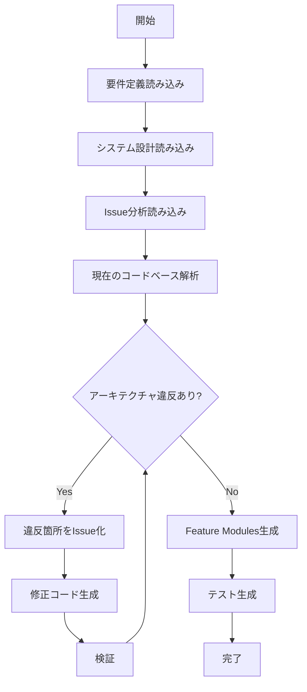

# 浦和カップ SDK生成プロンプト

## 概要

SystemDesign_v2.md に基づき、浦和カップトーナメント管理システムのフロントエンドSDKを自動生成するエージェントを構築します。

## 入力ファイル

```
要件定義: D:\UrawaCup\Requirement\RequirementSpecification.md
システム設計: D:\UrawaCup\SystemDesign_v2.md
Issue分析: D:\UrawaCup\Issue\RootCauseAnalysis.md
DB構造: D:\UrawaCup\Issue\DatabaseStructure.md
プロジェクト名: UrawaCup
出力先: agent-UrawaCup/
```

## 生成対象アーキテクチャ

SystemDesign_v2.mdで定義された以下の構造を生成：

```
src/
├── core/                           # 基盤（シングルトン）
│   ├── http/
│   │   ├── client.ts               # 唯一のHTTPクライアント
│   │   ├── interceptors/
│   │   │   ├── auth.ts             # 認証ヘッダー付与
│   │   │   ├── error.ts            # エラー正規化（AppError形式）
│   │   │   └── transform.ts        # snake_case ↔ camelCase自動変換
│   │   └── index.ts
│   │
│   ├── auth/
│   │   ├── manager.ts              # AuthManager（シングルトン）
│   │   ├── store.ts                # Zustand認証ストア
│   │   └── index.ts
│   │
│   ├── errors/
│   │   ├── types.ts                # AppError統一型
│   │   ├── handler.ts              # グローバルエラーハンドラ
│   │   └── index.ts
│   │
│   ├── sync/                       # オフライン同期
│   │   ├── queue.ts                # SyncQueue
│   │   ├── storage.ts              # IndexedDB操作
│   │   └── index.ts
│   │
│   └── config/
│       └── index.ts                # 環境設定
│
├── features/                       # 機能別モジュール
│   ├── tournaments/
│   ├── teams/
│   ├── players/
│   ├── matches/
│   ├── standings/
│   ├── exclusions/
│   └── reports/
│
├── shared/                         # 共有コンポーネント
│   ├── components/
│   ├── hooks/
│   └── utils/
│
└── api/
    └── generated/                  # OpenAPIから自動生成
```

## 解決すべき設計課題（RootCauseAnalysis.mdより）

### 1. HTTPクライアントの統一（最重要）

**現状の問題:**
- `utils/api.ts`, `utils/apiClient.ts`, `api/client.ts` の3つが存在
- 認証処理が分散

**解決策:**
```typescript
// src/core/http/client.ts - 唯一のHTTPクライアント
import axios from 'axios';
import { authInterceptor } from './interceptors/auth';
import { errorInterceptor } from './interceptors/error';
import { transformInterceptor } from './interceptors/transform';

const httpClient = axios.create({
  baseURL: import.meta.env.VITE_API_BASE_URL || '/api',
  timeout: 10000,
});

// インターセプター登録（順序重要）
httpClient.interceptors.request.use(authInterceptor);
httpClient.interceptors.request.use(transformInterceptor.request);
httpClient.interceptors.response.use(
  transformInterceptor.response,
  errorInterceptor
);

export { httpClient };
```

### 2. 命名規則の自動変換

**現状の問題:**
- バックエンド: snake_case
- フロントエンド: camelCase
- 手動変換で不整合発生

**解決策:**
```typescript
// src/core/http/interceptors/transform.ts
import { camelCase, snakeCase } from 'lodash-es';

function transformKeys(obj: any, transformer: (key: string) => string): any {
  if (Array.isArray(obj)) {
    return obj.map(item => transformKeys(item, transformer));
  }
  if (obj !== null && typeof obj === 'object') {
    return Object.keys(obj).reduce((acc, key) => {
      acc[transformer(key)] = transformKeys(obj[key], transformer);
      return acc;
    }, {} as any);
  }
  return obj;
}

export const transformInterceptor = {
  request: (config) => {
    if (config.data) {
      config.data = transformKeys(config.data, snakeCase);
    }
    if (config.params) {
      config.params = transformKeys(config.params, snakeCase);
    }
    return config;
  },
  response: (response) => {
    if (response.data) {
      response.data = transformKeys(response.data, camelCase);
    }
    return response;
  }
};
```

### 3. 統一エラー形式

**現状の問題:**
- FastAPIは `{ detail: "..." }` を返す
- フロントエンドは `{ error: { message: "..." } }` を期待
- エラーメッセージが表示されない

**解決策:**
```typescript
// src/core/errors/types.ts
export type ErrorCode =
  | 'BAD_REQUEST'
  | 'UNAUTHORIZED'
  | 'FORBIDDEN'
  | 'NOT_FOUND'
  | 'CONFLICT'
  | 'VERSION_CONFLICT'
  | 'VALIDATION_ERROR'
  | 'OFFLINE'
  | 'SERVER_ERROR'
  | 'UNKNOWN';

export interface AppError {
  code: ErrorCode;
  message: string;
  status: number;
  details?: Record<string, unknown>;
  retryable: boolean;
}

// src/core/http/interceptors/error.ts
export function errorInterceptor(error: AxiosError): Promise<never> {
  const appError: AppError = {
    code: mapStatusToCode(error.response?.status),
    message: extractMessage(error),
    status: error.response?.status || 0,
    details: error.response?.data,
    retryable: isRetryable(error.response?.status),
  };

  return Promise.reject(appError);
}

function extractMessage(error: AxiosError): string {
  const data = error.response?.data as any;
  // FastAPI形式対応
  if (data?.detail) {
    if (typeof data.detail === 'string') return data.detail;
    if (Array.isArray(data.detail)) return data.detail[0]?.msg || 'Validation error';
  }
  return data?.message || data?.error?.message || getDefaultMessage(error.response?.status);
}
```

### 4. 認証状態の一元管理

**現状の問題:**
- authStore, api.ts, client.ts でそれぞれトークン管理
- ログアウト時に不整合

**解決策:**
```typescript
// src/core/auth/manager.ts
class AuthManager {
  private static instance: AuthManager;
  private accessToken: string | null = null;

  static getInstance(): AuthManager {
    if (!AuthManager.instance) {
      AuthManager.instance = new AuthManager();
    }
    return AuthManager.instance;
  }

  setToken(token: string): void {
    this.accessToken = token;
  }

  getToken(): string | null {
    return this.accessToken;
  }

  clearToken(): void {
    this.accessToken = null;
  }

  isAuthenticated(): boolean {
    return this.accessToken !== null;
  }
}

export const authManager = AuthManager.getInstance();
```

## エージェント構成

```
agent-UrawaCup/
├── main.py                     # CLIエントリーポイント
├── config.py                   # 設定
├── agents/
│   ├── __init__.py
│   ├── issue_manager.py        # Issue管理
│   ├── requirement_analyzer.py # 要件解析
│   ├── code_generator.py       # コード生成
│   ├── architecture_validator.py # アーキテクチャ検証
│   └── auto_loop_agent.py      # 自動ループ
├── templates/                  # コードテンプレート
│   ├── core/
│   │   ├── http_client.ts.j2
│   │   ├── auth_manager.ts.j2
│   │   └── error_types.ts.j2
│   └── features/
│       └── feature_module.ts.j2
├── issues/                     # Issue保存
└── outputs/                    # 生成コード
```

## プロンプトテンプレート

### 1. アーキテクチャ検証プロンプト

```
以下のシステム設計とIssue分析に基づいて、現在のコードベースを検証してください。

# システム設計
{system_design_content}

# Issue分析（解決すべき問題）
{root_cause_analysis}

# 検証項目
1. HTTPクライアントが1つのみか確認
2. 認証管理が一元化されているか確認
3. エラー形式が統一されているか確認
4. 命名規則の変換が自動化されているか確認
5. オフライン対応の実装状況を確認

# 出力形式
{
  "violations": [
    {
      "rule": "違反している設計原則",
      "location": "ファイルパス",
      "description": "問題の説明",
      "fix": "修正方法"
    }
  ],
  "status": "pass|fail"
}
```

### 2. コア基盤生成プロンプト

```
以下の設計に基づいて、src/core/ ディレクトリの基盤コードを生成してください。

# 設計原則
- HTTPクライアントは1つのみ（シングルトン）
- 認証はAuthManagerで一元管理
- エラーはAppError形式に正規化
- 命名規則はインターセプターで自動変換

# 生成ファイル
1. src/core/http/client.ts
2. src/core/http/interceptors/auth.ts
3. src/core/http/interceptors/error.ts
4. src/core/http/interceptors/transform.ts
5. src/core/auth/manager.ts
6. src/core/auth/store.ts
7. src/core/errors/types.ts
8. src/core/errors/handler.ts
9. src/core/config/index.ts

# 重要な制約
- 既存の utils/api.ts, utils/apiClient.ts, api/client.ts は削除対象
- 全てのAPI呼び出しは httpClient 経由
- トークンは AuthManager 経由でのみアクセス
```

### 3. Feature Module生成プロンプト

```
以下のテンプレートに基づいて、{feature_name} モジュールを生成してください。

# ディレクトリ構造
src/features/{feature_name}/
├── api.ts          # API呼び出し
├── hooks.ts        # React Query hooks
├── types.ts        # 型定義
├── components/     # UI コンポーネント
└── index.ts        # 公開API

# API呼び出しテンプレート
import { httpClient } from '@/core/http';
import type { {Feature} } from './types';

export const {feature}Api = {
  getAll: () => httpClient.get<{Feature}[]>('/{features}'),
  getById: (id: number) => httpClient.get<{Feature}>(`/{features}/${id}`),
  create: (data: Create{Feature}Input) => httpClient.post<{Feature}>('/{features}', data),
  update: (id: number, data: Update{Feature}Input) => httpClient.patch<{Feature}>(`/{features}/${id}`, data),
  delete: (id: number) => httpClient.delete(`/{features}/${id}`),
};

# Hooks テンプレート
import { useQuery, useMutation, useQueryClient } from '@tanstack/react-query';
import { {feature}Api } from './api';

export function use{Features}() {
  return useQuery({
    queryKey: ['{features}'],
    queryFn: () => {feature}Api.getAll(),
  });
}
```

## 実行フロー



## 成功条件

1. **HTTPクライアント統一**: `src/core/http/client.ts` のみがAPI呼び出しを行う
2. **認証一元化**: `AuthManager` 経由でのみトークン管理
3. **エラー形式統一**: 全エラーが `AppError` 形式
4. **命名規則自動変換**: インターセプターで snake_case ↔ camelCase 変換
5. **既存コード削除**: `utils/api.ts`, `utils/apiClient.ts`, `api/client.ts` を削除
6. **テスト通過**: E2Eテストが全てパス

## コマンド

```bash
# 基盤コード生成
python main.py generate-core

# Feature Module生成
python main.py generate-feature --name teams
python main.py generate-feature --name matches

# アーキテクチャ検証
python main.py validate-architecture

# 全体生成（自動ループ）
python main.py autoloop

# 既存コードのマイグレーション
python main.py migrate --from utils/api.ts --to core/http/client.ts
```

## 環境変数

| 変数 | 説明 | デフォルト |
|------|------|-----------|
| `ANTHROPIC_API_KEY` | Claude API キー | 必須 |
| `URAWA_PROJECT_ROOT` | プロジェクトルート | D:\UrawaCup |
| `URAWA_OUTPUT_DIR` | 出力ディレクトリ | agent-UrawaCup/outputs |
