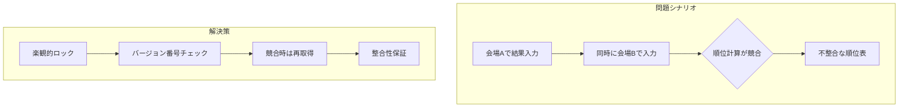
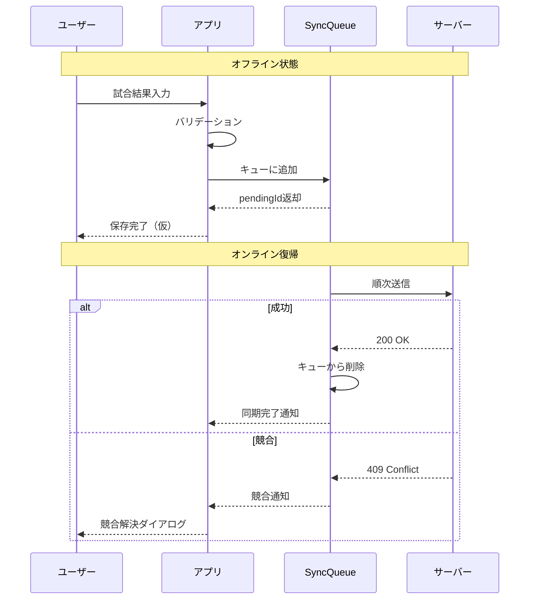
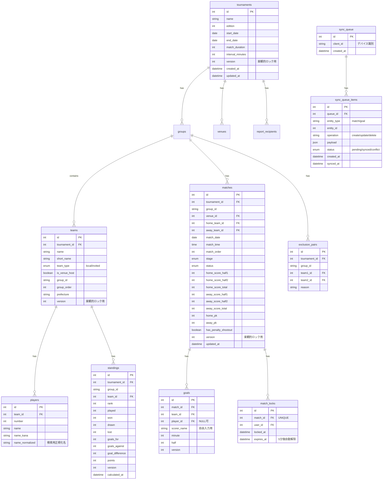
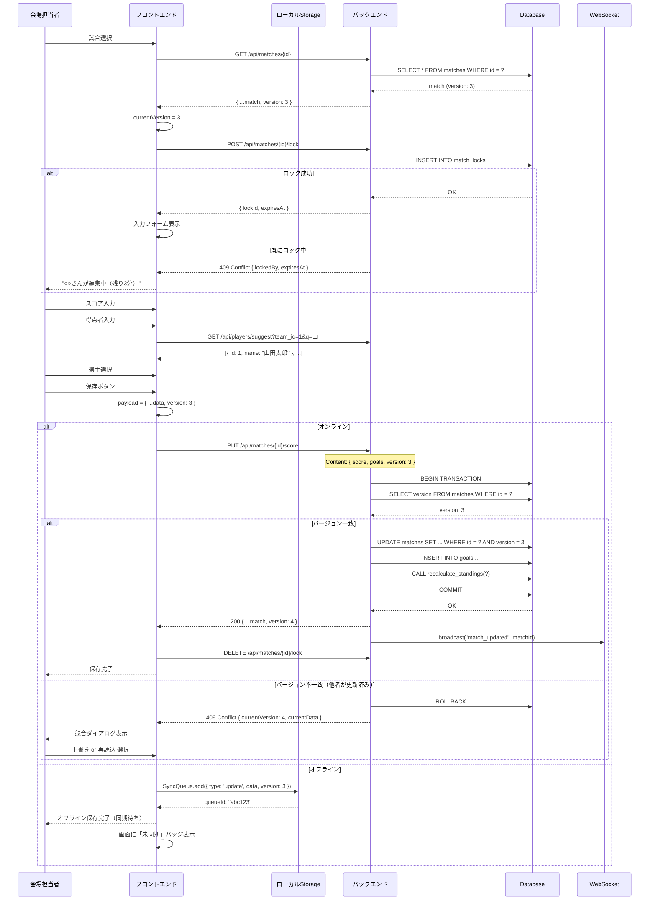
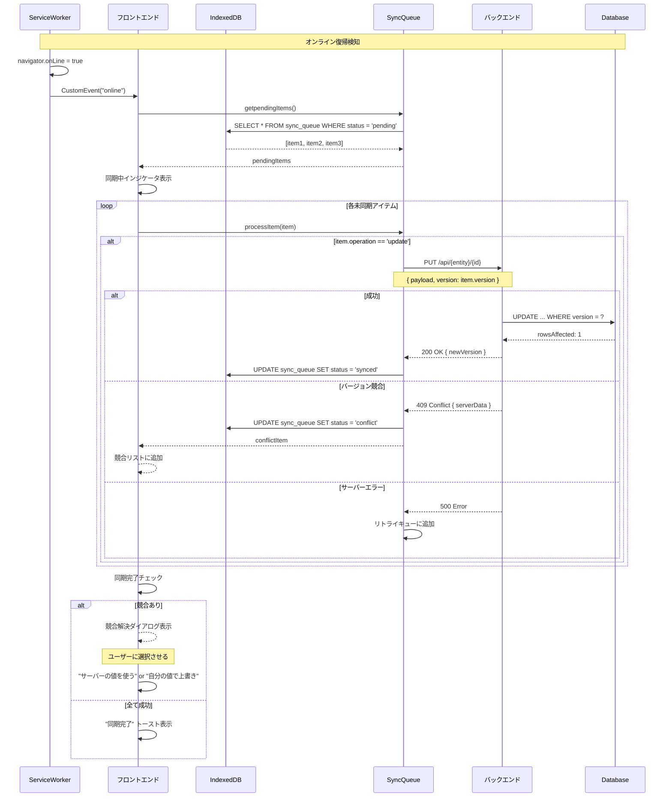
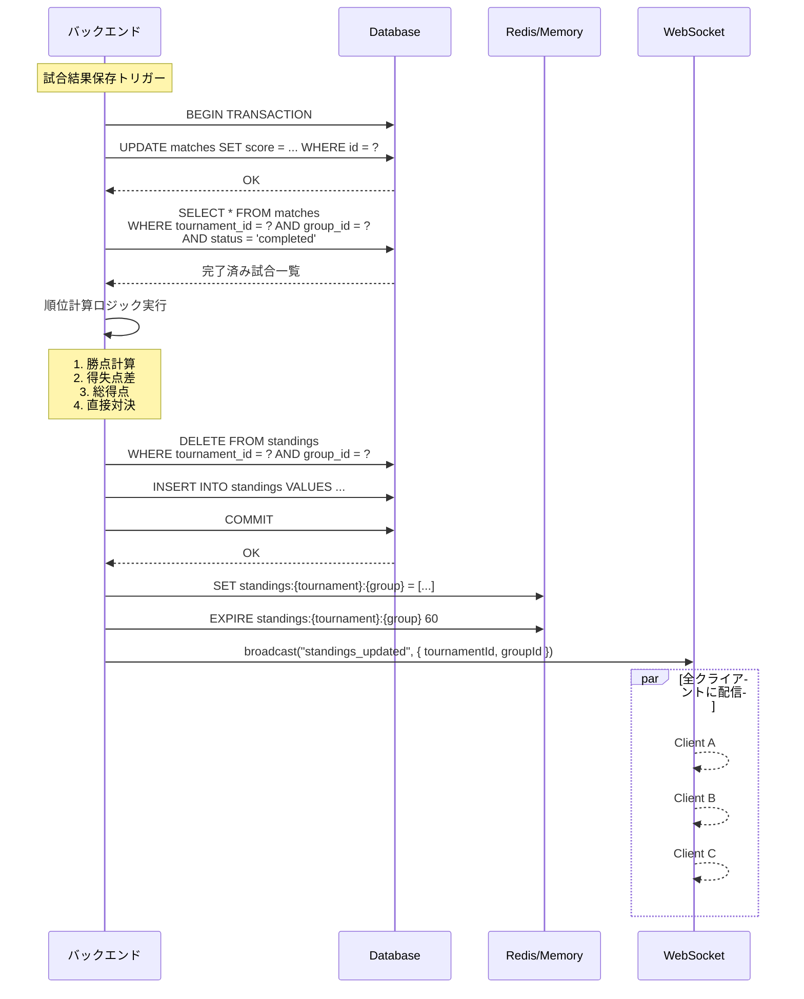
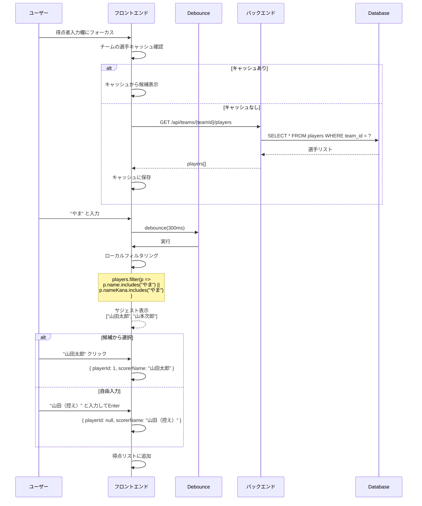
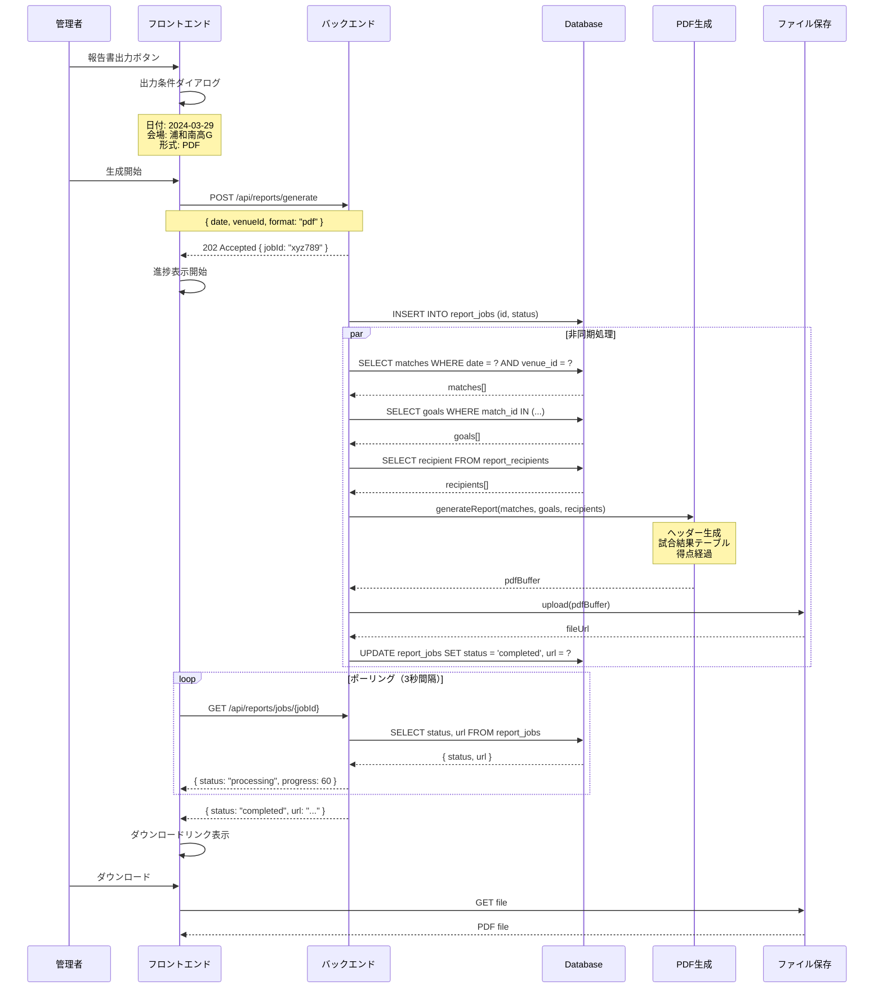
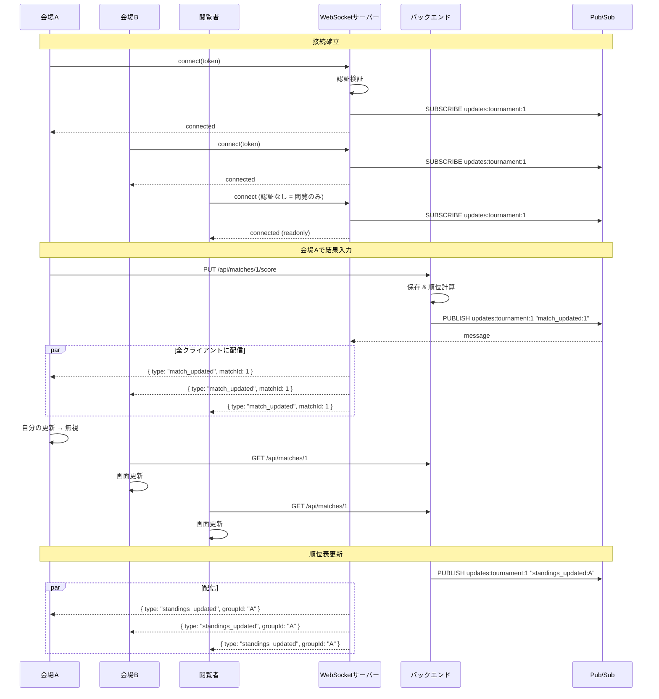
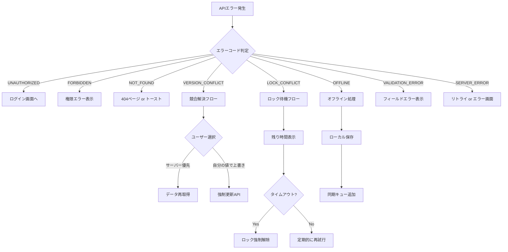

# 浦和カップ システム設計 - 問題分析と解決策

## 1. 予見される問題と解決策

### 1.1 アーキテクチャ上の問題

| 問題 | 原因 | 影響 | 解決策 |
|------|------|------|--------|
| **HTTPクライアントの乱立** | 各機能で個別にfetch/axiosを使用 | 認証・エラー処理の重複、不整合 | シングルトンHTTPクライアント |
| **命名規則の不一致** | バックエンド(snake_case)とフロントエンド(camelCase)の混在 | 型エラー、バグの温床 | 自動変換インターセプター |
| **型定義の重複** | 手動で型定義を作成 | バックエンドとの乖離 | OpenAPIから自動生成 |
| **エラー形式のバラつき** | 各APIで異なるエラー形式 | エラーハンドリングの複雑化 | 統一エラー形式の正規化 |
| **認証状態の分散管理** | ローカルストレージ直接参照 | セキュリティ問題、状態の不整合 | AuthManager一元管理 |

### 1.2 データ整合性の問題



| 問題 | シナリオ | 解決策 |
|------|----------|--------|
| **同時編集による競合** | 複数会場から同時に結果入力 | 楽観的ロック（version列） |
| **オフライン時のデータ損失** | ネット切断中に入力したデータ消失 | ローカルQueue + 同期 |
| **順位計算のタイミング** | 入力中に順位が変動 | トランザクション + 計算ロック |
| **得点者名の不一致** | 同一選手が異なる名前で登録 | player_idによる正規化 |

### 1.3 オフライン対応の問題



---

## 2. プロジェクト規約（project-conventions.yml）

```yaml
# project-conventions.yml - 浦和カップ トーナメント管理システム

project:
  name: "urawa-cup-tournament"
  type: "web-app"
  description: "浦和カップ高校サッカー大会管理システム"

# ===== 命名規則 =====
naming:
  api:
    request_body: "snake_case"      # FastAPIに合わせる
    response_body: "snake_case"     # FastAPIに合わせる
    url_path: "kebab-case"          # /api/v1/match-results
    query_params: "snake_case"      # ?team_id=1
  
  code:
    variables: "camelCase"          # const matchResult
    constants: "UPPER_SNAKE_CASE"   # const MAX_TEAMS = 24
    functions: "camelCase"          # function calculateStandings()
    classes: "PascalCase"           # class MatchService
    interfaces: "PascalCase"        # interface Match
    types: "PascalCase"             # type MatchStatus
    enums: "PascalCase"             # enum MatchStage
  
  files:
    components: "PascalCase.tsx"    # MatchCard.tsx
    hooks: "use*.ts"                # useMatches.ts
    services: "*.service.ts"        # match.service.ts
    types: "*.types.ts"             # match.types.ts
    tests: "*.test.ts"              # match.test.ts

# ===== アーキテクチャ =====
architecture:
  http_client:
    count: 1                         # 必ず1つのみ
    library: "axios"
    base_location: "src/core/http"
  
  state_management:
    library: "zustand"
    location: "src/core/store"
  
  authentication:
    type: "jwt"
    token_storage: "memory"          # XSS対策でメモリ保持
    refresh_strategy: "silent"
    manager_location: "src/core/auth"
  
  error_handling:
    format: "{ code, message, status, details }"
    location: "src/core/errors"
  
  offline:
    enabled: true
    storage: "IndexedDB"
    sync_queue: "src/core/sync"

# ===== 型定義 =====
types:
  generation: "auto"
  source: "openapi"
  endpoint: "http://localhost:8000/openapi.json"
  output_location: "src/api/generated"

# ===== ディレクトリ構成 =====
structure:
  pattern: "feature-based"
```

---

## 3. 改訂版ディレクトリ構成

```
src/
├── core/                           # 基盤（変更頻度：低）
│   ├── http/
│   │   ├── client.ts               # シングルトンHTTPクライアント
│   │   ├── interceptors/
│   │   │   ├── auth.ts             # 認証ヘッダー付与
│   │   │   ├── error.ts            # エラー正規化
│   │   │   └── transform.ts        # snake_case ↔ camelCase変換
│   │   └── index.ts
│   │
│   ├── auth/
│   │   ├── manager.ts              # AuthManager（シングルトン）
│   │   ├── store.ts                # Zustand認証ストア
│   │   └── index.ts
│   │
│   ├── errors/
│   │   ├── types.ts                # AppError型定義
│   │   ├── handler.ts              # グローバルエラーハンドラ
│   │   └── index.ts
│   │
│   ├── sync/                       # オフライン同期
│   │   ├── queue.ts                # SyncQueue
│   │   ├── storage.ts              # IndexedDB操作
│   │   ├── conflict.ts             # 競合解決
│   │   └── index.ts
│   │
│   └── config/
│       └── index.ts                # 環境設定
│
├── features/                       # 機能別（変更頻度：高）
│   ├── tournaments/                # 大会管理
│   │   ├── api.ts
│   │   ├── hooks.ts
│   │   ├── components/
│   │   ├── types.ts
│   │   └── index.ts
│   │
│   ├── teams/                      # チーム管理
│   │   ├── api.ts
│   │   ├── hooks.ts
│   │   ├── components/
│   │   ├── types.ts
│   │   └── index.ts
│   │
│   ├── players/                    # 選手管理
│   │   ├── api.ts
│   │   ├── hooks.ts
│   │   ├── components/
│   │   │   └── PlayerSuggest.tsx   # サジェストUI
│   │   ├── types.ts
│   │   └── index.ts
│   │
│   ├── matches/                    # 試合管理
│   │   ├── api.ts
│   │   ├── hooks.ts
│   │   ├── components/
│   │   │   ├── MatchCard.tsx
│   │   │   ├── ScoreInput.tsx
│   │   │   └── GoalInput.tsx
│   │   ├── types.ts
│   │   └── index.ts
│   │
│   ├── standings/                  # 順位表
│   │   ├── api.ts
│   │   ├── hooks.ts
│   │   ├── components/
│   │   │   └── StandingsTable.tsx
│   │   ├── calculator.ts           # 順位計算ロジック
│   │   ├── types.ts
│   │   └── index.ts
│   │
│   ├── exclusions/                 # 対戦除外設定
│   │   ├── api.ts
│   │   ├── hooks.ts
│   │   ├── components/
│   │   │   └── ExclusionMatrix.tsx
│   │   ├── types.ts
│   │   └── index.ts
│   │
│   └── reports/                    # 報告書
│       ├── api.ts
│       ├── hooks.ts
│       ├── components/
│       ├── types.ts
│       └── index.ts
│
├── shared/                         # 共有
│   ├── components/
│   │   ├── Layout/
│   │   ├── Button/
│   │   ├── Modal/
│   │   ├── Toast/
│   │   └── OfflineIndicator.tsx
│   │
│   ├── hooks/
│   │   ├── useOnlineStatus.ts
│   │   ├── useWebSocket.ts
│   │   └── useSyncStatus.ts
│   │
│   └── utils/
│       ├── date.ts
│       └── format.ts
│
├── api/
│   ├── generated/                  # OpenAPIから自動生成
│   │   └── schema.ts
│   └── client.ts
│
└── pages/                          # ページコンポーネント
    ├── Dashboard.tsx
    ├── Teams.tsx
    ├── Schedule.tsx
    ├── Results.tsx
    ├── Standings.tsx
    └── Reports.tsx
```

---

## 4. 改訂版データベース設計

### 4.1 楽観的ロック対応のER図



### 4.2 主要テーブルの詳細定義

#### matches（試合）- 楽観的ロック対応

```sql
CREATE TABLE matches (
    id INTEGER PRIMARY KEY AUTOINCREMENT,
    tournament_id INTEGER NOT NULL REFERENCES tournaments(id),
    group_id VARCHAR(1),
    venue_id INTEGER REFERENCES venues(id),
    home_team_id INTEGER NOT NULL REFERENCES teams(id),
    away_team_id INTEGER NOT NULL REFERENCES teams(id),
    match_date DATE NOT NULL,
    match_time TIME NOT NULL,
    match_order INTEGER NOT NULL,
    stage VARCHAR(20) NOT NULL DEFAULT 'preliminary',
    status VARCHAR(20) NOT NULL DEFAULT 'scheduled',
    
    -- スコア
    home_score_half1 INTEGER,
    home_score_half2 INTEGER,
    home_score_total INTEGER,
    away_score_half1 INTEGER,
    away_score_half2 INTEGER,
    away_score_total INTEGER,
    home_pk INTEGER,
    away_pk INTEGER,
    has_penalty_shootout BOOLEAN DEFAULT FALSE,
    
    -- 楽観的ロック
    version INTEGER NOT NULL DEFAULT 1,
    
    -- メタデータ
    created_at DATETIME DEFAULT CURRENT_TIMESTAMP,
    updated_at DATETIME DEFAULT CURRENT_TIMESTAMP,
    
    UNIQUE(tournament_id, match_date, venue_id, match_order)
);

-- バージョン自動更新トリガー
CREATE TRIGGER update_match_version
AFTER UPDATE ON matches
BEGIN
    UPDATE matches 
    SET version = version + 1, updated_at = CURRENT_TIMESTAMP
    WHERE id = NEW.id;
END;
```

#### match_locks（排他ロック）

```sql
CREATE TABLE match_locks (
    id INTEGER PRIMARY KEY AUTOINCREMENT,
    match_id INTEGER NOT NULL UNIQUE REFERENCES matches(id),
    user_id INTEGER NOT NULL REFERENCES users(id),
    locked_at DATETIME NOT NULL DEFAULT CURRENT_TIMESTAMP,
    expires_at DATETIME NOT NULL,
    
    -- 5分後に自動期限切れ
    CHECK (expires_at > locked_at)
);

-- 期限切れロックを自動削除するジョブを別途実装
```

#### sync_queue_items（オフライン同期キュー）

```sql
CREATE TABLE sync_queue_items (
    id INTEGER PRIMARY KEY AUTOINCREMENT,
    client_id VARCHAR(36) NOT NULL,  -- UUID
    entity_type VARCHAR(50) NOT NULL,  -- 'match', 'goal'
    entity_id INTEGER,
    operation VARCHAR(20) NOT NULL,  -- 'create', 'update', 'delete'
    payload JSON NOT NULL,
    status VARCHAR(20) NOT NULL DEFAULT 'pending',  -- 'pending', 'synced', 'conflict'
    error_message TEXT,
    created_at DATETIME NOT NULL DEFAULT CURRENT_TIMESTAMP,
    synced_at DATETIME,
    
    INDEX idx_status (status),
    INDEX idx_client (client_id)
);
```

### 4.3 インデックス戦略

```sql
-- 頻繁なクエリ用インデックス
CREATE INDEX idx_matches_tournament_date ON matches(tournament_id, match_date);
CREATE INDEX idx_matches_status ON matches(status);
CREATE INDEX idx_matches_venue ON matches(venue_id, match_date);

CREATE INDEX idx_standings_tournament_group ON standings(tournament_id, group_id);
CREATE INDEX idx_standings_rank ON standings(tournament_id, group_id, rank);

CREATE INDEX idx_goals_match ON goals(match_id);
CREATE INDEX idx_goals_team ON goals(team_id);

CREATE INDEX idx_players_team ON players(team_id);
CREATE INDEX idx_players_name ON players(name_normalized);  -- サジェスト用

CREATE INDEX idx_exclusions_group ON exclusion_pairs(tournament_id, group_id);
```

---

## 5. 改訂版シーケンス図

### 5.1 試合結果入力（楽観的ロック対応）



### 5.2 オフライン同期処理



### 5.3 順位計算（トランザクション保証）



### 5.4 得点者入力（サジェスト付き）



### 5.5 報告書生成（非同期処理）



### 5.6 WebSocketリアルタイム更新



---

## 6. エラーハンドリング設計

### 6.1 統一エラー形式

```typescript
// src/core/errors/types.ts

export type ErrorCode =
  | 'BAD_REQUEST'
  | 'UNAUTHORIZED'
  | 'FORBIDDEN'
  | 'NOT_FOUND'
  | 'CONFLICT'
  | 'VALIDATION_ERROR'
  | 'VERSION_CONFLICT'
  | 'LOCK_CONFLICT'
  | 'OFFLINE'
  | 'SYNC_ERROR'
  | 'SERVER_ERROR'
  | 'UNKNOWN';

export interface AppError {
  code: ErrorCode;
  message: string;
  status?: number;
  details?: {
    field?: string;
    expected?: unknown;
    actual?: unknown;
    conflictData?: unknown;
  };
  retryable: boolean;
}
```

### 6.2 エラー別対処フロー



---

## 7. 設計原則チェックリスト

### 浦和カップシステムでの適用状況

| 原則 | 適用 | 実装方法 |
|------|------|----------|
| **Single Source of Truth** | ✅ | HTTPクライアント1つ、AuthManager1つ |
| **Contract First** | ✅ | OpenAPIスキーマから型自動生成 |
| **Explicit Dependencies** | ✅ | DI/Factory経由でのみ依存注入 |
| **Optimistic Locking** | ✅ | version列で競合検知 |
| **Offline First** | ✅ | SyncQueue + IndexedDB |
| **Consistent Naming** | ✅ | インターセプターで自動変換 |
| **Normalized Errors** | ✅ | AppError統一形式 |

### 開発前チェックリスト

```
□ project-conventions.yml を作成したか？
□ HTTPクライアントは1つのみか？
□ 型はOpenAPIから自動生成しているか？
□ 認証トークンの管理は1箇所か？
□ エラー形式は統一されているか？
□ 命名規則変換は自動化されているか？
□ オフライン対応の設計は完了しているか？
□ 楽観的ロックの設計は完了しているか？
□ WebSocket接続の設計は完了しているか？
```
