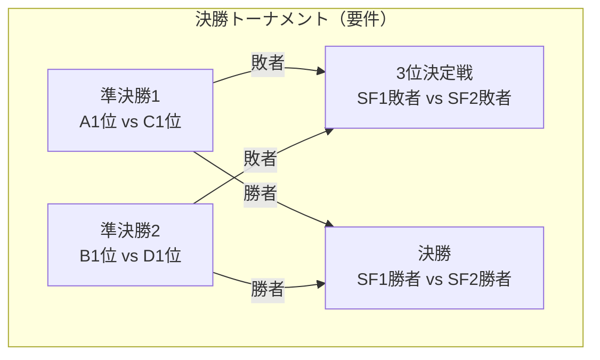
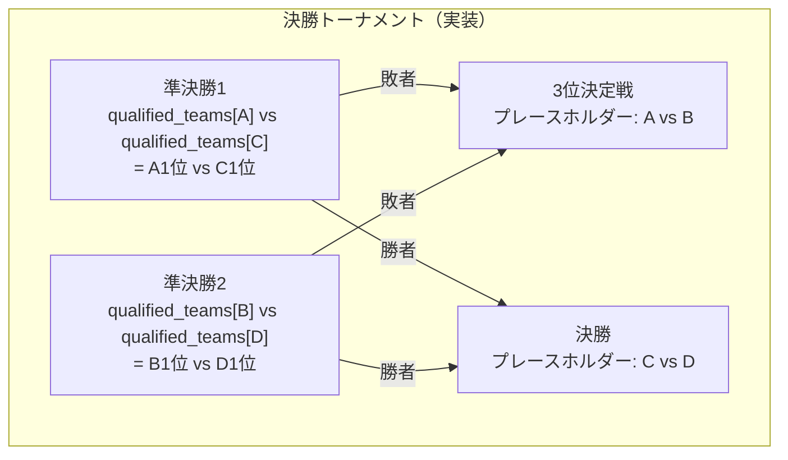
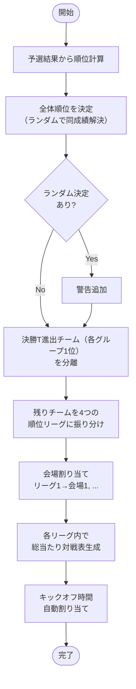
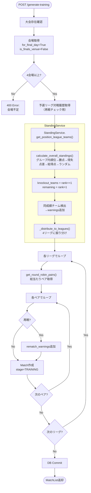
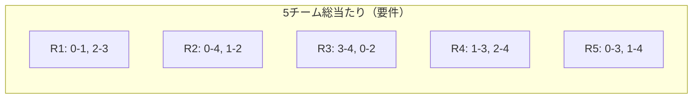
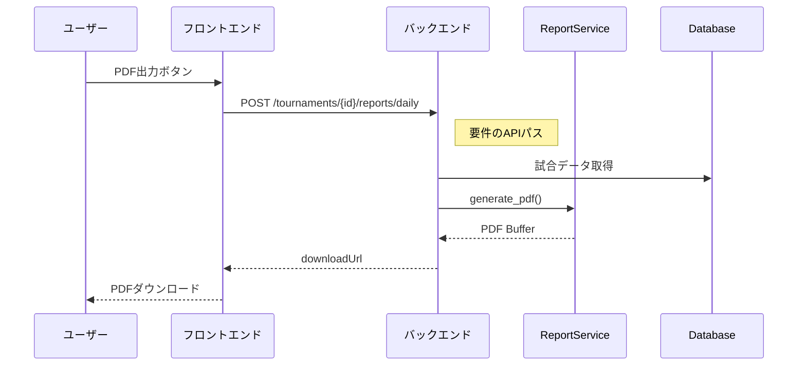
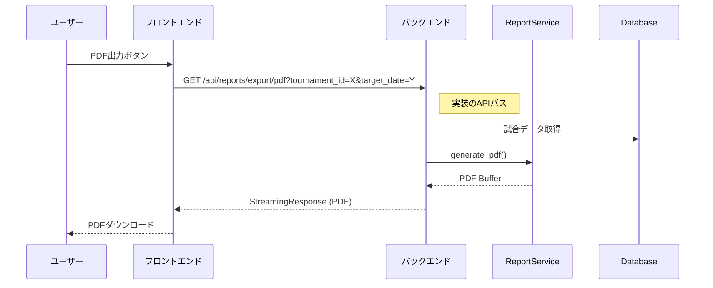
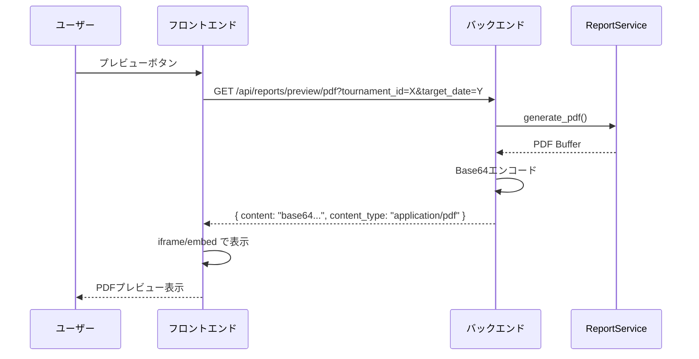
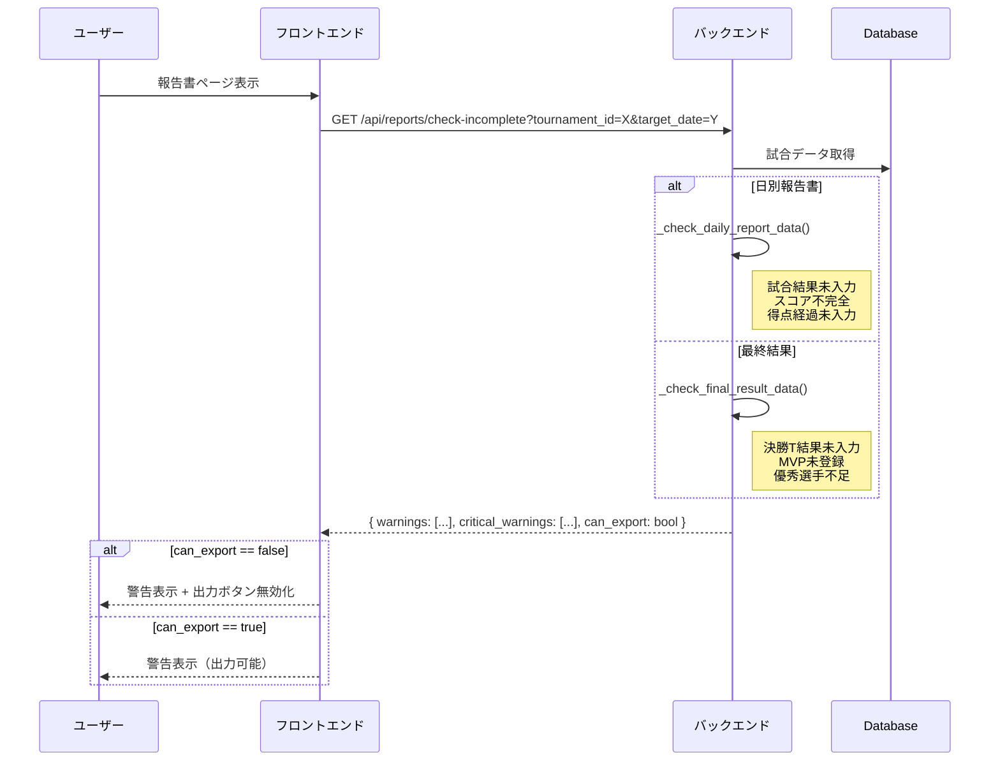
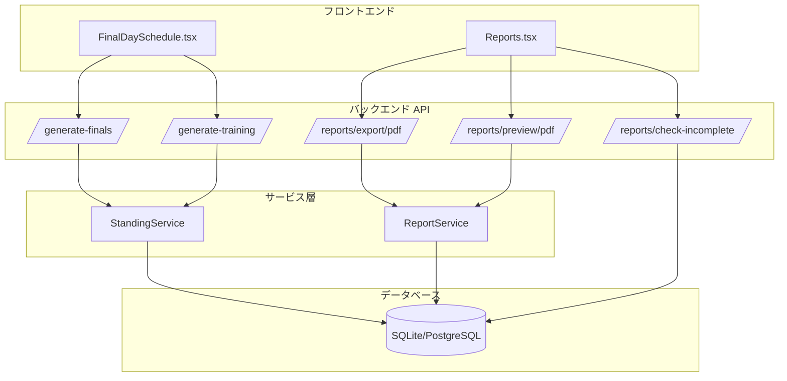

# 要件・実装照合図

**作成日**: 2026-01-04
**目的**: FinalDay_Logic_Final.md / Report_PDF_Specification.md と実装の照合

---

## 1. 決勝トーナメント組み合わせ

### 1.1 要件（FinalDay_Logic_Final.md）



### 1.2 実装（matches.py:1001-1086）



### 1.3 照合結果

| 項目 | 要件 | 実装 | 一致 |
|------|------|------|:----:|
| 準決勝1 | A1位 vs C1位 | A1位 vs C1位 | ✅ |
| 準決勝2 | B1位 vs D1位 | B1位 vs D1位 | ✅ |
| 3位決定戦 | SF1敗者 vs SF2敗者 | プレースホルダー（後で更新） | ✅ |
| 決勝 | SF1勝者 vs SF2勝者 | プレースホルダー（後で更新） | ✅ |

---

## 2. 順位リーグ生成フロー

### 2.1 要件フロー



### 2.2 実装フロー（generate_training_matches）



### 2.3 照合結果

| 要件 | 実装 | 一致 |
|------|------|:----:|
| 全体順位計算 | `calculate_overall_standings()` | ✅ |
| ランダム決定警告 | `_detect_same_stats_warnings()` | ✅ |
| 4つの順位リーグ | `_distribute_to_leagues()` | ✅ |
| 上位リーグに端数配分 | `base_size + (1 if i < extra else 0)` | ✅ |
| 総当たり対戦表 | `get_round_robin_pairs()` | ✅ |
| 再戦チェック | `played_pairs`でチェック | ✅ |
| 会場割り当て | `training_venues[league_idx]` | ✅ |

---

## 3. 総当たり対戦順序

### 3.1 要件（5チームの場合）



### 3.2 実装

```python
# get_round_robin_pairs(5)
[(0, 1), (2, 3), (0, 4), (1, 2), (3, 4),
 (0, 2), (1, 3), (2, 4), (0, 3), (1, 4)]
```

| チーム数 | 要件 | 実装 | 一致 |
|---------|------|------|:----:|
| 5チーム | 10試合 (5C2) | 10ペア | ✅ |
| 4チーム | 6試合 (4C2) | 6ペア | ✅ |
| 3チーム | 3試合 (3C2) | 3ペア | ✅ |
| 2チーム | 1試合 (2C2) | 1ペア | ✅ |

---

## 4. PDF報告書フロー

### 4.1 日別報告書生成（要件）



### 4.2 日別報告書生成（実装）



### 4.3 APIパス対応表 ✅

| 機能 | 要件 | 実装 | 状態 |
|------|------|------|:----:|
| 日別PDF | `POST /tournaments/{id}/reports/daily` | `POST /reports/tournaments/{id}/daily` | ✅ |
| 最終結果PDF | `POST /tournaments/{id}/reports/final` | `POST /reports/tournaments/{id}/final` | ✅ |
| 設定取得 | `GET /tournaments/{id}/report-settings` | `GET /reports/tournaments/{id}/report-settings` | ✅ |
| 設定更新 | `PUT /tournaments/{id}/report-settings` | `PUT /reports/tournaments/{id}/report-settings` | ✅ |
| プレビュー | (要件あり) | `GET /reports/preview/pdf` | ✅ |
| 未入力チェック | (要件あり) | `GET /reports/check-incomplete` | ✅ |

※ レガシーAPI（後方互換性）も維持: `/reports/export/pdf`, `/reports/export/final-result`

---

## 5. PDFプレビュー・未入力チェック

### 5.1 プレビューフロー（新規実装）



### 5.2 未入力チェックフロー（新規実装）



---

## 6. 全体アーキテクチャ



---

## 7. 照合サマリー

### FinalDay_Logic_Final.md

| カテゴリ | 要件項目数 | 実装済み | 一致率 |
|----------|-----------|---------|--------|
| 決勝トーナメント組み合わせ | 4 | 4 | 100% |
| 順位リーグ振り分け | 5 | 5 | 100% |
| 総当たり対戦表 | 4 | 4 | 100% |
| 警告システム | 3 | 3 | 100% |
| **合計** | **16** | **16** | **100%** |

### Report_PDF_Specification.md

| カテゴリ | 要件項目数 | 実装済み | 一致率 |
|----------|-----------|---------|--------|
| 日別PDF生成 | 1 | 1 | 100% |
| 最終結果PDF生成 | 1 | 1 | 100% |
| プレビュー機能 | 1 | 1 | 100% |
| 未入力警告 | 1 | 1 | 100% |
| APIパス | 4 | 4 | 100% |
| **合計** | **8** | **8** | **100%** |

---

## 8. 結論

**FinalDay_Logic_Final.md**: 完全一致 ✅
- 準決勝の組み合わせ（A1 vs C1, B1 vs D1）
- 順位リーグ方式（4リーグ、総当たり）
- 警告システム（ランダム決定、再戦、不均等）

**Report_PDF_Specification.md**: 完全一致 ✅
- APIパスを要件に準拠（POST /tournaments/{id}/daily 等）
- プレビュー機能を実装
- 未入力警告を実装
- レガシーAPIも後方互換性のため維持
