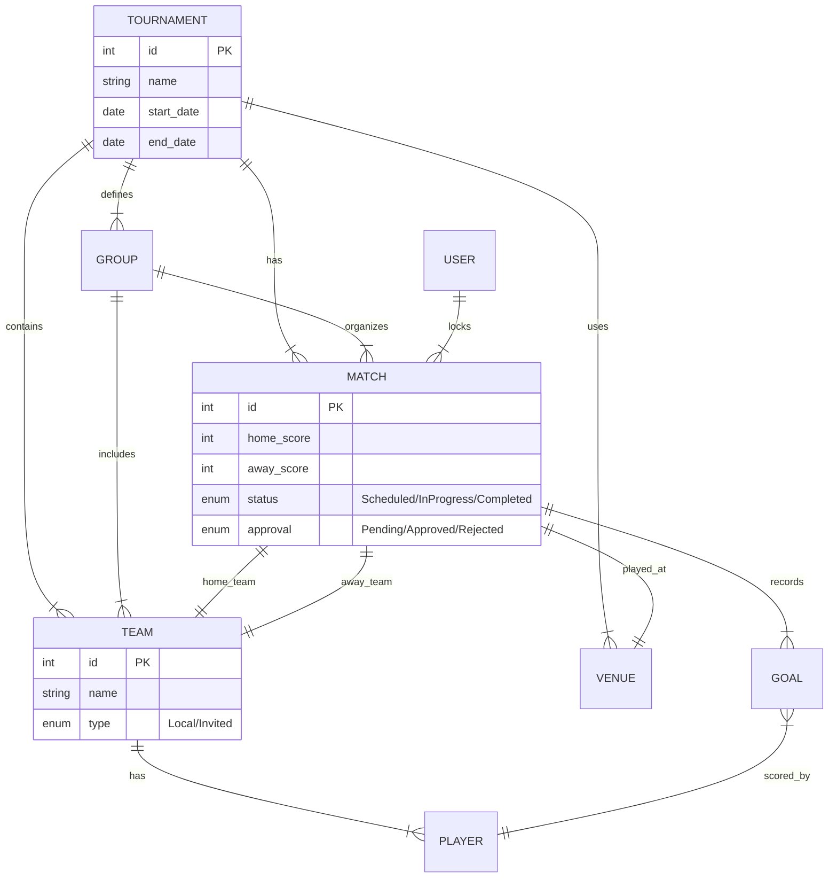

# Entity Relationship Diagram

```mermaid
erDiagram
    TOURNAMENT ||--|{ TEAM : contains
    TOURNAMENT ||--|{ MATCH : has
    TOURNAMENT ||--|{ VENUE : uses
    TOURNAMENT ||--|{ GROUP : defines
    
    GROUP ||--|{ TEAM : includes
    GROUP ||--|{ MATCH : organizes
    
    MATCH ||--|| TEAM : home_team
    MATCH ||--|| TEAM : away_team
    MATCH ||--|{ GOAL : records
    MATCH ||--|| VENUE : played_at
    
    TEAM ||--|{ PLAYER : has
    GOAL }|--|| PLAYER : scored_by
    
    USER ||--|{ MATCH : locks
    
    TOURNAMENT {
        int id PK
        string name
        date start_date
        date end_date
    }

    TEAM {
        int id PK
        string name
        enum type "Local/Invited"
    }

    MATCH {
        int id PK
        int home_score
        int away_score
        enum status "Scheduled/InProgress/Completed"
        enum approval "Pending/Approved/Rejected"
    }
```
