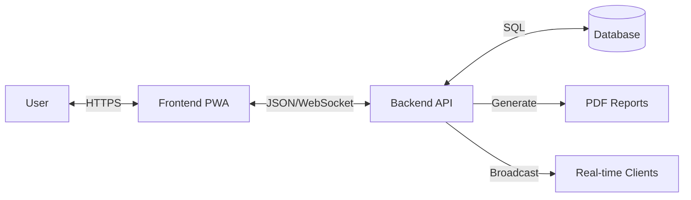

# System Flowcharts

## 1. Match Result Approval Process
Logic flow for handling match scores from input to final approval.

```mermaid
flowchart TD
    Start[Venue Staff Input] --> Input{Input Score}
    Input --> Validate[Frontend Validation]
    Validate -- Error --> Input
    Validate -- Valid --> Post[POST /matches/score]
    
    Post --> StatusCheck{Check Status}
    StatusCheck -->|Update| DBSuccess[Save to DB]
    
    DBSuccess --> SetStatus[Status = Completed]
    SetStatus --> SetApproval[Approval = Pending]
    SetApproval --> Notify[Notify Admin (WebSocket)]
    
    Notify --> AdminAction{<strong>Admin Review</strong>}
    
    AdminAction -- Approve --> Approved[Status = Approved]
    Approved --> Recalc[Recalculate Standings]
    Recalc --> BroadcastApp[Broadcast: Approved]
    BroadcastApp --> End[Process Complete]
    
    AdminAction -- Reject --> InputReason[Input Rejection Reason]
    InputReason --> Rejected[Status = Rejected]
    Rejected --> ResetStatus[Match Status -> Scheduled]
    ResetStatus --> BroadcastRej[Broadcast: Rejected]
    BroadcastRej --> Input
```

## 2. PWA Offline Data Synchronization
Logic flow for handling data when the device is offline and recovering.

```mermaid
flowchart TD
    UserAction[User Inputs Score] --> CheckNet{<strong>Network Available?</strong>}
    
    %% Online Path
    CheckNet -- Yes --> API[Call API]
    API --> APISuccess{Success?}
    APISuccess -- Yes --> Done[Done]
    APISuccess -- No --> Error[Show Error]
    
    %% Offline Path
    CheckNet -- No --> LocalSave[Save to IndexedDB (Queue)]
    LocalSave --> UIUpdate[UI: Show 'Waiting for Sync']
    
    UIUpdate --> Monitor[Service Worker Monitor]
    Monitor --> DetectNet{Network Restored?}
    DetectNet -- No --> Monitor
    
    DetectNet -- Yes --> TriggerSync[Trigger Sync Process]
    TriggerSync --> ReadQueue[Read IndexedDB Queue]
    
    ReadQueue --> QueueEmpty{Empty?}
    QueueEmpty -- Yes --> SyncDone[Sync Complete]
    
    QueueEmpty -- No --> PopItem[Get Next Item]
    PopItem --> SendAPI[Send to API]
    
    SendAPI --> SyncSuccess{Success?}
    SyncSuccess -- Yes --> RemoveQueue[Remove from Queue]
    RemoveQueue --> ReadQueue
    
    SyncSuccess -- Conflict (409) --> MarkConflict[Mark as Conflict]
    MarkConflict --> NotifyUser[Notify User to Resolve]
    NotifyUser --> RemoveQueue
```

## 3. Simple System Architecture (Data Flow)
Simplified view of how data moves through the system.


