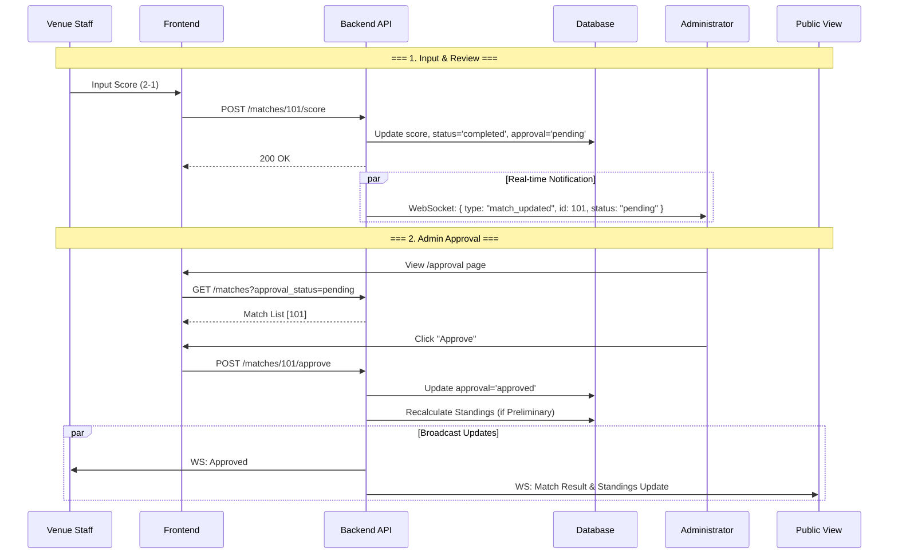
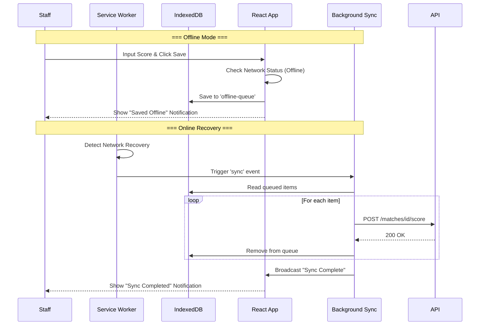

# Process Flows

## 1. Match Approval Workflow
This diagram illustrates the newly implemented approval process for match results.

## 2. PWA Offline Score Input
Flow for handling score inputs when network is unavailable.

