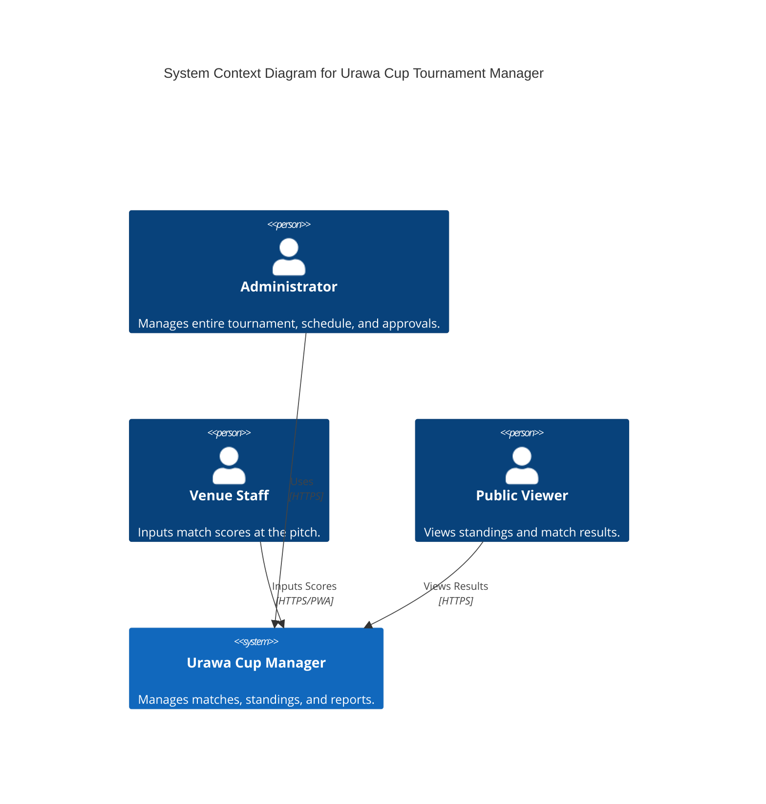
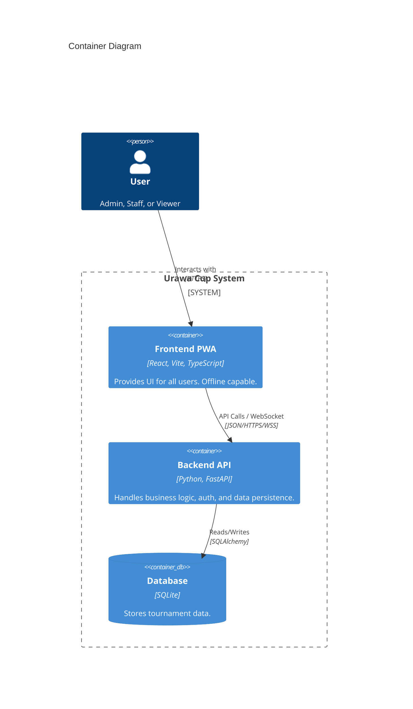

# System Architecture

## C4 Context Diagram

```mermaid
C4Context
    title System Context Diagram for Urawa Cup Tournament Manager

    Person(admin, "Administrator", "Manages entire tournament, schedule, and approvals.")
    Person(venueStaff, "Venue Staff", "Inputs match scores at the pitch.")
    Person(viewer, "Public Viewer", "Views standings and match results.")

    System(tournamentSystem, "Urawa Cup Manager", "Manages matches, standings, and reports.")

    Rel(admin, tournamentSystem, "Uses", "HTTPS")
    Rel(venueStaff, tournamentSystem, "Inputs Scores", "HTTPS/PWA")
    Rel(viewer, tournamentSystem, "Views Results", "HTTPS")
```

## Container Diagram

```mermaid
C4Container
    title Container Diagram

    Person(user, "User", "Admin, Staff, or Viewer")

    System_Boundary(c1, "Urawa Cup System") {
        Container(pwa, "Frontend PWA", "React, Vite, TypeScript", "Provides UI for all users. Offline capable.")
        Container(api, "Backend API", "Python, FastAPI", "Handles business logic, auth, and data persistence.")
        ContainerDb(db, "Database", "SQLite", "Stores tournament data.")
    }

    Rel(user, pwa, "Interacts with", "HTTPS")
    Rel(pwa, api, "API Calls / WebSocket", "JSON/HTTPS/WSS")
    Rel(api, db, "Reads/Writes", "SQLAlchemy")
```
