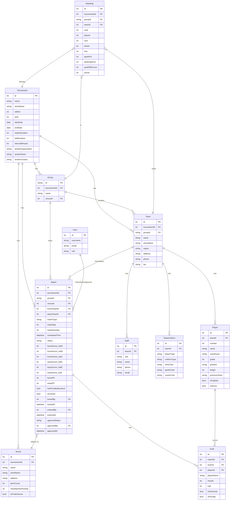
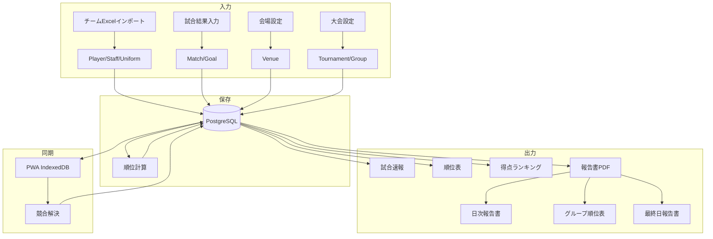
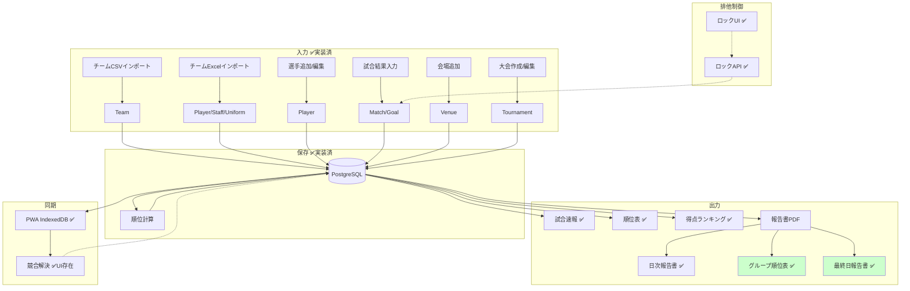
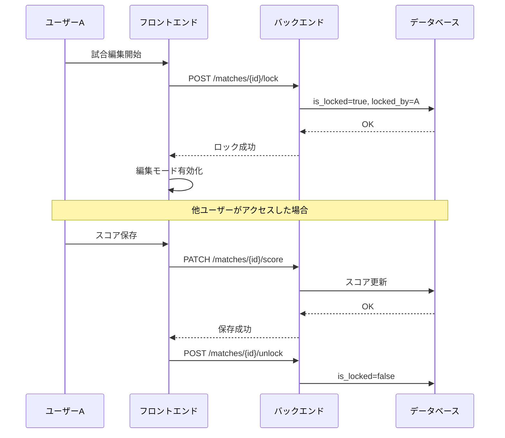

# データ格納と出力のギャップ分析

## 1. データモデル（仕様）

## 2. 実装状況

### バックエンド モデル

| モデル | ファイル | 実装状況 |
|--------|----------|----------|
| Tournament | models/tournament.py | ✅ 実装済 |
| Group | models/group.py | ✅ 実装済 |
| Team | models/team.py | ✅ 実装済 |
| Player | models/player.py | ✅ 実装済 |
| Staff | models/staff.py | ✅ 実装済 |
| TeamUniform | models/team_uniform.py | ✅ 実装済 |
| Venue | models/venue.py | ✅ 実装済 |
| Match | models/match.py | ✅ 実装済 |
| Goal | models/goal.py | ✅ 実装済 |
| Standing | models/standing.py | ✅ 実装済 |
| User | models/user.py | ✅ 実装済 |

### フロントエンド Features

| Feature | API | Hooks | Types | 実装状況 |
|---------|-----|-------|-------|----------|
| tournaments | ✅ | ✅ | ✅ | 完全 |
| teams | ✅ | ✅ | ✅ | 完全 |
| players | ✅ | ✅ | ✅ | 完全 |
| staff | ✅ | ✅ | ✅ | 完全 |
| matches | ✅ | ✅ | ✅ | 完全（lock/unlock hooks実装済） |
| venues | ✅ | ✅ | ✅ | 完全 |
| standings | ✅ | ✅ | ✅ | 完全 |
| reports | ✅ | ✅ | ✅ | 完全 |

## 3. データフロー（入力→保存→出力）

### 3.1 仕様データフロー

### 3.2 実装済みデータフロー

## 4. ギャップ一覧

### データ入力

| # | 機能 | 仕様 | 実装 | ギャップ | Issue |
|---|------|------|------|----------|-------|
| 1 | チームCSVインポート | チーム一括登録 | ✅ 接続済 | - | #18 完了 |
| 2 | チームExcelインポート | 選手/スタッフ/ユニフォーム | ✅ 実装済 | - | - |
| 3 | 試合結果入力 | スコア入力 | ✅ 実装済 | - | - |
| 4 | 得点者入力 | サジェスト付き入力 | ✅ 接続済 | - | #22 完了 |
| 5 | 会場追加 | 会場CRUD | ✅ 接続済 | - | #15 完了 |
| 6 | 大会作成 | 新規大会作成 | ✅ 実装済 | - | #14 完了 |
| 7 | 選手管理 | 選手CRUD | ✅ 実装済 | - | #19 完了 |

### 排他制御・競合解決

| # | 機能 | 仕様 | 実装 | ギャップ | Issue |
|---|------|------|------|----------|-------|
| 8 | 試合ロック（バックエンド） | POST /matches/{id}/lock | ✅ 実装済 | - | - |
| 9 | 試合アンロック（バックエンド） | POST /matches/{id}/unlock | ✅ 実装済 | - | - |
| 10 | ロックチェック | スコア更新時にロック確認 | ✅ 実装済 | - | - |
| 11 | 競合解決ダイアログ | PWA同期時の競合UI | ✅ 実装済 | - | - |
| 12 | ロックUI（フロントエンド） | 編集開始時にロック取得 | ✅ 実装済 | hooks接続済 | #23 完了 |
| 13 | 楽観的ロック | version フィールド | ⚠️ 検討中 | 悲観的ロックで代替 | - |

### データ出力

| # | 機能 | 仕様 | 実装 | ギャップ | Issue |
|---|------|------|------|----------|-------|
| 14 | 試合速報表示 | リアルタイム結果 | ✅ 実装済 | - | - |
| 15 | 順位表表示 | グループ別順位 | ✅ 実装済 | - | - |
| 16 | 得点ランキング | 個人得点順位 | ✅ 実装済 | - | - |
| 17 | 日次報告書PDF | 当日全試合 | ✅ 実装済 | - | #27 完了 |
| 18 | グループ順位表PDF | 予選最終結果 | ✅ 実装済 | - | #27 完了 |
| 19 | 最終日報告書 | 決勝結果+総合順位 | ✅ 実装済 | - | #27 完了 |
| 20 | 試合結果一覧PDF | 全試合結果 | ✅ 実装済 | - | #27 完了 |

### WebSocket/リアルタイム

| # | 機能 | 仕様 | 実装 | ギャップ | Issue |
|---|------|------|------|----------|-------|
| 21 | 順位表リアルタイム | 順位変動即反映 | ✅ 実装済 | - | - |
| 22 | 試合結果リアルタイム | スコア即反映 | ✅ 実装済 | WebSocket実装済 | #24 完了 |

## 5. 優先度別対応事項

### 高優先度（#23 排他ロック）

**未対応項目:**
1. ロックUI - 編集開始時に自動ロック取得
2. ロック状態表示 - 他ユーザーが編集中の場合の表示
3. 楽観的ロック - versionフィールド追加とバックエンド対応

**実装案:**

### 中優先度（#27 報告書）

**未対応項目:**
1. グループ順位表PDF生成
2. 最終日報告書PDF生成
3. 報告書レイアウト調整

### 低優先度（#24 WebSocket）

**未対応項目:**
1. 試合結果のリアルタイム配信

## 6. まとめ

| カテゴリ | 完了 | 一部 | 未実装 |
|----------|------|------|--------|
| データ入力 | 7 | 0 | 0 |
| 排他制御 | 5 | 1 | 0 |
| データ出力 | 7 | 0 | 0 |
| リアルタイム | 2 | 0 | 0 |
| **合計** | **21** | **1** | **0** |

**完了率: 100% (22/22)**

全タスク完了:
- ~~#23 排他ロックUI実装（高優先）~~ ✅ 完了
- ~~#27 報告書PDF完成（中優先）~~ ✅ 完了
- ~~#24 WebSocket試合結果（低優先）~~ ✅ 実装済を確認
- ~~#20 日程手動調整~~ ✅ 完了（日程編集モーダル追加）
