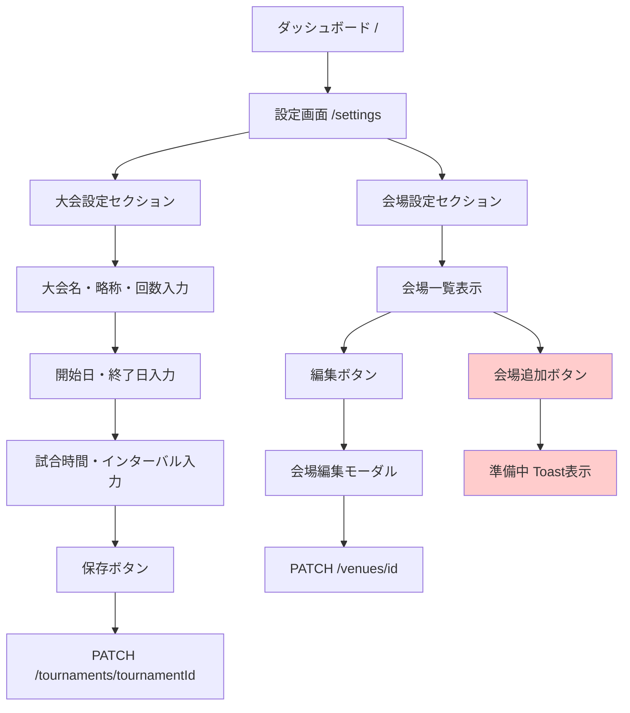
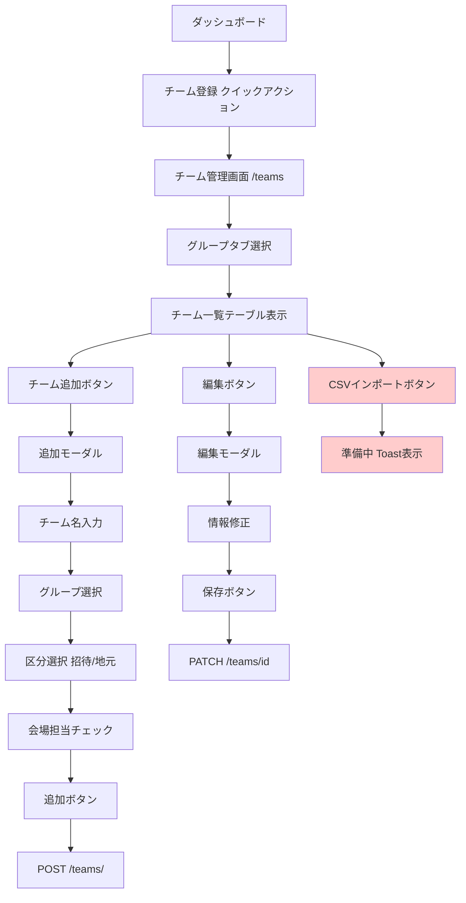
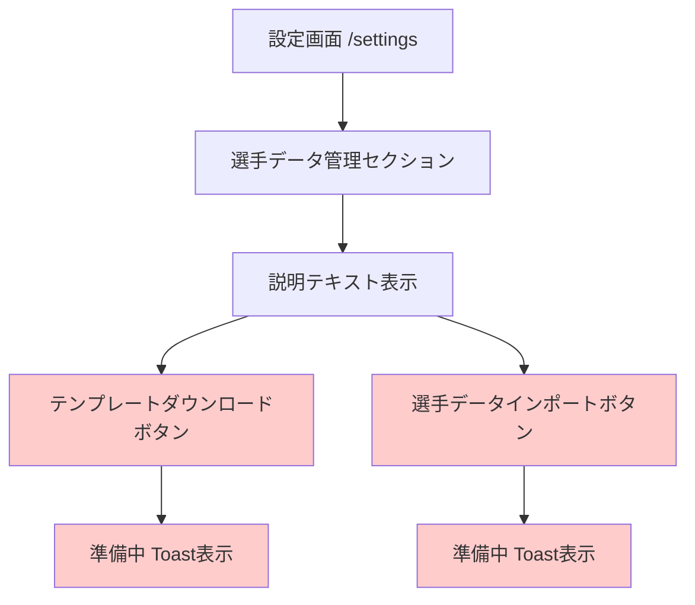
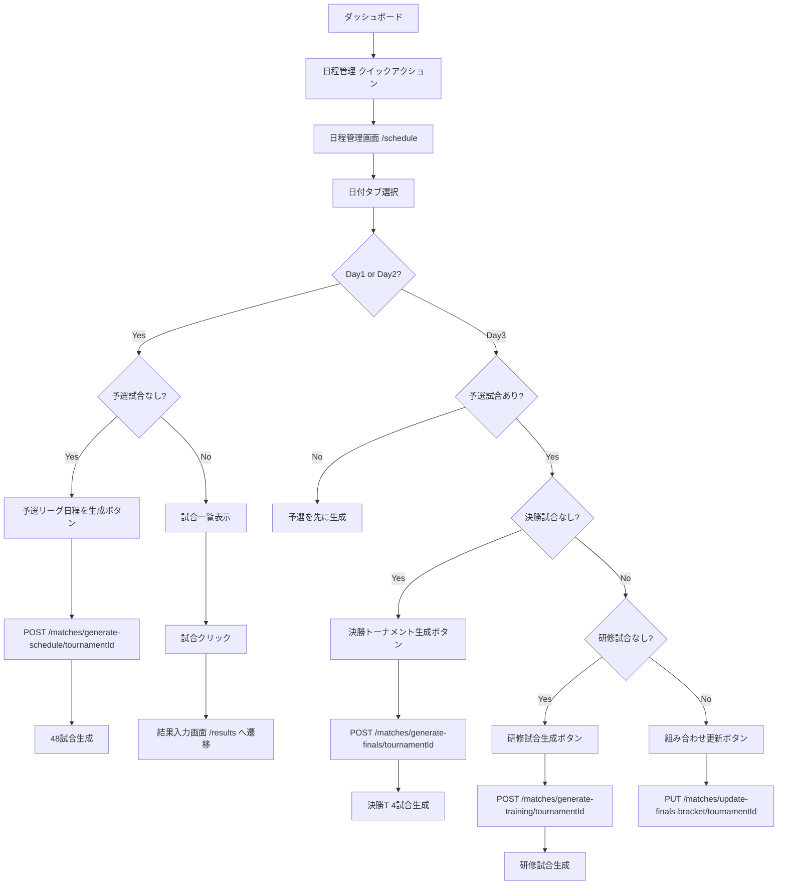
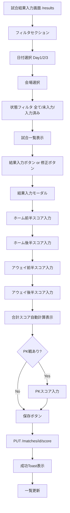
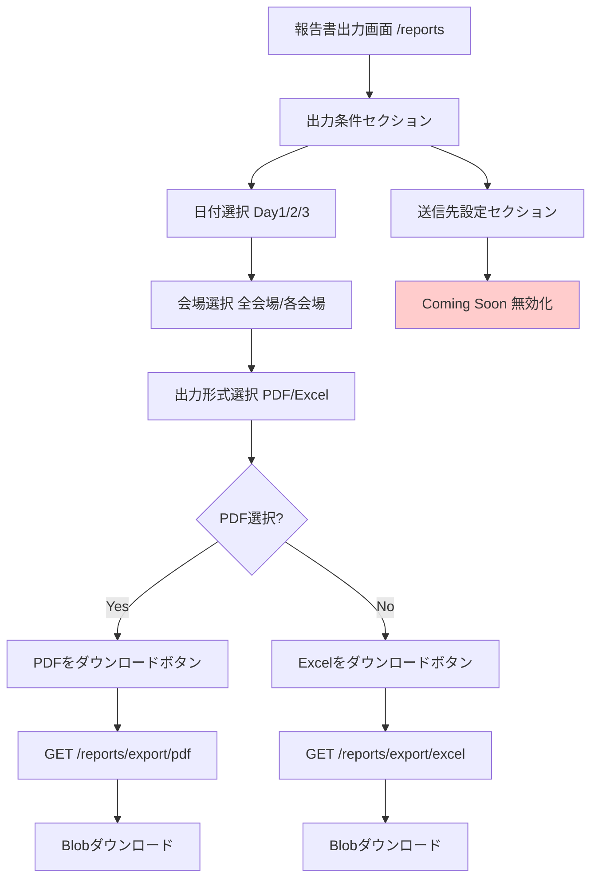
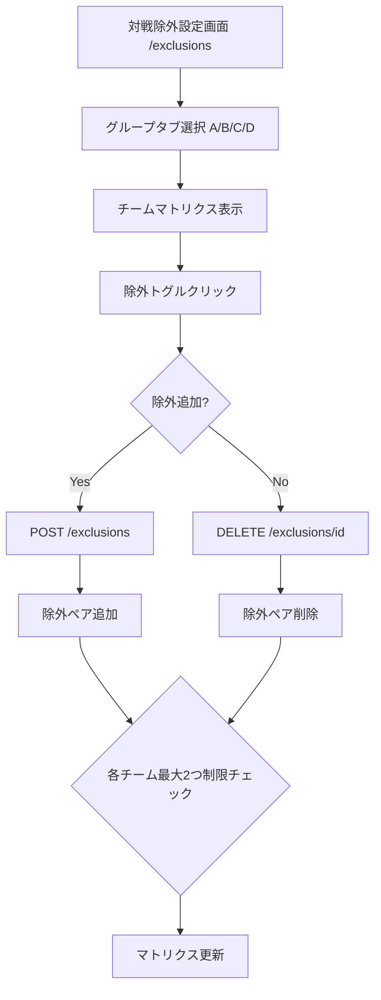
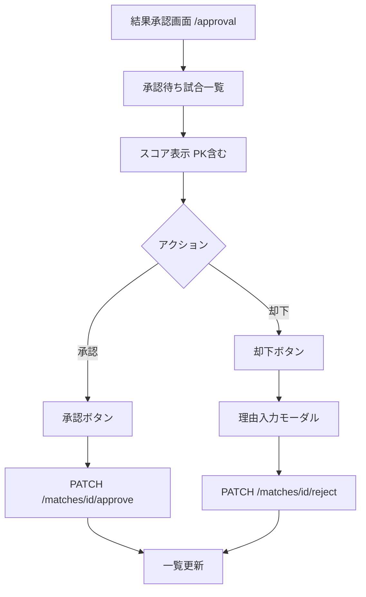

# ユーザーフロー図（実装ベース）

## 1. 大会作成・設定フロー（実装）

**注**: 新規大会作成ボタンは未実装。既存大会の編集のみ。会場追加も準備中。

## 2. チーム登録フロー（実装）

**注**: CSVインポート機能はUI実装済みだがAPI連携は準備中。

## 3. 選手登録フロー（実装）

**注**: 選手管理機能は設計段階。UIボタンはあるが機能未実装。

## 4. 試合日程生成フロー（実装）

## 5. スコア入力フロー（実装）

**注**: 得点者入力機能は実装されていない。排他ロック・バージョン競合検出も未実装。

## 6. 報告書作成フロー（実装）

**注**: メール送信機能は Coming Soon。バックグラウンドジョブ・ポーリングは未実装（同期ダウンロード）。

## 7. 対戦除外設定フロー（実装）

## 8. 結果承認フロー（実装）

