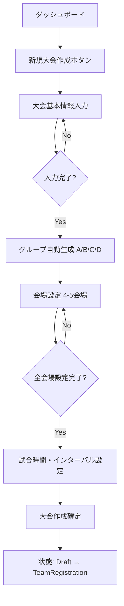
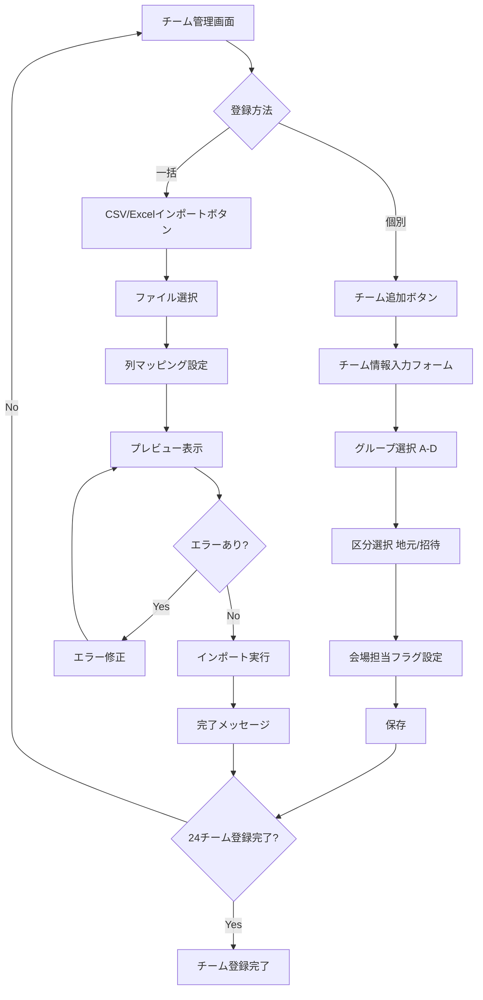
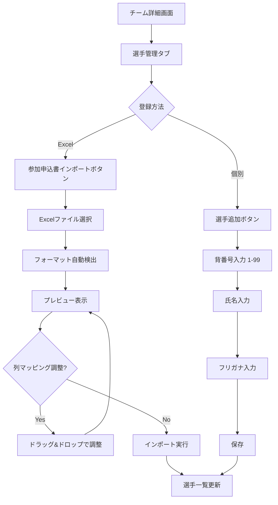
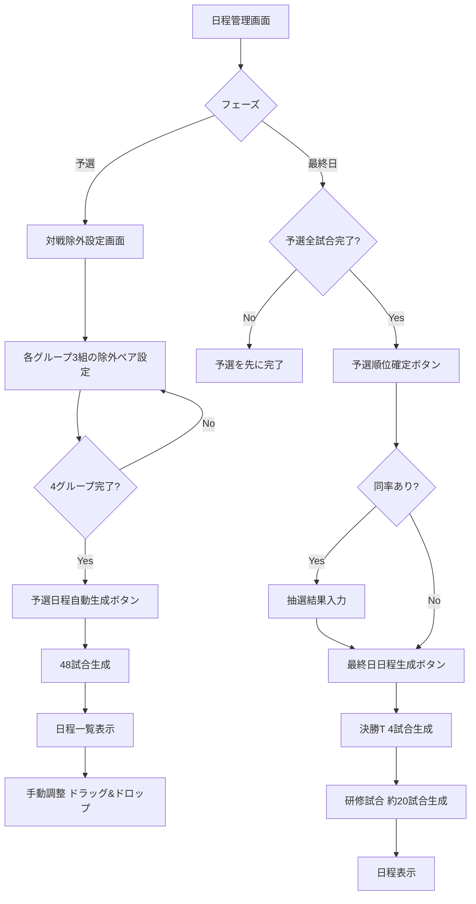
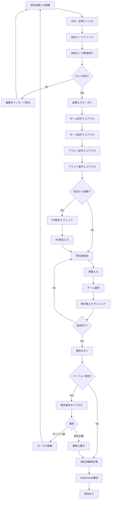
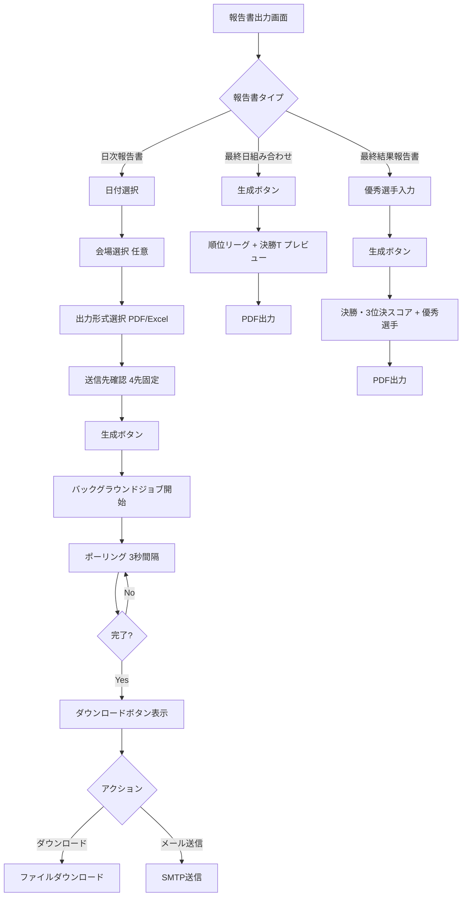
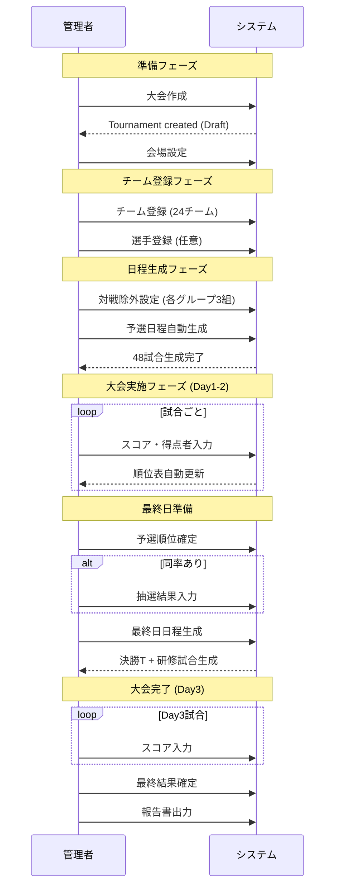

# ユーザーフロー図（仕様書ベース）

## 1. 大会作成・設定フロー

```mermaid
flowchart TD
    A[ダッシュボード] --> B[新規大会作成ボタン]
    B --> C[大会基本情報入力]
    C --> D{入力完了?}
    D -->|No| C
    D -->|Yes| E[グループ自動生成 A/B/C/D]
    E --> F[会場設定 4-5会場]
    F --> G{全会場設定完了?}
    G -->|No| F
    G -->|Yes| H[試合時間・インターバル設定]
    H --> I[大会作成確定]
    I --> J[状態: Draft → TeamRegistration]
```

## 2. チーム登録フロー

```mermaid
flowchart TD
    A[チーム管理画面] --> B{登録方法}
    B -->|個別| C[チーム追加ボタン]
    B -->|一括| D[CSV/Excelインポートボタン]
    
    C --> E[チーム情報入力フォーム]
    E --> F[グループ選択 A-D]
    F --> G[区分選択 地元/招待]
    G --> H[会場担当フラグ設定]
    H --> I[保存]
    
    D --> J[ファイル選択]
    J --> K[列マッピング設定]
    K --> L[プレビュー表示]
    L --> M{エラーあり?}
    M -->|Yes| N[エラー修正]
    N --> L
    M -->|No| O[インポート実行]
    O --> P[完了メッセージ]
    
    I --> Q{24チーム登録完了?}
    P --> Q
    Q -->|No| A
    Q -->|Yes| R[チーム登録完了]
```

## 3. 選手登録フロー

```mermaid
flowchart TD
    A[チーム詳細画面] --> B[選手管理タブ]
    B --> C{登録方法}
    
    C -->|Excel| D[参加申込書インポートボタン]
    D --> E[Excelファイル選択]
    E --> F[フォーマット自動検出]
    F --> G[プレビュー表示]
    G --> H{列マッピング調整?}
    H -->|Yes| I[ドラッグ&ドロップで調整]
    I --> G
    H -->|No| J[インポート実行]
    J --> K[選手一覧更新]
    
    C -->|個別| L[選手追加ボタン]
    L --> M[背番号入力 1-99]
    M --> N[氏名入力]
    N --> O[フリガナ入力]
    O --> P[保存]
    P --> K
```

## 4. 試合日程生成フロー

```mermaid
flowchart TD
    A[日程管理画面] --> B{フェーズ}
    
    B -->|予選| C[対戦除外設定画面]
    C --> D[各グループ3組の除外ペア設定]
    D --> E{4グループ完了?}
    E -->|No| D
    E -->|Yes| F[予選日程自動生成ボタン]
    F --> G[48試合生成]
    G --> H[日程一覧表示]
    H --> I[手動調整 ドラッグ&ドロップ]
    
    B -->|最終日| J{予選全試合完了?}
    J -->|No| K[予選を先に完了]
    J -->|Yes| L[予選順位確定ボタン]
    L --> M{同率あり?}
    M -->|Yes| N[抽選結果入力]
    N --> O[最終日日程生成ボタン]
    M -->|No| O
    O --> P[決勝T 4試合生成]
    P --> Q[研修試合 約20試合生成]
    Q --> R[日程表示]
```

## 5. スコア入力フロー

```mermaid
flowchart TD
    A[試合結果入力画面] --> B[日付・会場フィルタ]
    B --> C[試合カードクリック]
    C --> D[排他ロック取得試行]
    D --> E{ロック成功?}
    E -->|No| F[編集中メッセージ表示]
    F --> A
    E -->|Yes| G[結果入力モーダル]
    
    G --> H[ホーム前半スコア入力]
    H --> I[ホーム後半スコア入力]
    I --> J[アウェイ前半スコア入力]
    J --> K[アウェイ後半スコア入力]
    K --> L{同点かつ決勝T?}
    L -->|Yes| M[PK戦あり チェック]
    M --> N[PK得点入力]
    L -->|No| O[得点者追加]
    N --> O
    
    O --> P[時間入力]
    P --> Q[チーム選択]
    Q --> R[得点者入力 サジェスト]
    R --> S{追加完了?}
    S -->|No| O
    S -->|Yes| T[保存ボタン]
    
    T --> U{バージョン競合?}
    U -->|Yes| V[競合解決ダイアログ]
    V --> W{選択}
    W -->|サーバー値| X[ローカル破棄]
    W -->|自分の値| Y[強制上書き]
    U -->|No| Z[順位自動再計算]
    X --> A
    Y --> Z
    Z --> AA[WebSocket通知]
    AA --> AB[保存完了]
```

## 6. 報告書作成フロー

```mermaid
flowchart TD
    A[報告書出力画面] --> B{報告書タイプ}
    
    B -->|日次報告書| C[日付選択]
    C --> D[会場選択 任意]
    D --> E[出力形式選択 PDF/Excel]
    E --> F[送信先確認 4先固定]
    F --> G[生成ボタン]
    G --> H[バックグラウンドジョブ開始]
    H --> I[ポーリング 3秒間隔]
    I --> J{完了?}
    J -->|No| I
    J -->|Yes| K[ダウンロードボタン表示]
    K --> L{アクション}
    L -->|ダウンロード| M[ファイルダウンロード]
    L -->|メール送信| N[SMTP送信]
    
    B -->|最終日組み合わせ| O[生成ボタン]
    O --> P[順位リーグ + 決勝T プレビュー]
    P --> Q[PDF出力]
    
    B -->|最終結果報告書| R[優秀選手入力]
    R --> S[生成ボタン]
    S --> T[決勝・3位決スコア + 優秀選手]
    T --> U[PDF出力]
```

## 7. 統合フロー：大会ライフサイクル

```mermaid
sequenceDiagram
    participant A as 管理者
    participant S as システム

    Note over A,S: 準備フェーズ
    A->>S: 大会作成
    S-->>A: Tournament created (Draft)
    A->>S: 会場設定
    
    Note over A,S: チーム登録フェーズ
    A->>S: チーム登録 (24チーム)
    A->>S: 選手登録 (任意)
    
    Note over A,S: 日程生成フェーズ
    A->>S: 対戦除外設定 (各グループ3組)
    A->>S: 予選日程自動生成
    S-->>A: 48試合生成完了
    
    Note over A,S: 大会実施フェーズ (Day1-2)
    loop 試合ごと
        A->>S: スコア・得点者入力
        S-->>A: 順位表自動更新
    end
    
    Note over A,S: 最終日準備
    A->>S: 予選順位確定
    alt 同率あり
        A->>S: 抽選結果入力
    end
    A->>S: 最終日日程生成
    S-->>A: 決勝T + 研修試合生成
    
    Note over A,S: 大会完了 (Day3)
    loop Day3試合
        A->>S: スコア入力
    end
    A->>S: 最終結果確定
    A->>S: 報告書出力
```
