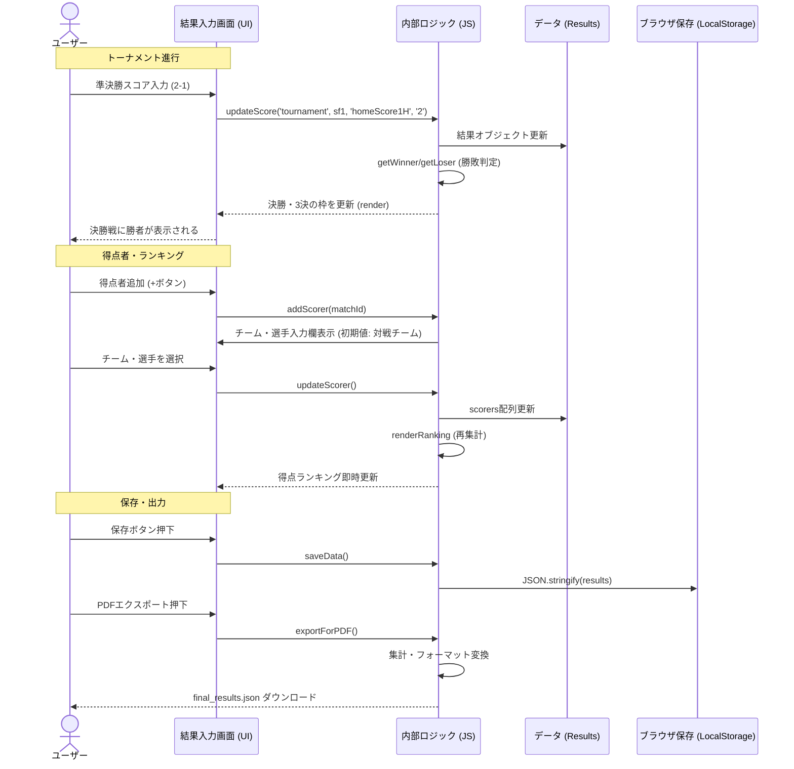

# 最終日結果入力ツール 理想動作仕様書 & 詳細チェックリスト

本ドキュメントは、`final_day_results.html` が目指すべき「理想的な動作（あるべき姿）」と、それを検証するための詳細なチェックリストです。

## 📋 理想的なユーザー体験フロー (Ideal User Flow)

### 1. 準備フェーズ
1.  **起動**: ファイルを開くと、シンプルで清潔感のある入力インターフェースが表示される。
2.  **データ読み込み**: スケジュール管理ツールから出力されたJSONを読み込むと、瞬時に「決勝トーナメント」と「研修試合」の枠組みが構築される。
3.  **状態復元**: もし作業途中の場合、ブラウザのローカル保存データから前回の続きを再開できる。

### 2. 試合結果入力フェーズ（トーナメント）
1.  **スコア入力**: 準決勝のスコアを入力すると、**即座に決勝・3位決定戦の対戦カードが埋まる**。
2.  **PK戦対応**: 同点の場合は「PK戦」チェックボックスが強調され、PKスコアを入力すると勝ち上がり判定が行われる。
3.  **得点者入力**:
    *   「得点者追加」を押すと、**その試合の対戦チームが自動選択**された状態で入力欄が開く。
    *   チームを選ぶと、**登録選手リスト（マスタ）から選手名をプルダウン選択**できる（手入力も可）。
    *   入力した得点は、裏でリアルタイムに「得点ランキング」に集計される。

### 3. 表彰・出力フェーズ
1.  **ランキング確認**: 試合結果を入力し終えると、順位表（1位〜4位）と得点ランキングが自動完成している。
2.  **優秀選手選出**: 全参加チームの選手リストから、MVPと優秀選手を選出する。
3.  **最終出力**: PDF出力用のJSONデータをエクスポートする。このデータには「試合結果」「トーナメント結果」「得点ランキング」「優秀選手」すべてが含まれる。

---

## 📋 設計・実装方針 (Design Policy)

ユーザーからの「チームIDを使用すべきか、文字列（チーム名）で十分か？」という問いに対する、本システムの推奨方針です。

### 結論: **「厳格な文字列マッチング (Strict Name Matching)」を採用する**

現状の実装（`final_day_results.html`）が単一ファイルで完結している点、および入力元JSONの構造を考慮し、数値IDの導入による複雑化を避けます。ただし、データの整合性を保つために以下のルールを**厳守**します。

1.  **マスタデータの一元化**:
    *   読み込んだJSONから「全参加チームリスト」を生成し、これを唯一の正（Single Source of Truth）とする。
    *   プログラム内部でのチーム参照は、全てこのリスト内の文字列と完全一致しなければならない。
2.  **自由入力の禁止**:
    *   ロジックに関わる部分（勝者判定、得点者の所属チームなど）では、ユーザーによるチーム名の自由入力（手打ち）を禁止し、必ずリストからの選択式とする。
3.  **表記ゆれの排除**:
    *   データ読み込み時に、「浦和南」と「浦和 南」のような表記ゆれがないか検証する（可能であれば）。

---

## ✅ 詳細動作チェックリスト

### 🏗️ 基盤・データ (Foundation)

- [ ] **初期化・読み込み**
    - [ ] **ファイル選択時の挙動**
        - *Action*: `final_day_schedule.json` を選択する。
        - *Check*: コンソールログにエラー（赤文字）が出ないこと。
        - *Check*: 画面中央の「ファイルを読み込む」エリアが消え、メイン画面が表示されること。
    - [ ] **サンプルデータ展開**
        - *Action*: [サンプルデータで試す] ボタンをクリックする。
        - *Check*: トーナメント表に「浦和南」「浦和学院」などのチーム名がセットされること。
        - *Check*: 研修試合タブ内に複数の試合カードが生成されること。
- [ ] **データ構造の整合性**
    - [ ] **シード・メタデータ表示**
        - *Check*: チーム名の下や横に `(A1)` `(C2)` などのシード情報またはグループ情報が表示されていること。
        - *Check*: 会場名が各カードのヘッダー部分に正しく表示されていること。

### 🏆 トーナメント進行自動化 (Tournament Logic)

- [ ] **勝ち上がり判定 (Win/Loss)**
    - [ ] **[通常勝利] 勝者の決勝進出**
        - *Action*: SF1で Home(2) - Away(1) と入力する。
        - *Check*: 決勝戦(Final)のHome枠に「SF1のHomeチーム名」が即座に表示されること。
        - *Check*: 3位決定戦(3rd)のHome枠に「SF1のAwayチーム名」が即座に表示されること。
    - [ ] **[PK勝利] PK戦での勝者判定**
        - *Action*: SF2で Home(1) - Away(1) とし、[PK戦]にチェックを入れ、PK Home(5) - Away(4) と入力する。
        - *Check*: 決勝戦(Final)のAway枠に「SF2のHomeチーム名」が表示されること（PK勝ち）。
        - *Check*: 3位決定戦(3rd)のAway枠に「SF2のAwayチーム名」が表示されること（PK負け）。
    - [ ] **[リセット] スコア削除時の挙動**
        - *Action*: 入力したスコアを削除（空欄に）する。
        - *Check*: 変動していた決勝・3決の枠が、「SF1勝者」「SF1敗者」等のプレースホルダーに戻ること。

- [ ] **スコア連動**
    - [ ] **合計スコア計算**
        - *Action*: 前半「1」、後半「2」と入力する。
        - *Check*: 合計表示部分（中央の大きい数字）が「3」になること。
    - [ ] **不正値ガード**
        - *Action*: スコア欄に「-1」や「abc」を入力してみる。
        - *Check*: 入力が拒否されるか、自動的に「0」または空欄に修正されること。

### ⚽ 得点者・選手管理 (Scorers & Players)

- [ ] **得点者入力UI**
    - [ ] **チーム初期選択**
        - *Action*: ある試合（例: 浦和南 vs 浦和学院）で [+追加] ボタンを押す。
        - *Check*: 追加された行のチーム選択プルダウンが、デフォルトで「浦和南」（ホーム）か「浦和学院」（アウェイ）のどちらかになっていること。
    - [ ] **選手プルダウン連動**
        - *Action*: チーム選択プルダウンで「浦和学院」を選択する。
        - *Check*: 隣の選手名入力欄（またはプルダウン）の候補が、浦和学院の登録選手リストに切り替わること。
    - [ ] **自由入力の許容**
        - *Action*: リストにない選手名（例: "練習生"）を手入力する。
        - *Check*: エラーにならず、そのまま入力が確定できること。

- [ ] **得点ランキング集計 (Top Scorers)**
    - [ ] **リアルタイム反映**
        - *Action*: 試合Aで「選手X」に1得点、試合Bで「選手X」に1得点を追加する。
        - *Check*: 得点ランキングセクションで「選手X」が「2点」として表示されること。
    - [ ] **同点ランク順**
        - *Action*: 「選手Y」にも2得点分入力する。
        - *Check*: ランキング上で「選手X」と「選手Y」が並んで表示されること（順序は仕様によるが、両方表示されていること）。
    - [ ] **削除時の反映**
        - *Action*: 試合Aの「選手X」の得点行を [✕] ボタンで削除する。
        - *Check*: 得点ランキングの「選手X」が「1点」に減ること。0点になった場合はランキングから消えること。

### 🏟️ 研修試合 (Training Matches)

- [ ] **表示・入力**
    - [ ] **会場グルーピング**
        - *Check*: 研修試合タブを開いた際、「浦和南高G」「市立浦和高G」などの会場名で見出しが分かれていること。
    - [ ] **全試合入力可否**
        - *Action*: 一番下の試合のスコアを入力してみる。
        - *Check*: 動作が重くならず、スムーズに入力・反映されること。

### 🎖️ 優秀選手・表彰 (Awards)

- [ ] **優秀選手選考**
    - [ ] **MVP入力**
        - *Action*: MVP欄に選手名を入力する。
        - *Check*: 正常に入力・保持されること。
    - [ ] **全チーム選択**
        - *Action*: 優秀選手の所属チームプルダウンを開く。
        - *Check*: 決勝トーナメント進出チームだけでなく、予選敗退チーム（研修試合のみ参加）も選択肢に含まれていること。

### 💾 保存・出力 (Persistence & Export)

- [ ] **一時保存 (LocalStorage)**
    - [ ] **保存実行**
        - *Action*: いくつかの試合結果を入力した後、[保存] ボタンを押す。
        - *Check*: 「保存しました」等のメッセージが表示されること。
    - [ ] **リロード復元**
        - *Action*: ブラウザをリロード（F5）し、初期画面に戻った後、[読み込み] ボタンを押す。
        - *Check*: 先ほど入力したスコアや得点者が完全に元通り表示されること。

- [ ] **PDF連携データ出力**
    - [ ] **ファイル生成**
        - *Action*: [最終結果PDF用エクスポート] ボタンを押す。
        - *Check*: `final_results_for_pdf.json` などのファイルがダウンロードされること。
    - [ ] **データ内容確認**
        - *Action*: ダウンロードしたJSONファイルをテキストエディタで開く。
        - *Check*: `ranking` 配列に優勝〜4位までのチーム名が入っていること。
        - *Check*: `scorers` 配列に、入力した得点王候補の選手データが入っていること。

### 📱 UI/UX・レスポンシブ

- [ ] **操作性・反応**
    - [ ] **タブ切り替え**
        - *Action*: [決勝トーナメント] [研修試合] タブを交互に連打して切り替える。
        - *Check*: 表示が乱れたり、フリーズしたりしないこと。
- [ ] **モバイル表示**
    - [ ] **画面幅縮小**
        - *Action*: ブラウザの幅をスマホサイズ（約375px）まで狭める。
        - *Check*: スコア入力欄が縦並びになるなどして、横スクロールなしで入力可能か、あるいは横スクロールしてもレイアウトが崩壊しないこと。

### 🔄 データ連動・内部状態チェックリスト (Data Linkage Verification)

図解されたデータフローが、実際のシステム内部で正しく処理されているかを確認するための技術的なチェックリストです。開発者コンソール (F12) を使用して確認します。

- [ ] **トーナメント結果の連動 (`results.tournament`)**
    - [ ] **準決勝スコア入力時**
        - *Action*: SF1の結果を入力する。
        - *Verify*: `results.tournament` 配列内の `sf1` オブジェクトの `homeScore1H` 等が更新されているか。
        - *Verify*: 自動的に決勝戦 (`final`) オブジェクトの `home` (または `away`) プロパティに、勝者のチームオブジェクトがセットされているか。
        - *Verify*: 自動的に3位決定戦 (`3rd`) オブジェクトに、敗者のチームオブジェクトがセットされているか。

- [ ] **得点データの格納と集計 (`results.tournament` -> `results.ranking`)**
    - [ ] **得点者追加時**
        - *Action*: 試合ID `sf1` に得点者を追加する。
        - *Verify*: `results.tournament[index].scorers` 配列に新しい得点者オブジェクト `{time, name, team}` が追加されているか。
    - [ ] **ランキング集計ロジック**
        - *Action*: `updateRanking()` (または該当する集計関数) が実行された後。
        - *Verify*: `results.ranking` (または得点王集計用変数) に、入力した選手名と正しい合計得点が反映されているか。
    - [ ] **チーム・選手名の紐付け**
        - *Verify*: 得点者オブジェクトの `team` プロパティが、単なる文字列ではなく、マスタデータと整合性の取れた値（チームIDや正確な名称）になっているか。

- [ ] **優秀選手の保存 (`results.players`)**
    - [ ] **選出時**
        - *Action*: 優秀選手を入力する。
        - *Verify*: `results.players` 配列に `{type: 'excellent', name: '...', team: '...'}` の形式で格納されているか。
        - *Verify*: PDF出力用JSON生成時、この配列が欠落せず `players` キーに出力されているか。

---

## 📊 動作フロー可視化 (Visualization)

### シーケンス図: ユーザー操作とシステム挙動
ユーザーが「得点者追加」や「スコア入力」を行った際、システム内部でどのようにデータが処理され、表示が更新されるかの流れです。



### データフロー図: 入力値の反映先
どの入力項目が、最終的にどの出力データ（ランキングやトーナメント結果）に影響を与えるかの関係図です。

```mermaid
graph TD
    subgraph Input [入力データ]
        M_Result[試合スコア (準決勝)]
        M_PK[PK戦スコア]
        S_Input[得点者入力]
        P_Select[優秀選手選択]
    end

    subgraph Process [処理ロジック]
        WinnerCheck{勝敗判定}
        RankAgg[得点集計]
        Format[PDF用フォーマット変換]
    end

    subgraph Output [反映・出力先]
        NextMatch[決勝・3決の対戦カード]
        RankTable[チーム最終順位 (1-4位)]
        ScoreRank[得点ランキング]
        BestPlayers[優秀選手一覧]
        PDF_JSON[PDF用JSONファイル]
    end

    %% フロー接続
    M_Result --> WinnerCheck
    M_PK --> WinnerCheck
    
    WinnerCheck -->|勝者| NextMatch
    WinnerCheck -->|敗者| NextMatch
    WinnerCheck -->|決勝結果| RankTable

    S_Input --> RankAgg
    RankAgg --> ScoreRank

    %% PDF出力への統合
    NextMatch --> Format
    RankTable --> Format
    ScoreRank --> Format
    BestPlayers --> Format
    P_Select --> BestPlayers

    Format --> PDF_JSON

    %% スタイル定義
    style Input fill:#e1f5fe,stroke:#01579b
    style Process fill:#f3e5f5,stroke:#4a148c
    style Output fill:#fff3e0,stroke:#e65100
    style WinnerCheck fill:#fff9c4,stroke:#fbc02d
```
