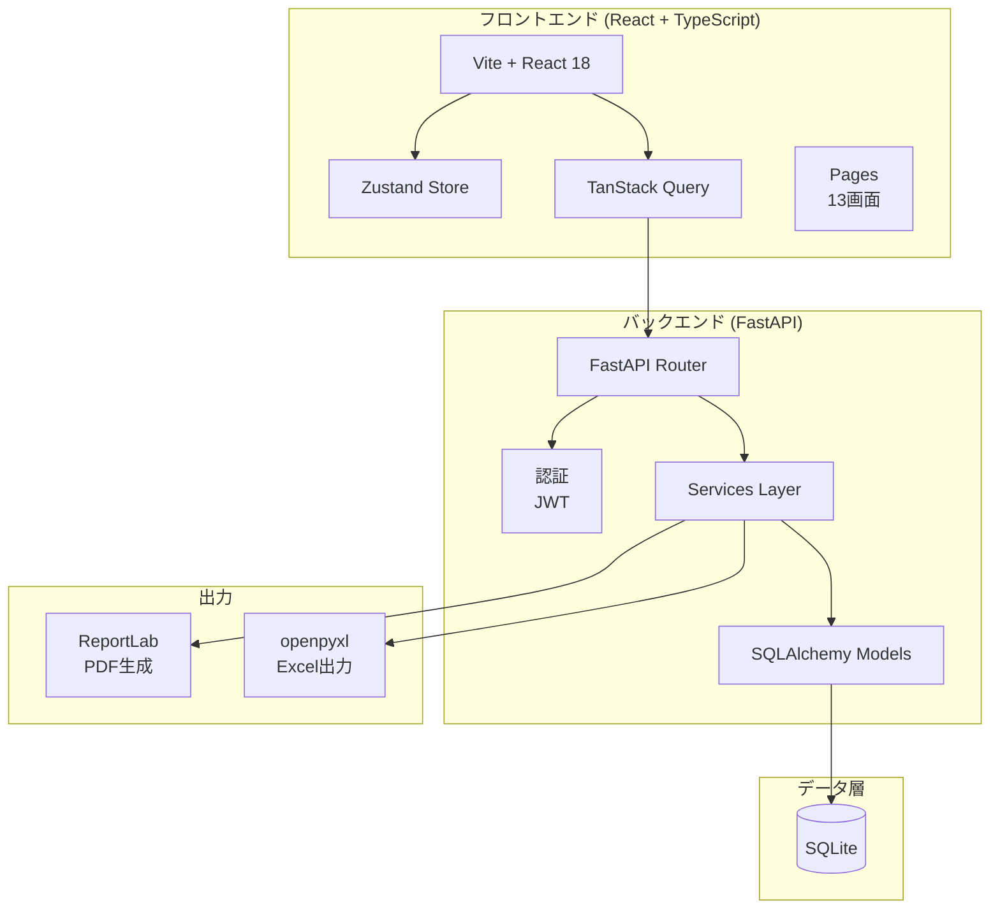
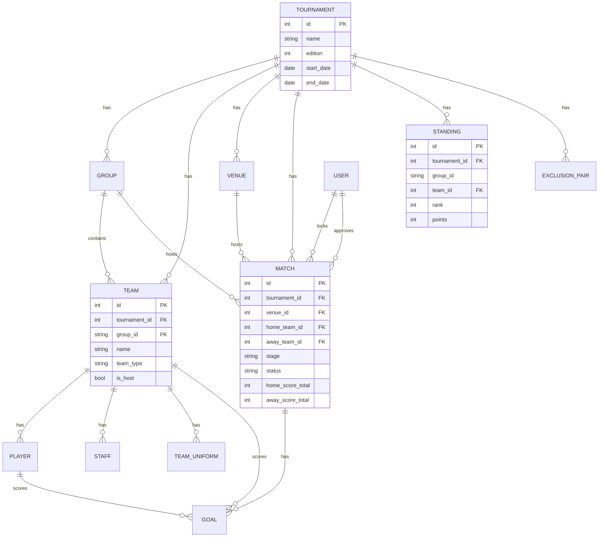
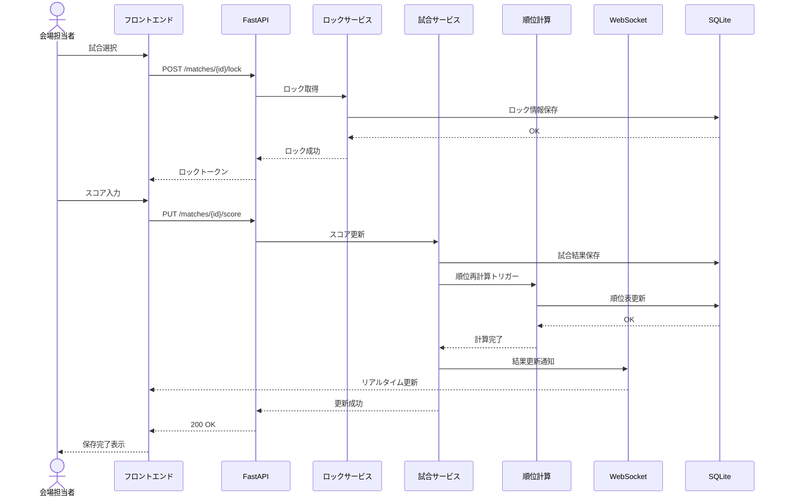
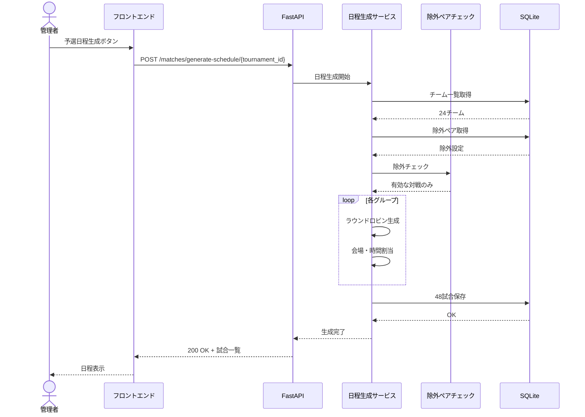
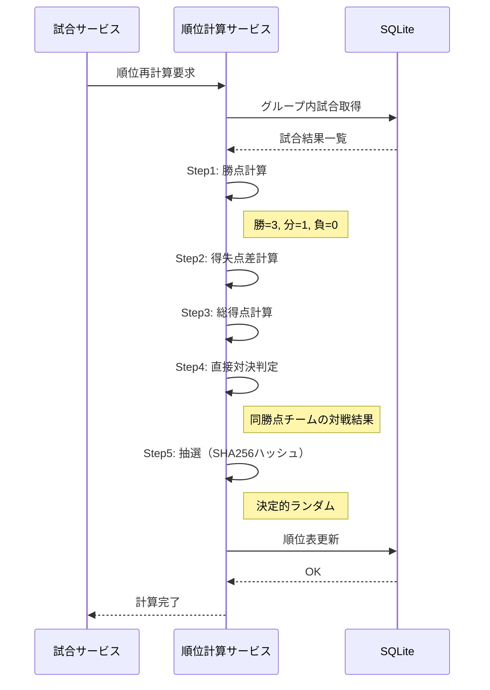
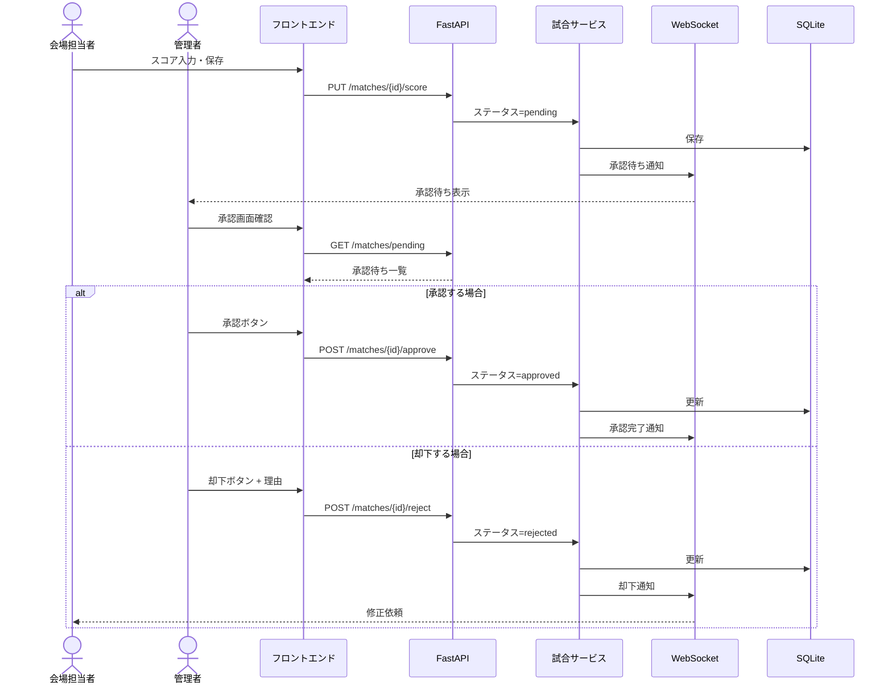
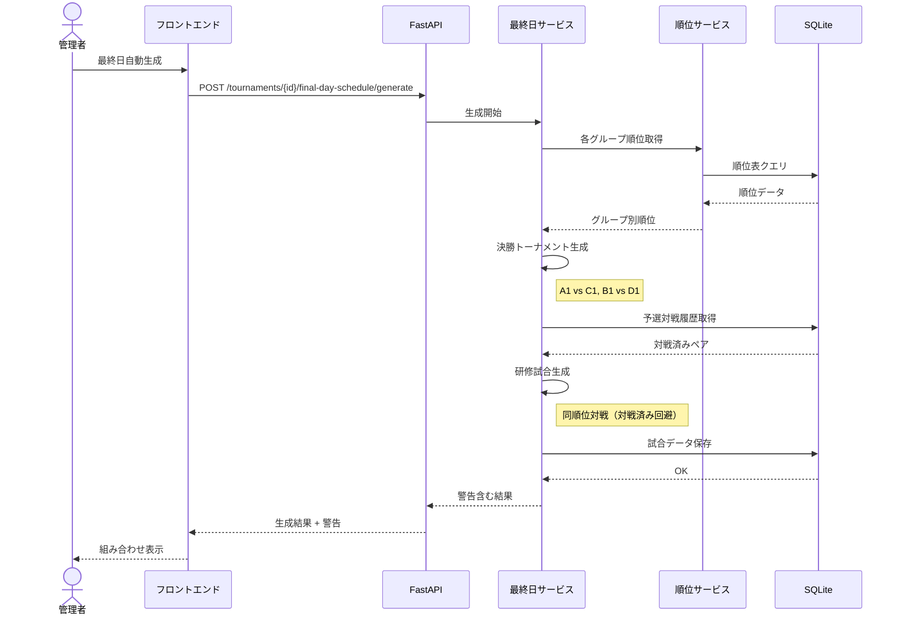
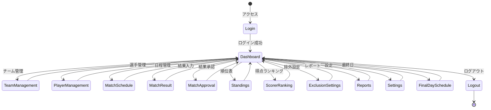

# 浦和カップ システム分析ドキュメント

## 1. システム構成図

## 2. データモデル ER図

## 3. 主要フロー シーケンス図

### 3.1 試合結果入力フロー

### 3.2 日程生成フロー

### 3.3 順位計算フロー

### 3.4 結果承認フロー

### 3.5 最終日スケジュール生成フロー

## 4. 画面遷移図

## 5. 機能要件マトリクス

| 機能ID | 機能名 | 要件 | 実装状況 | 備考 |
|--------|--------|------|----------|------|
| F-01 | 大会作成・編集 | 高 | ✅ | |
| F-02 | 大会設定 | 高 | ✅ | |
| F-03 | グループ自動作成 | 高 | ✅ | |
| F-04 | 送信元情報設定 | 高 | ✅ | |
| F-10 | チーム登録・編集・削除 | 高 | ⚠️ | 削除UIなし |
| F-11 | グループ割当 | 高 | ✅ | |
| F-12 | CSVインポート | 中 | ✅ | |
| F-13 | チーム区分設定 | 高 | ✅ | |
| F-14 | 会場担当校フラグ | 高 | ✅ | |
| F-20 | 選手登録・編集・削除 | 高 | ✅ | |
| F-21 | Excel/CSVインポート | 高 | ✅ | |
| F-22 | 参加申込書インポート | 中 | ❓ | 要確認 |
| F-23 | 得点者サジェスト | 高 | ✅ | |
| F-24 | 選手検索 | 中 | ✅ | |
| F-30 | スタッフ登録 | 高 | ✅ | |
| F-31 | 役割設定 | 高 | ✅ | |
| F-40 | 会場登録・編集・削除 | 高 | ✅ | |
| F-41 | グループ紐付け | 高 | ✅ | |
| F-42 | 試合数上限設定 | 中 | ✅ | |
| F-50 | 対戦除外設定 | 高 | ✅ | |
| F-51 | 予選日程自動生成 | 高 | ✅ | |
| F-52 | 決勝トーナメント生成 | 高 | ✅ | |
| F-53 | 研修試合生成 | 中 | ✅ | |
| F-54 | 日程手動調整 | 中 | ✅ | |
| F-55 | 組み合わせ変更 | 中 | ✅ | |
| F-60 | スコア入力 | 最高 | ✅ | |
| F-61 | PK戦スコア入力 | 高 | ✅ | |
| F-62 | 得点者入力 | 中 | ✅ | |
| F-63 | 入力ロック機能 | 高 | ✅ | |
| F-64 | 結果承認フロー | 中 | ✅ | |
| F-70 | 順位表自動計算 | 最高 | ✅ | |
| F-71 | グループ別順位表 | 高 | ✅ | |
| F-72 | 得点ランキング | 中 | ✅ | |
| F-73 | 統計ダッシュボード | 低 | ⚠️ | 基本のみ |
| F-80 | 日次報告書PDF | 最高 | ⚠️ | core未移植 |
| F-81 | グループ順位表PDF | 高 | ⚠️ | 簡易実装 |
| F-82 | 最終日組み合わせ表PDF | 高 | ⚠️ | core未移植 |
| F-83 | 最終結果報告書PDF | 高 | ❌ | 未実装 |
| F-84 | Excel出力 | 中 | ✅ | |
| F-90 | 公開順位表 | 高 | ✅ | |
| F-91 | 公開試合一覧 | 高 | ✅ | |
| F-92 | リアルタイム更新 | 中 | ✅ | WebSocket |
| F-100 | オフライン入力対応 | 中 | ✅ | PWA |
| F-101 | IndexedDBローカル保存 | 中 | ✅ | Dexie.js |
| F-102 | 競合解決UI | 中 | ⚠️ | 基本のみ |
| F-103 | オンライン復帰時同期 | 中 | ✅ | |

### 凡例
- ✅ 実装完了
- ⚠️ 部分実装/改善必要
- ❌ 未実装
- ❓ 要確認

## 6. 発見された差異（イシュー候補）

### 6.1 高優先度

| # | 差異 | 要件 | 実装状況 | 影響度 |
|---|------|------|----------|--------|
| 1 | チーム削除UI | F-10 | UIなし | 中 |
| 2 | 最終結果報告書PDF | F-83 | 未実装 | 高 |
| 3 | 日次報告書PDF品質 | F-80 | core版と差異 | 高 |

### 6.2 中優先度

| # | 差異 | 要件 | 実装状況 | 影響度 |
|---|------|------|----------|--------|
| 4 | 統計ダッシュボード | F-73 | 基本のみ | 低 |
| 5 | 競合解決UI | F-102 | 簡易版 | 中 |
| 6 | 参加申込書インポート | F-22 | 要確認 | 中 |

## 7. 次のアクション

1. 上記差異をissues.yamlにイシューとして登録
2. 優先度順に対応計画を策定
3. coreのPDF生成機能をimpl-repoに移植
