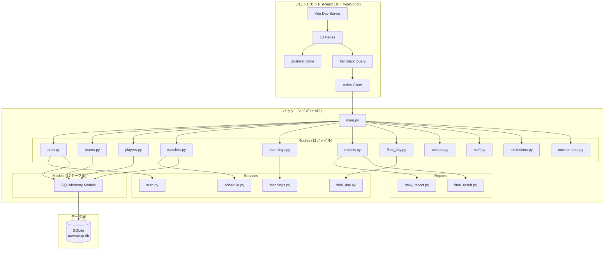
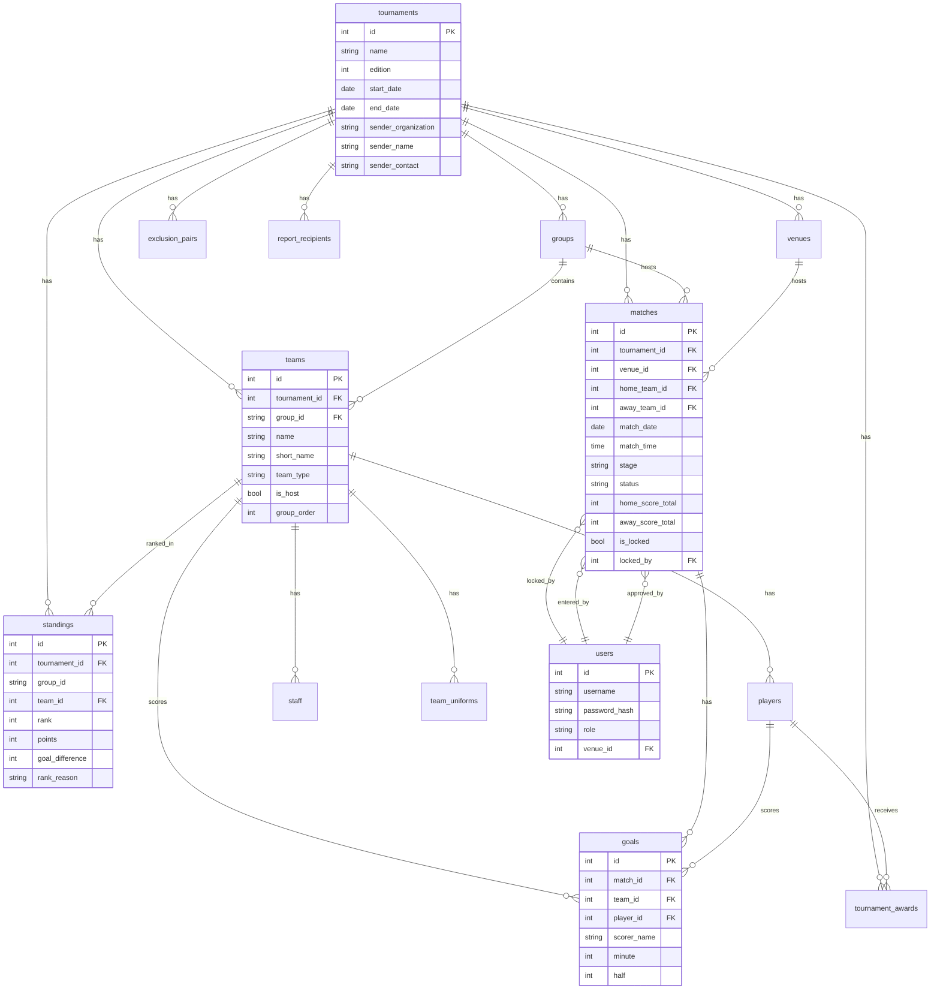
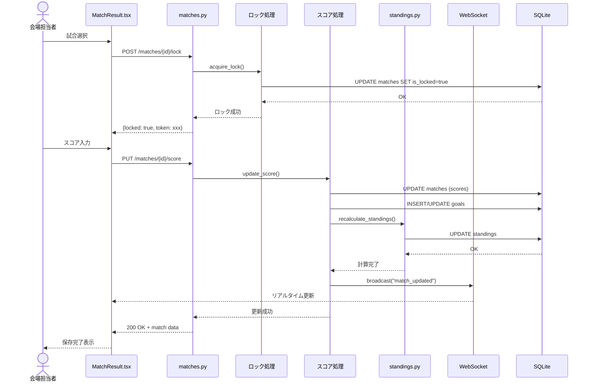
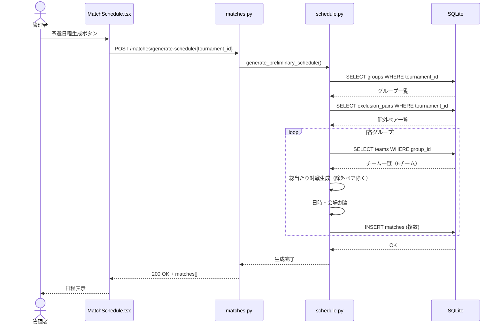
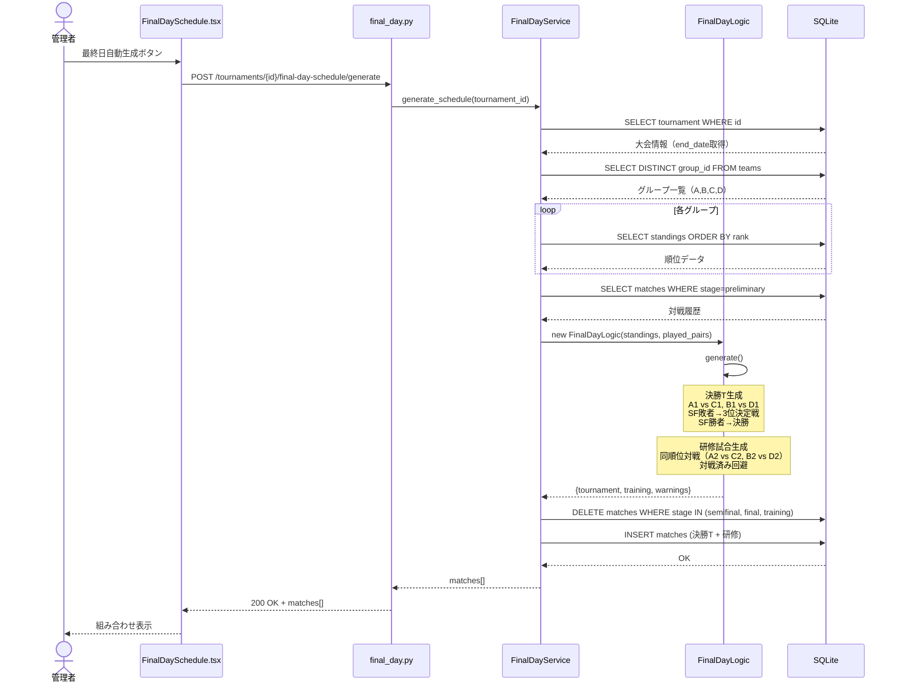
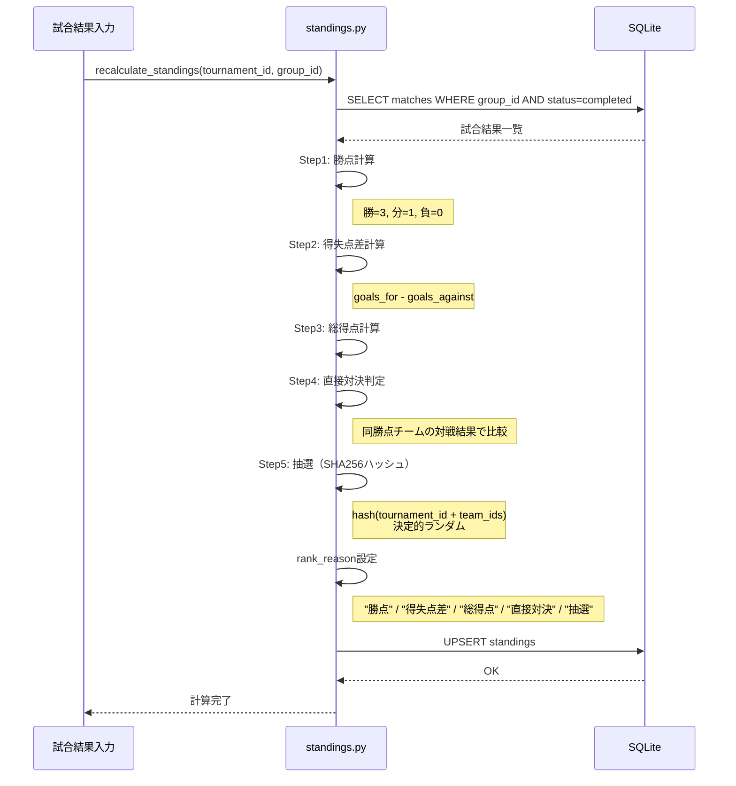
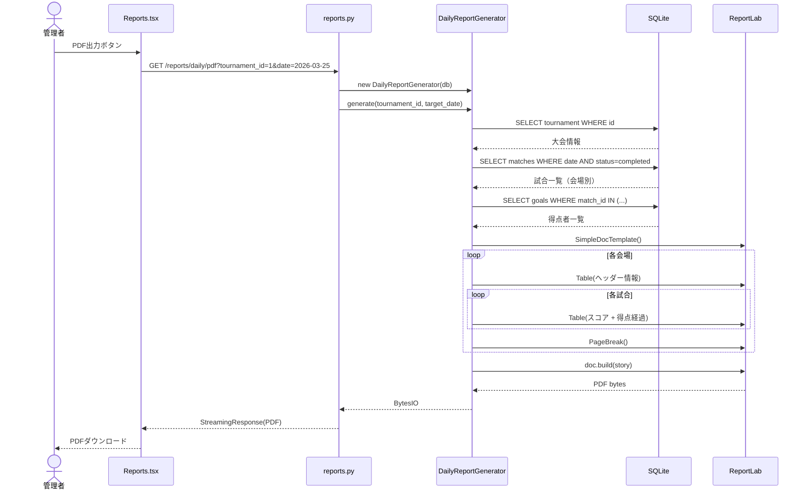

# 実装分析ドキュメント

**作成日**: 2026-01-06
**対象**: impl-repo (D:\UrawaCup2\impl-repo)

---

## 1. 実装側システム構成図

---

## 2. 実装側ER図

---

## 3. 実装側シーケンス図

### 3.1 試合結果入力フロー（実装）

### 3.2 予選日程生成フロー（実装）

### 3.3 最終日組み合わせ生成フロー（実装）

### 3.4 順位計算フロー（実装）

### 3.5 PDF生成フロー（実装）

---

## 4. 要件 vs 実装 比較表

### 4.1 機能要件チェックリスト

| ID | 機能 | 要件 | 実装状態 | 備考 |
|----|------|------|----------|------|
| F-01 | 大会作成・編集 | 高 | ✅完全 | グループA-D自動作成 |
| F-02 | 大会設定 | 高 | ✅完全 | Settings.tsx |
| F-03 | グループ自動作成 | 高 | ✅完全 | 大会作成時に自動 |
| F-04 | 送信元情報設定 | 高 | ✅完全 | Settings.tsx |
| F-10 | チーム登録・編集・削除 | 高 | ⚠️部分的 | **削除UIなし** |
| F-11 | グループ割当 | 高 | ✅完全 | |
| F-12 | CSVインポート | 中 | ✅完全 | teams.py /import |
| F-13 | チーム区分設定 | 高 | ✅完全 | local/invited |
| F-14 | 会場担当校フラグ | 高 | ✅完全 | is_host |
| F-20 | 選手登録・編集・削除 | 高 | ⚠️部分的 | **編集・削除UIスタブ** |
| F-21 | Excel/CSVインポート | 高 | ⚠️部分的 | **CSVのみ実装** |
| F-22 | 参加申込書インポート | 中 | ❌未実装 | 2列構成未対応 |
| F-23 | 得点者サジェスト | 高 | ✅完全 | /players/suggest |
| F-24 | 選手検索 | 中 | ✅完全 | |
| F-30 | スタッフ登録 | 高 | ✅完全 | staff.py |
| F-31 | 役割設定 | 高 | ✅完全 | manager/coach/referee |
| F-40 | 会場登録・編集・削除 | 高 | ✅完全 | venues.py |
| F-41 | グループ紐付け | 高 | ✅完全 | |
| F-42 | 試合数上限設定 | 中 | ✅完全 | max_matches_per_day |
| F-50 | 対戦除外設定 | 高 | ✅完全 | exclusions.py |
| F-51 | 予選日程自動生成 | 高 | ✅完全 | schedule.py |
| F-52 | 決勝トーナメント生成 | 高 | ✅完全 | final_day.py |
| F-53 | 研修試合生成 | 中 | ✅完全 | 同順位対戦 |
| F-54 | 日程手動調整 | 中 | ✅完全 | |
| F-55 | 組み合わせ変更 | 中 | ✅完全 | 入れ替えボタン |
| F-60 | スコア入力 | 最高 | ✅完全 | |
| F-61 | PK戦スコア入力 | 高 | ✅完全 | |
| F-62 | 得点者入力 | 中 | ✅完全 | サジェスト付き |
| F-63 | 入力ロック機能 | 高 | ✅完全 | is_locked統合 |
| F-64 | 結果承認フロー | 中 | ✅完全 | approve/reject/resubmit |
| F-70 | 順位表自動計算 | 最高 | ✅完全 | |
| F-71 | グループ別順位表 | 高 | ✅完全 | |
| F-72 | 得点ランキング | 中 | ✅完全 | /standings/scorers |
| F-73 | 統計ダッシュボード | 低 | ⚠️部分的 | 基本のみ |
| F-80 | 日次報告書PDF | 最高 | ✅完全 | Platypus実装 |
| F-81 | グループ順位表PDF | 高 | ⚠️部分的 | Excel出力のみ |
| F-82 | 最終日組み合わせ表PDF | 高 | ❌未実装 | |
| F-83 | 最終結果報告書PDF | 高 | ✅完全 | Platypus実装 |
| F-84 | Excel出力 | 中 | ⚠️部分的 | 順位表のみ |
| F-90 | 公開順位表 | 高 | ✅完全 | /public/standings |
| F-91 | 公開試合一覧 | 高 | ✅完全 | /public/matches |
| F-92 | リアルタイム更新 | 中 | ✅完全 | WebSocket |
| F-100 | オフライン入力対応 | 中 | ❌未実装 | PWA未実装 |
| F-101 | IndexedDBローカル保存 | 中 | ❌未実装 | |
| F-102 | 競合解決UI | 中 | ❌未実装 | |
| F-103 | オンライン復帰時同期 | 中 | ❌未実装 | |

### 4.2 API比較

| 要件パス | 要件メソッド | 実装パス | 実装メソッド | 状態 |
|---------|-------------|---------|-------------|------|
| /api/auth/login | POST | /api/auth/login | POST | ✅一致 |
| /api/auth/logout | POST | /api/auth/logout | POST | ✅一致 |
| /api/auth/me | GET | /api/auth/me | GET | ✅一致 |
| /api/tournaments | GET/POST | /api/tournaments | GET/POST | ✅一致 |
| /api/tournaments/{id} | PATCH | /api/tournaments/{id} | PUT/PATCH | ✅一致 |
| /api/teams | GET/POST | /api/teams | GET/POST | ✅一致 |
| /api/teams/{id} | PATCH | /api/teams/{id} | PUT | ⚠️PUT |
| /api/matches/{id}/lock | DELETE | /api/matches/{id}/lock | DELETE | ✅一致 |
| /api/reports/daily | GET | /api/reports/daily/pdf | GET | ⚠️パス異なる |
| /api/final-day-matches/swap | POST | なし | - | ❌未実装 |

### 4.3 画面比較

| 要件画面 | URL | 実装ファイル | 状態 |
|---------|-----|-------------|------|
| S-01 ログイン | /login | Login.tsx | ✅完全 |
| S-02 ダッシュボード | / | Dashboard.tsx | ✅完全 |
| S-03 チーム管理 | /teams | TeamManagement.tsx | ⚠️削除UIなし |
| S-04 選手管理 | /players | PlayerManagement.tsx | ⚠️編集UIスタブ |
| S-05 日程管理 | /schedule | MatchSchedule.tsx | ✅完全 |
| S-06 結果入力 | /results | MatchResult.tsx | ✅完全 |
| S-07 結果承認 | /approval | MatchApproval.tsx | ✅完全 |
| S-08 順位表 | /standings | Standings.tsx | ✅完全 |
| S-09 得点ランキング | /scorers | ScorerRanking.tsx | ✅完全 |
| S-10 対戦除外設定 | /exclusions | ExclusionSettings.tsx | ✅完全 |
| S-11 レポート | /reports | Reports.tsx | ⚠️Excel出力スタブ |
| S-12 設定 | /settings | Settings.tsx | ✅完全 |
| S-13 最終日組み合わせ | /final-day | FinalDaySchedule.tsx | ✅完全 |
| P-01 公開順位表 | /public/standings | 要確認 | ⚠️tournamentIdハードコード |
| P-02 公開試合一覧 | /public/matches | 要確認 | ⚠️tournamentIdハードコード |

---

## 5. 発見された差異（新規イシュー候補）

### 5.1 高優先度

| # | 差異 | 影響 |
|---|------|------|
| 1 | F-82 最終日組み合わせ表PDF未実装 | 最終日の印刷物がない |
| 2 | F-100〜103 PWA/オフライン機能未実装 | 会場でのネット障害時に使用不可 |
| 3 | チーム削除UIなし（F-10） | 誤登録時の削除が不便 |
| 4 | 選手編集・削除UIスタブ（F-20） | 選手管理が不完全 |

### 5.2 中優先度

| # | 差異 | 影響 |
|---|------|------|
| 5 | F-21 Excelインポート未実装 | CSVのみ対応 |
| 6 | F-22 参加申込書インポート未実装 | 2列構成フォーマット未対応 |
| 7 | F-81 順位表PDF未実装（Excel only） | PDF出力不可 |
| 8 | 公開画面tournamentIdハードコード | 複数大会運用不可 |
| 9 | /api/final-day-matches/swap未実装 | API経由の入れ替え不可 |

---

## 6. 実装完了率サマリー

| カテゴリ | 要件数 | 完全実装 | 部分実装 | 未実装 | 完了率 |
|---------|-------|---------|---------|--------|--------|
| 大会管理 (F-01〜04) | 4 | 4 | 0 | 0 | 100% |
| チーム管理 (F-10〜14) | 5 | 4 | 1 | 0 | 90% |
| 選手管理 (F-20〜24) | 5 | 2 | 2 | 1 | 60% |
| スタッフ管理 (F-30〜31) | 2 | 2 | 0 | 0 | 100% |
| 会場管理 (F-40〜42) | 3 | 3 | 0 | 0 | 100% |
| 日程管理 (F-50〜55) | 6 | 6 | 0 | 0 | 100% |
| 試合結果 (F-60〜64) | 5 | 5 | 0 | 0 | 100% |
| 順位表 (F-70〜73) | 4 | 3 | 1 | 0 | 88% |
| レポート (F-80〜84) | 5 | 2 | 2 | 1 | 60% |
| 公開機能 (F-90〜92) | 3 | 3 | 0 | 0 | 100% |
| PWA (F-100〜103) | 4 | 0 | 0 | 4 | 0% |
| **合計** | **46** | **34** | **6** | **6** | **74%** |

---

## 7. 推奨アクション

### 即時対応（大会運用に影響）
1. チーム削除UIの追加
2. 選手編集・削除UIの実装
3. 公開画面のtournamentId動的化

### 短期対応（利便性向上）
4. 最終日組み合わせ表PDF実装
5. 順位表PDF実装
6. Excelインポート対応

### 中長期対応（機能拡張）
7. PWA/オフライン対応
8. 参加申込書インポート
